# 알고리즘

> 유한한 단계를 통해 문제를 해결하기 위한 일련의 절차나 방법
>
> 올바른 알고리즘 : 어떠한 경우에도 실행 결과가 똑같이 나오는 것


**순차 구조(sequential structure)** : 한 문장씩 순서대로 처리되는 구조

**조건식** : if와 콜론(:) 사이에 있는 식

**선택 구조(select structure)** : 프로그램의 실행 흐름이 조건식으로 평가한 결과에 따라 변경되는 구조


- input() 함수는 문자열을 반환하므로, 정수형으로 변환할 때는 int() 함수 사용

-  복합문의 구조

  ```python
  if 문 / while 문(header) : 실행문(suite)
  ```

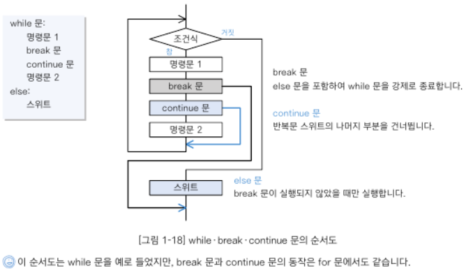


## 구조적 프로그래밍

> 입력과 출력으로 이루어진 구성 요소를 계층으로 배치하여 프로그램을 구성하는 방법(structured programming).
>
> **순차**, **선택**, **반복** 이라는 세 종류의 제어 흐름 사용


### 자료구조(data structure)

> 데이터 단위와 데이터 자체 사이의 물리적 또는 논리적인 관계. 데이터가 모여 있는 구조

- 배열의 원소 수 구하기 : len()

- 배열의 최솟값과 최댓값 구하기 : min(), max()

- 빈 배열 판단하기

  ```python
  if x:
      # x가 비어 있지 않으면(True) 실행
  else:
      # x가 비어 있으면(False) 실행
  ```

- 비교 연산자로 배열의 대소 또는 등가 관계 판단하기 : 맨 앞 원소부터 차례대로 비교. 어느 원소의 값이 크거나 원소 수가 많은 배열을 더 크다고 판단

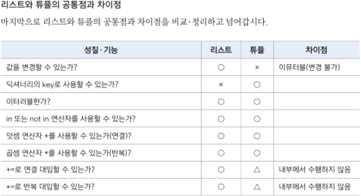

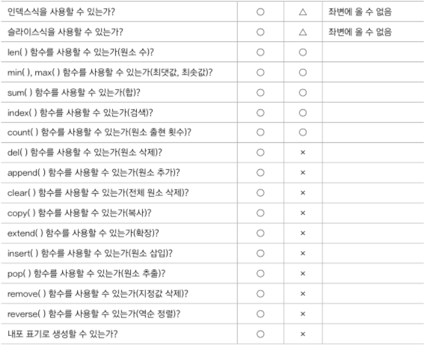

**random.randint(a, b)** : a 이상 b 이하인 난수를 생성하여 반환 

**등가성(equality)** : `==` 두 객체의 값이 같은지 비교

**동일성(identity)** : `is` 두 객체의 값과 식별 번호가 같은지 비교

**스캔(scan)** : 배열 원소를 하나씩 차례로 주목하여 살펴보는 방식

**reversed(x)** : 리스트와 튜플에서 역순으로 스캔하는 경우

**의사 코드(pseudo code)** : 파이썬 명령어와 우리말을 섞어 표현

```python
for i in range(n // 2):
    a[i]와 a[n -i -1]의 값을 교환
```


## 배열

> 일정한 자료형의 변수들을 하나의 이름으로 열거하여 사용하는 자료구조


## 정렬

> 2개 이상의 자료를 특정 기준에 의해 작은 값부터 큰 값 혹은 그 반대의 순서대로 재배열하는 것

**키** : 자료를 정렬하는 기준이 되는 특정 값


- 버블 정렬 (Bubble Sort) : 인접한 두 개의 원소를 비교하며 자리를 계속 교환하는 방식

  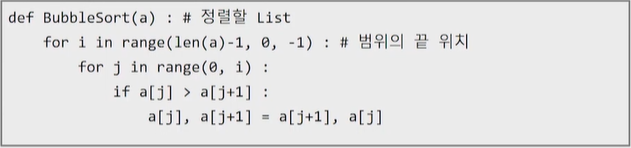

- 카운팅 정렬 (Counting Sort) : 항목들의 순서를 결정하기 위해 집합에 각 항목이 몇 개씩 있는지 세는 작업을 하여, 선형 시간에 정렬하는 효율적인 방식

  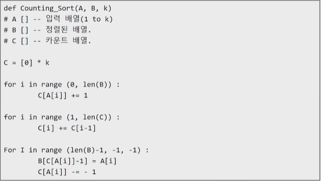

- 선택 정렬 (Selection Sort) : 주어진 자료들 중 가장 작은 값의 원소부터 차례대로 선택하여 위치를 교환하는 방식

  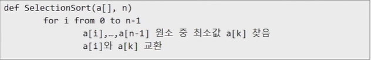

  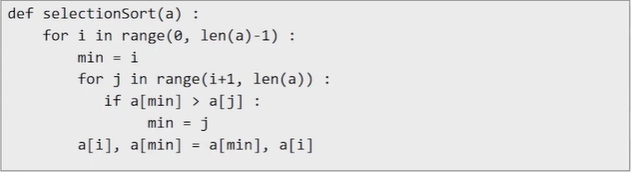

- 퀵 정렬 (Quick Sort)

- 삽입 정렬 (Insertion Sort)

- 병합 정렬 (Merge Sort)


## 완전 검색 (Exaustive Search)

> 모든 경우의 수를 나열해보고 확인하는 기법. 수행 속도는 느리지만, 해답을 찾아내지 못할 확률이 적음

- 순열 (Permutation) : 서로 다른 것들 중 몇 개를 뽑아서 한 줄로 나열하는 것. `nPr = n!`

  

- 탐욕(Greedy) 알고리즘 : 최적해를 구하는 데 사용되는 근시안적인 방법

  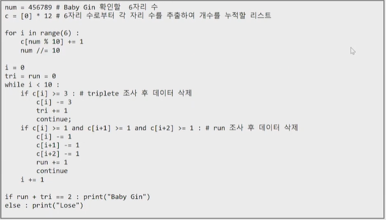


## 순차 검색 (Sequential Search)

> 일렬로 되어 있는 자료를 순서대로 검색하는 방법.

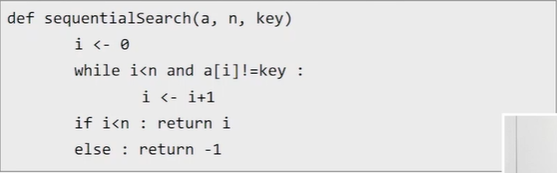


## 이진 검색

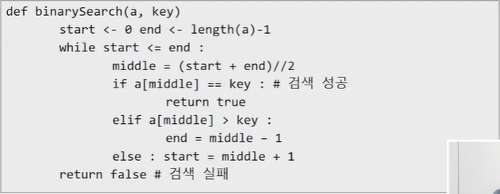


## 문자열(string)

> 시퀀스 자료형. 인덱싱, 슬라이싱 연산들을 사용할 수 있음.


- 문자열 기호

  - `+` : 문자열 + 문자열. 이어 붙여주는 역할
  - `*` : 문자열 * 수. 수만큼 문자열이 반복

  

- 문자열 클래스에서 제공되는 메소드
  - replace()
  - split()
  - isalpha()
  - find()


## 스택 (stack)

> 물건을 쌓아 올리듯 자료를 쌓아 올린 형태의 자료 구조. LIFO(Last-In-First-Out)

- 선형구조 : 자료 간의 관계가 1대 1의 관계

- 비선형구조 : 자료 간의 관계가 1대 N의 관계 (트리, 그래프) - 그래프로 표현된 모든 자료를 빠짐없이 검색하는 것이 중요

  - **DFS(깊이 우선 탐색)**

    - 재귀

      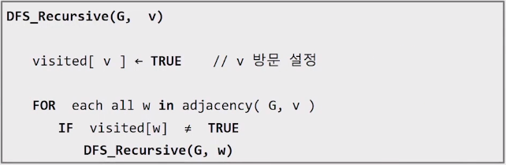

  - **BFS(너비 우선 탐색)**


**top** : 스택에서 마지막 삽입된 원소의 위치

**push** : 저장소에 자료를 저장

**pop** : 삭제. 저장소에서 자료를 역순으로 꺼냄

**isEmpty** : 스택이 공백인지 아닌지를 확인

**peek** : 스택의 top에 있는 item(원소)을 반환


**메모이제이션(Memoization)** : 컴퓨터 프로그램을 실행할 때 이전에 계산한 값을 메모리에 저장해서 매번 다시 계산하지 않도록 하여 전체적인 실행속도를 빠르게 하는 기술. 동적 계획법의 핵심이 되는 기술. 

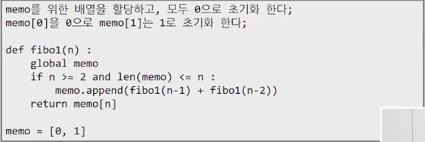

**재귀호출**

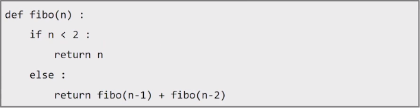


### 백트래킹 

- 최적화 (optimization)
- 결정 (decision)

   

## 큐(Queue)

> 스택과 마찬가지로 삽입과 삭제의 위치가 제한적인 자료구조. (큐의 뒤에서는 삽입만 / 앞에서는 삭제만). FIFO(First In First Out)

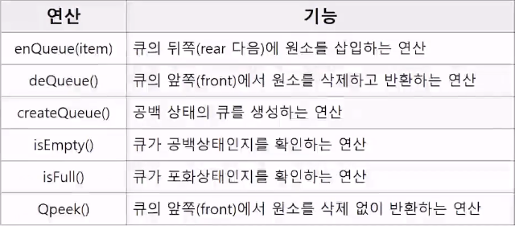


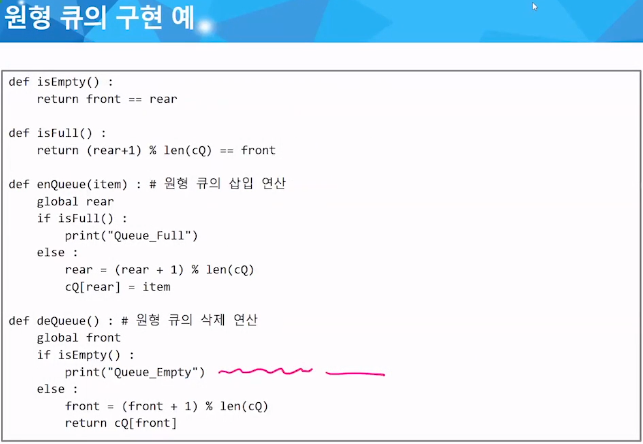

---------------------------------

참조

PEP 8 : https://www.python.org/dev/peps/pep-0008

 

