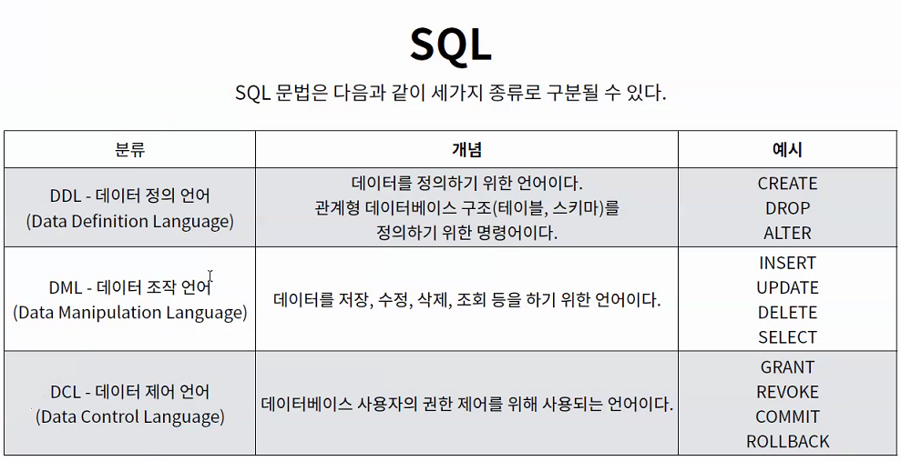

# 1 : N 관계

- 테이블의 관계를 정의해서 사용


- 장고 모델에서 사용되는 Field
  - 1 :1 : OneToOneField() - 유저와 프로필
  - 1 : N : ForeignKey - 글과 댓글, 제조사와 자동차
  - N : M : ManyToManyField() : 좋아요 누르는 관계 (글 - 사용자)


- ForeignKey 사용법 (1 : N)

  - 언제 사용?

    - 맛집 - 리뷰 /  지역 - 팔리는 소주 등등....

  - 사용 방법

    - models.ForeignKey(**참조 모델, 참조 모델이 삭제되었을 때 어떻게 할지**)

      - models.ForeignKey(Articles, on_delete=models.**CASCADE**)

        - on_delete 종류는 어떤 게 있나?

          - CASCADE : 참조하는 테이블이 삭제되면 내 데이터도 삭제하겠다.
          - PROTECT : 참조하는 테이블이 삭제되려고 하면 삭제하지 못하게 에러를 발생
            - 참조(1의 입장) 테이블을 삭제하려면 N 입장의 테이블의 관계 정리가 필요하다.
          - SET_NULL : 참조하는 테이블이 삭제되면 내 데이터에 해당 값을 NULL 로 설정한다.
            - 이 값을 사용하려면 null = True 가 필요하다.
          - SET_DEFAULT : 참조하는 테이블이 삭제되면 Default 값으로 설정한다.
            - 이 값을 사용하려면 default 설정이 필요하다.
          - SET(함수명) : 특정 함수를 호출해서 그 함수의 결과 값으로 설정한다.
          - DO_NOTHING : 아무 것도 하지 않는다.

          

    - 참조 모델이 DB 에 저장될 때는 pk 값을 저장함

      - 그 컬럼명은 `필드명_id` 라고 장고에서 만들어 줌 (ForeignKey 로 설정한 필드의 최종 DB 필드명)

    - 글에서 댓글을 역참조하는 방법

      - `참조하는 테이블명_set` 로 가능


--------------------------------

- 코멘트 CRD 를 작성


- ForeighKey 를 사용해서 게시글의 댓글을 달아주는 코드를 완성
  - Comment 모델 정의
  - forms.py 에 CommentForm 을 정의
    - 여기에서 article 정보는 제외하기 위해서 `exclude` 사용
  - 정의된 CommentForm 을 가지고 detail 페이지에서 커멘트 받을 수 있게 form 을 나타냄.
  - 작성된 Comment 를 저장하기 위해 views 에 comment_create 함수를 작성
    - form.save() 에러 발생
    - article 정보가 없어서 not null 에러 발생
    - article 정보는 따로 저장을 해 주어야 했음
    - form.save() 를 하면 바로 DB 에 저장되지만, commit = False 를 인자로 넣어주면 DB 에 바로 저장되지 않음.
    - article 정보를 넣고 수동 save() 함
  - 작성된 comment 도 detail 에서 보여줌
  - 삭제 버튼도 추가
  - Update 는 시간 되는 분들은 도전 한번 추천


- 댓글 갯수 달아주는 방법

  - detail 페이지에서 comments 의 갯수를 세어서 보여줌

    ```python
    1. 필터를 이용한 방법
    {{ comments|length }}
    
    2. QuerySet 의 count method 를 이용하는 방법
    {{ comments.count }}
    * QuerySet의 count를 실행하면 DB에 쿼리를 날려서 DB에서 count를 세어서 전달해줌.
    
    3. 역참조하여 필터를 이용
    {{ article.comment_set.all|length }}
    ```

- 댓글이 없을 때는 `for ... empty` 사용


- get_object_or_404
  - DB에서 해당 정보가 없으면 404 페이지 에러를 발생
  - 사용이유 : 책임 소재를 분명히 하기 위해서
    - http error code :
      - 4XX 코드는 유저의 요청이 잘못된 경우
      - 5XX 코드는 서버에서 잘못 처리되는 경우


------------------------

# DB, SQL





왜  shell_plus 를 사용하나??

- 댓글을 달 수 있는 인터페이스가 없음
- 그래서 쉘플러스를 사용
- 쉘플러스는 python 환경 -> 파이썬 코드 -> Django 에 쓸 수 있는 코드
- 동작의 이해를 돕기 위해서 사용


