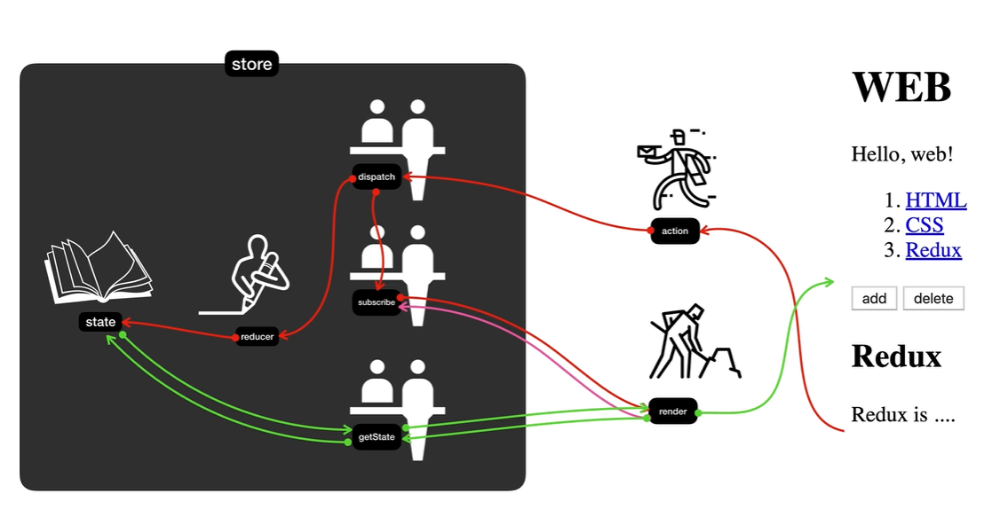

# Redux

> A predictable state container for JavaScript apps


▼ dispatch, reducer를 통해서 데이터의 수정 가능 (직접 불가)

--------------------------

- Single Source of Truth : 상태는 객체. app에 있는 모든 데이터 삽입하므로, app의 복잡성을 낮춤

```javascript
state = {
    contents: [
        {id:1, title: 'HTML', desc: 'HTML is...'},
        {id:2, title: 'CSS', desc: 'CSS is...'}
    ]
}
```

```javascript
// id가 2인 content를 선택하였을 때의 객체의 상태. 객체의 상태에 따라서 app의 모습은 바뀌지만, 단 하나의 state 유지함으로서 app의 복작성 낮춤

state = {
    contents: [
        {id:1, title: 'HTML', desc: 'HTML is...'},
        {id:2, title: 'CSS', desc: 'CSS is...'}
    ],
    selected_id:2
}
```

---------------------------

▼ getState를 통해서 데이터 가져오기 가능 (직접 불가)


→ 데이터를 외부에서 직접적으로 제어할 수 없도록 함으로써, **의도하지 않게 state 값이 변하는 것을 사전에 차단**. app을 보다 예측가능하게 만듬




`store` : 은행

`dispatch`, `subscribe`, `getState` : 창구 직원. 우리가 직접 데이터를 만지지 못하므로, 우리와 함께 일을 할 함수

```javascript
// 1. store를 만들 때, reducer라는 함수를 제일 먼저 공급

function reducer(oldState action){
    //....
}
var store = Redux.createStore(reducer);
```

```javascript
// 2. getState함수를 이용하여 state에서 데이터 가져오기

function render(){
    var state = store.getState();
    //....
    document.querySelector('#app').innerHTML = `
		<h1>WEB<h1>
		....
	`
} // innerHTML을 통해 state의 값을 이용해 Web Page(UI) 형성
```

```javascript
// 3. render함수를 subscribe에 등록

store.subscribe(render);
// state 값이 바뀔 때 마다, render 함수가 실행되면서 UI가 갱신
```

```javascript
// 4. dispatch

<form onsubmit="
	//....
	store.dispatch({type:'create', payload:{title:title, desc:desc}});
">
```

type:'create'라는 `action` → `dispatch`(1. `reducer`를 호출해서 state 값 변경 2.`subscribe`를 이용해서 render 함수 호출) → 화면 갱신

`reducer` : state를 입력값으로 받고, action을 참조해서 새로운 state값을 만들어내서  return 해주는, state 가공자

```javascript
// 5. type:'create'라는 action에 대응하는 reducer 함수.

function reducer(state, action){
    if(action.type === 'create'){
        var newContents = oldState.contents.concat();
        var newMaxId = oldState.maxId+1;
        newContents.push({id:newMaxId, title:action.pa})
		return Object.assign({}, state, {
            contents:newContents,
            maxId:newMaxId,
            mode: 'read',
            selectedId:newMaxId
        }); // return해주는 객체는 state의 새로운 값
    };
}
```

`state` 값 변경 → `dispatch` → `subscribe`에 등록되어 있는 `render` 함수 호출 → `getState` → `state` →  UI변경

 

# Redux의 적용

### Installation

```bash
# 1. NPM 설치

npm install --save redux

# 2. redux CDN

<script src="https://cdnjs.cloudflare.com/ajax/libs/redux/4.0.0-beta.1/redux.js"></script>
```


```html
<!DOCTYPE html>
<html lang="en">
  <head>
      <script src=""></script>
  </head>
    
  <body>
    <style>
        .container {
            border: 5px solid black;
            padding: 10px;
        }
    </style>
    <div id="red"></div>
    <script>
        // 2. reducer라는 함수를 만들어서 store에 주입시킨다. 
        function reducer(state, action){
            if(state === undefined){ // Store를 만들었을 때, 초기값 필요
                return {color:'yellow'}
            }
            // 6. state 복제
            var newState;
            if(action.type === 'CHANGE_COLOR'){
                newState = Object.assign({}, state, {color:action.color})
            }
            return newState; // 7. reducer가 실행될 때 마다, 새로운 state값 return
        }
        // 1. store를 만든다.
        var store = Redux.createStore(reducer);
        // 3. store에 저장된 state값을 가져온다.
        console.log(store.getState());
        function red() {
            // 4. state 지정
            var state = store.getState();
            document.querySelector('#red').innerHTML = `
				<div class="container" id="component_red" style="background-color:${state.color}">
					<h1>red</h1>
					<input type="button" value="fire" onclick="
						// 5. dispatch 함수 호출. property로 type 설정
						store.dispatch({type:'CHANGE_COLOR', color:'red'});
					">
        		</div>
			`;
        }
        // 8. subscribe에 render 등록(state값이 바뀔 때 마다, red함수 호출)
        store.subscribe(red);
        red();
    </script>
  </body>
</html>
```


