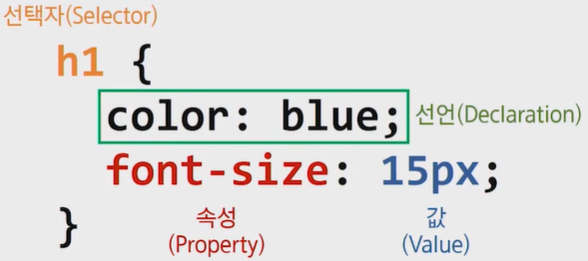
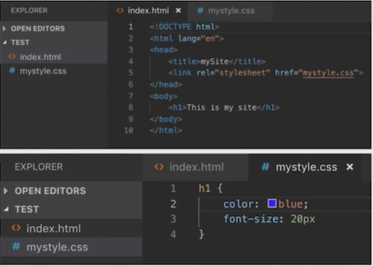
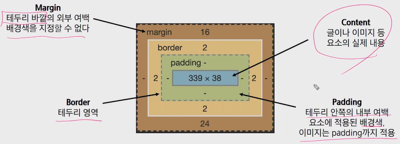
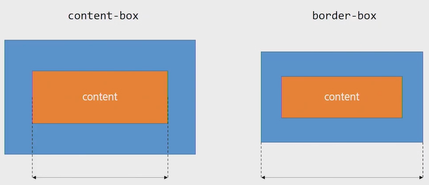

[TOC]

# CSS(Cascading Style Sheets)

> 스타일, 레이아웃 등을 통해 HTML이 사용자에게 어떻게 표시 되는지를 지정하는 언어
>
> 사용자에게 문서(HTML)를 표시하는 방법을 지정하는 언어


## CSS 구문



- 구문은 선택자와 함께 열린다. 
- 스타일을 지정할 html 요소를 선택. 
- 다음 중괄호가 있는데 이 안에는 속성과 값 쌍 형태를 가지는 하나 또는 그 이상의 선언(declaration)이 있다. 
- 각 쌍은 우리가 선택한 요소의 속성을 지정하고 속성에 부여할 값을 지정한다.

**선언문** 

- 속성 (Property)
  - 사람이 읽을 수 있는 식별자로, 어떤 (글꼴, 너비, 배경색 등) 스타일 기능을 변경할지 나타냅니다.
- 값 (Value)
  - 각 속성에는 값을 부여한다.
  - 값은 어떻게 (글꼴을 이걸로, 배경 색을 저걸로 등)스타일 기능을 변경할 건지 나타낸다.

**CSS 정의 방법**

1. `Inline style` : 해당 태그에 직접 <sytle> 속성을 활용. 관리하기가 힘듦

   ```html
   <h1 style="color : blue; font-size: 100px;">Hello</h1>
   ```

2. 내부 참조 (`Embedding`) : head 태그 내에 <style>에 지정. 하나의 html에서만 적용

   ```html
   <head>
       <style>
           h1 {
               color : blue;
               font-size : 100px;
           }
       </style>
   </head>
   ```

3. 외부 참조 (`Link style`) - 외부 CSS 파일을 <head>내 <link>를 통해 불러오기

   

---


## CSS Selector

> 선택자는 스타일을 지정할 웹 페이지의 HTML 요소를 대상으로 하는 데 사용

```html
선택자 {
	속성1 : 속성값1;
	속성2 : 속성값2;
}
```

- **기초 선택자**

  - 전체 선택자(*)
  - 타입 선택자(h1, h2, ...)
  - 클래스 선택자(.) : 클래스 선택자는 마침표( .) 문자로 시작 하며 해당 클래스가 적용된 문서의 모든 항목을 선택
  - 아이디 선택자(#) : 클래스 선택자와 같은 방식으로 사용할 수 있으나, 아이디는 문서 당 한 번만 사용할 수 있으며 요소에는 단일 id값만 적용
  - 속성 선택자 

- **고급 선택자**

  - 자식 선택자(셀렉터a `>` 셀렉터b) : 자식(바로 아래의 요소)
  - 자손 선택자(셀렉터a  `공백` 셀렉터b) : 자손(하위의 모든 요소)
  - 형제 선택자(셀렉터a  `~` 셀렉터b) : 같은 레벨에 있는 요소
  - 인접 형제 선택자(셀렉터a  `+` 셀렉터b) : 바로 붙어 있는 형제 요소

- 의사 클래스(pseudo class)

  - 링크, 동적 의사 클래스
  - 구조적 의사 클래스

  

**적용 우선순위** (cascading order)

1. `!important`
   - 다른 사람들의 코드에서 발견할 때 그 의미를 알 수 있는 것은 좋다.
   - 하지만 반드시 필요한 경우가 아니면 절대 사용하지 않는 것이 좋다.
   - `!important` 는 cascading이 정상적으로 작동하는 방식을 변경하므로, CSS 스타일 문제를 해결하기가 어렵습니다.
2. `inline style` : 직접 선택하기 때문에
3. `id 선택자`
   - id는 대부분의 다른 선택자보다 우선순위가 높기 때문에 다루기가 어려워 질 수 있다.
   - 대부분의 경우 id 보다는 모두  class 선택자로 작성하는 것이 좋다.
   - 만약 문서 내 `링크 이동`이나 `for`를 사용하는 특별한 경우에만 아이디를 사용한다.
4. `class 선택자` , 속성 선택자, pseudo-class
5. `요소 선택자(태그 선택자)`, pseudo-element
6. `소스 순서`


**CSS 상속** - MDN에서 확인하기

- CSS는 상속을 통해 부모 요소의 속성을 자식에게 상속한다. (모두 X)
  - 속성(프로퍼티) 중에는 상속이 되는 것과 되지 않는 것들이 있다.
  - 상속 되는 것
    - Text 관련 요소(font, color, text-align), opacity, visibility 등
  - 상속 되지 않는 것
    - Box model 관련 요소(width, height, margin, padding, border, box-sizing, display), position 관련 요소(position, top/right/bottom/left, z-index) 등

---


## CSS 단위

**(상대) 크기 단위**

**px**

- 모니터 해상도의 한 화소인 '픽셀'을 기준
- 픽셀의 크기는 변하지 않기 때문에 고정적인 단위

**%**

- 백분율 단위
- 가변적인 레이아웃에서 자주 사용

**em**

- em은 상속의 영향 받음, rem은 최상위 요소(html)를 기준으로 결정됨.
- 배수 단위, 요소에 지정된 사이즈에 상대적인 사이즈를 가짐.

**rem**

- 최상위 요소인 html(root em)을  절대 단위를 기준으로 배수 단위를 가짐. 
- 상속에 영향을 받지 않기 때문에 대부분의 경우 `rem` 을 많이 사용한다.

**viewport**

- (스크롤을 내리지 않은 상태에서) 웹 페이지를 방문한 유저에게 현재 보이는 웹 컨텐츠의 영역
- viewport를 기준으로한 상대적인 사이즈
- 주로 스마트폰이나 테블릿 디바이스의 화면을 일컫는 용어로 사용된다.
- vw(뷰포트 너비의 1%), vh(뷰포트 높이의 1%), vmin(너비/높이 중 짧은 쪽의 1%), vmax(너비/높이 중 긴 쪽의 1%)


**색상 표현 단위**

1. 색상 키워드
   - 색상 키워드는 대소문자를 구분하지 않는 식별자로, red, blue, black처럼 특정 색을 나타낸다
2. RGB 색상
   - 빨강, 초록, 파랑을 통해 특정 색을 표현
   - `'#' + 16진수 표기법`이나 `rgb() 함수형 표기법`으로 사용
   - a는 alpha(투명도)가 추가된 것
3. HSL 색상
   - 색상, 채도, 명도를 통해 특정 색상을 표현
   - a는 alpha(투명도)가 추가된 것


**문서 표현**

1. 텍스트
   - 변형 서체(vs <b>, <i> vs <strong>, <em>)
2. 컬러(color), 배경(background-image, background-color)
3. 목록 꾸미기

---


## Box Model

> 웹 디자인은 contents를 담을 box model을 정의하고 CSS 속성을 통해 스타일(배경, 폰트와 텍스트 등)과 위치 및 정렬을 지정하는 것.

- 모든 HTML 요소는 box 형태로 되어있다.
- 하나의 박스는 네 부분(영역)으로 이루어 진다.
  - content / padding / border / margin



1. Content
   
   - 글이나 이미지, 비디오 등 요소의 실제 내용
   
2. Padding (안쪽 여백)
   - Border(테두리) 안쪽의 내부 여백
   - 배경색, 이미지 지정 가능
   
3. Border (테두리 영역)

4. Margin (바깥쪽 여백) 
   - 테두리 바깥의 외부 여백
   - 배경색 지정 불가
   
   ```html
   # shorthand
   
   .margin-1 {
     margin: 10px;
   }       # 상하좌우
   
   .margin-2 {
     margin: 10px 20px;
   }       # 상하 / 좌우
   
   .margin-3 {
     margin: 10px 20px 30px;
   }       # 상 / 좌우 / 하
   
   .margin-1 {
     margin: 10px 20px 30px 40px;
   }       #  상 / 우 / 하 / 좌
   ```

**box-sizing**



- 기본적으로 모든 요소의 `box-sizing`은 `content-box` -> default

  : Padding을 제외한 순수 contetns 영역만을 box로 지정

- 다만, 우리가 **일반적으로 영역을 볼 때는 border까지의 너비를 100px 보는 것을 원함**

  : 그 경우 `box-sizing`을 `border-box`으로 설정

**마진 상쇄(Margin collapsing)**

- block의 top 및 bottom margin이 때로는 (결합되는 마진 중 크기가) 가장 큰 한 마진으로 결합(combine, 상쇄(collapsed))된다.


---


## Display

> display CSS 속성은 요소를 블록과 인라인 요소 중 어느 쪽으로 처리할지와 함께 자식 요소를 배치할 때 사용할 레이아웃을 설정한다.
>
> 모든 요소는 네모(박스모델)이고, 어떻게 보여지는지(display)에 따라 문서의 배치가 달라질 수 있다.

**display : `block`** 

- 줄 바꿈이 일어나는 요소
- 화면 크기 전체의 가로 폭을 차지
- 블록 레벨 요소안에 인라인 레벨 요소가 들어갈 수 있다.
- div / ul, ol, li / p / hr / form 등

**display : `inline`**

- 줄바꿈이 일어나지 않는 행의 일부 요소
- content 너비만큼 가로 폭을 차지
- width, height, margin-top, margin-bottom을 지정할 수 없음
- 상하 여백은 line-height로 지정
- span / a / img / input, label / b, em, i, strong 등

**display : `inline-block`**

- inline 처럼 텍스트 흐름대로 나열, block처럼 박스 형태이기 때문에 block 속성 사용가능.

**display : `none`**

- 해당 요소를 화면에서 표시하지 않으며 요소의 공간조차 사라지게 한다.
- `visibility: hidden;`은 해당 요소를 화면에서 사라지게는 하나 공간은 사라지지 않는다.


---


## Position

> CSS position 속성은 문서 상에서 요소를 배치하는 방법을 지정한다.

**박스의 위치 속성 & 값**

- position
  - static / absolute / relative / fixed
  - z-index

**기본 개념**

1. `static` : 디폴트 값 (기본 위치)
   - 기본적인 요소의 배치 순서에 따름(좌측 상단)
   - 부모 요소 내에서 배치될 때는 부모 요소의 위치를 기준으로 배치
2. `relative` : 기본 위치(static)를 기준으로 좌표 속성을 사용해 위치 이동 (상대 위치)
3. `absolute` : static 이 아닌 부모/조상 요소를 기준으로 좌표 속성 만큼 이동 (절대 위치)
   - 부모 요소를 찾아가고 나아가 없다면 body에 붙는다.
   - 기본적인 배치 순서에서 제외
4. `fixed` : 부모/조상 요소와 관계없이 브라우저의 viewport를 기준으로 좌표 속성 만큼 이동 (고정 위치)
   - 스크롤을 내리거나 올려도 화면에서 사라지지 않고 항상 같은 곳에 위치
5. `sticky` : relative처럼 기본 배치 순서는 가지고 있음.
   - 화면 밖으로 벗어나면 fixed처럼 위치에 고정되어 있음.

**absolute**

- `absolute`는 원래 위치해 있었던 과거 위치에 있던 공간은 더 이상 존재하지 않는다는 점이 특징이다.
- 즉, 다른 모든 것과는 별개로 독자적인 곳에 놓이게 된다.
- 언제 쓸까?
  - 페이지의 다른 요소의 위치와 간섭하지 않는 격리된 사용자 인터페이스 기능을 만들 수 있다.
  - 팝업 정보 상자 및 제어 메뉴, 롤오버 패널, 페이지 어느 곳에서나 끌어서 놓기할 수 있는 유저 인터페이스 페이지 등


---


## 참고문헌

MDN (https://developer.mozilla.org/ko/)

https://developer.mozilla.org/en-US/docs/Web/CSS/CSS_Selectors

https://developer.mozilla.org/ko/docs/Learn/CSS/Building_blocks/Cascade_and_inheritance

https://developer.mozilla.org/ko/docs/Web/CSS/inheritance

https://developer.mozilla.org/ko/docs/Web/HTML/Block-level_elements

https://developer.mozilla.org/ko/docs/Web/HTML/Inline_elements

https://developer.mozilla.org/ko/docs/Web/CSS/display

Emmet(https://docs.emmet.io/cheat-sheet/ ) : HTML 문서 등을 편집할 때 빠른 코딩