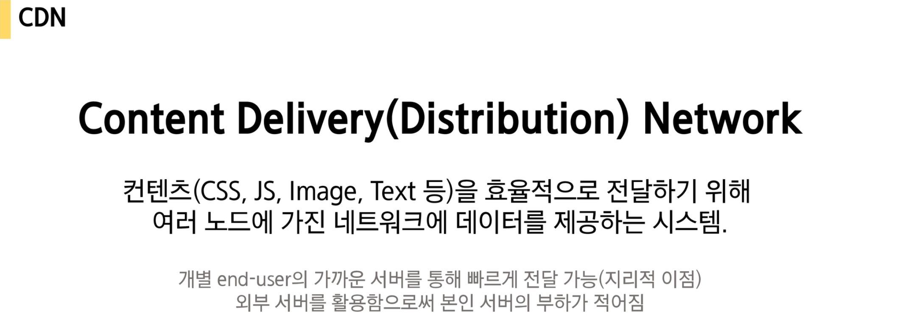
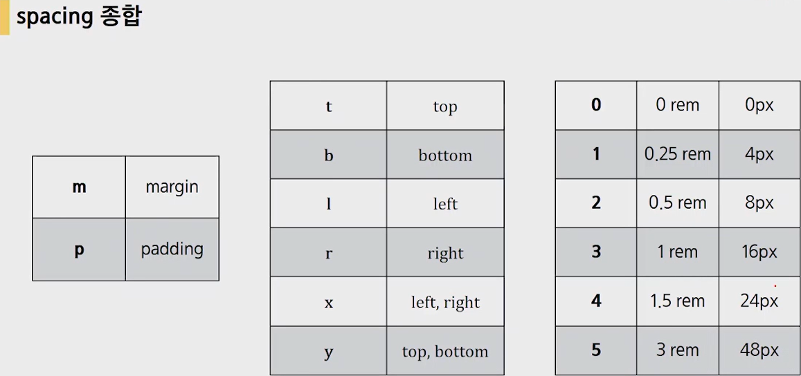
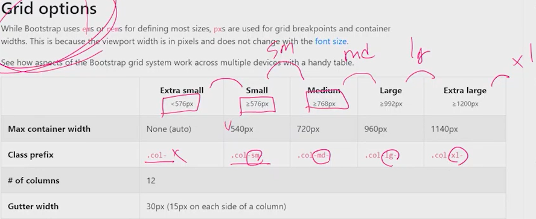

[TOC]

# CSS Layout

> 웹페이지에 포함되는 요소들을 어떻게 취합하고 그것들이 어느 위치에 놓일 것인지를 제어한다.

## display

## position

## float

> 한 요소(element)가 정상 흐름(normal flow)으로부터 빠져 텍스트 및 인라인(inline) 요소가 그 주위를 감싸 자기 컨테이너의 좌,우측을 따라 배치되어야 함을 지정한다.
>
> float된 이미지 좌, 우측 주변으로 텍스트를 둘러싸는 레이아웃을 위해 도입


**clearfix**

- float 요소와 다른 텍스트가아닌 block 요소간의 레이아웃 깨짐을 막기 위해 다음과 같이 작성한다.

  ```css
  /* float 속성을 적용한 요소의 부모요소에 적용한다. */
  /* 부모 태그 다음에 가상 요소(::after)로 내용이 빈(content:"") 블럭(display: block;)을 만들고 */
  /* 이 가상요소는 float left,right(both)를 초기화 한다는 뜻 */
  
  .clearfix::after {
    content: "";
    display: block;
    clear: both;
  }
  ```


**정리**

- flexbox 및 그리드 레이아웃과 같은 기술이 나오기 이전에 float는 열 레이아웃을 만드는데 사용되었다.
- mdn에서는 더 새롭고 나은 레이아웃 기술이 나와있으므로 레거시 레이아웃 기술로 분류해놓기도 했다.
- 결국 원래 텍스트 블록 내에서 float 이미지를 위한 역할로 돌아간 것이다.
- 여전히 사용하는 경우도 있다. (ex. naver nav bar)


---


## flexbox

> 일명 flexbox라 불리는 Flexible Box module은 flexbox 인터페이스 내의 아이템 간 공간 배분과 강력한 정렬 기능을 제공하기 위한 1차원 레이아웃 모델로 설계되었다.
>
> 웹페이지의 컨테이너에 아이템의 폭과 높이 또는 순서를 변경해서 웹페이지의 사용 가능한 공간을 최대한 채우고 이를 디바이스 종류에 따라 유연하게 반영하도록 하는 개념


**핵심 개념**

- 요소
  - flex container (부모 요소)
  - flex items (자식 요소)
- 축
  - main axis (메인축)
  - cross  axis (교차축)


**flex container**

- flexbox 레이아웃을 형성하는 가장 기본적인 모델

- flexbox가 놓여있는 영역

- flex 컨테이너를 생성하려면 영역 내의 컨테이너 요소의 display 값을 flex 혹은 inline-flex로 지정

  ```html
  .flex-container {
    display : flex;
  }
  ```

- flex 컨테이너를 선언시 아래와 같이 기본 값이 지정
  - item은 행으로 나열
  - item은 주축의 시작 선에서 시작
  - item은 교차축의 크기를 채우기 위해 늘어남
  - `flex-wrap` 속성은 `nowrap`으로 지정


```
Tip !

justify - main axis
align - cross axis

content - 여러 줄
items - 한 줄
self - 개별 요소
```


**flex-direction**

>  배치 방향 설정 (main-axis 의 방향만 바뀜. flex 는 single-direction layout concept 이기 때문)

- row (기본값)
  - 가로로 요소가 쌓임
  - row 는 주축의 방향을 왼쪽에서 오른쪽으로 흐르게 한다.
- row-reverse
- column
  - 세로로 요소가 쌓임
  - column 은 주축의 방향을 위에서 아래로 흐르게 한다.
- column-reverse


**flex-wrap**

>  item들이 강제로 한 줄에 배치 되게 할 것인지 여부 설정

- nowrap (기본 값)
  - 모든 아이템들 한 줄에 나타내려고 함 (그래서 자리가 없어도 튀어나옴)
- wrap : 넘치면 그 다음 줄로
- wrap-reverse : 넘치면 그 윗줄로 (역순)


**flex-flow**

>  flex-direction 과 flex-wrap 의 shorthand

```css
flex-flow: row nowrap;
```


**flex-grow**

- 기본 값 : 0
- 주축에서 남는 공간을 항목들에게 숫자만큼 분배하는 방법
- 각 아이템의 상대적 비율을 정하는 것이 아님
- 음수는 불가능


**order**

- 기본 값 : 0
- 작은 숫자 일수록 앞(왼쪽)으로 이동.


**justify-content**

> main axis 방향 정렬
>
> `flex-direction: row` 기준으로 작성됨

- flex-start (기본 값)
  - 시작 지점에서 쌓임(왼쪽 → 오른쪽)
- flex-end
  - 쌓이는 방향이 반대 (`flex-direction: row-reverse` 와는 다르다. 아이템의 순서는 그대로 정렬만 우측에 되는 것.)
- center
- space-between
  - 좌우 정렬 (item 들 간격 동일)
- space-around
  - 균등 좌우 정렬 (내부 요소 여백은 외곽 여백의 2배)
- space-evenly
  - 균등 정렬 (내부 요소 여백과 외곽 여백 모두 동일)


**align-items**

> cross axis 한 줄 방향 정렬
>
> `flex-direction: row` 기준으로 작성됨

- stretch (기본 값)
  - 컨테이너를 가득 채움
- flex-start
  - 위
- flex-end
  - 아래
- center
- baseline
  - item 내부의 text에 기준선을 맞춤


**align-content**

> cross axis 여러 줄 방향 정렬

- flex-start
- flex-end
- center
- stretch
- space-between
- space-around


**align-self**

> align-items 와 동일 (단, flex item 개별 요소에 적용)

- auto (기본 값)
- flex-start
- flex-end
- center
- baseline
- stretch
  - 부모 컨테이너에 자동으로 맞춰서 늘어난다. (Stretch 'auto'-sized items to fit the container) 


# RESET CSS

> 모든 HTML 요소 스타일을 일관된 기준으로 재설정하는 간결하고 압축된 규칙 세트
>
> HTML5 Element, Typograph, Table, List 등의 요소들에 일관성있게 스타일을 적용 시키는 기본 단계


## 사용 배경

- 모든 브라우저는 각자의 `user agent stylesheet` 를 가지고 있는데 (웹사이트를 보다 읽기 편하게 하기 위해)
- 문제는 이 설정이 브라우저마다 상이하다는 것


## 종류

**Normalize CSS**

> gentle solution

- W3C 의 표준을 기준으로 브라우저 중 하나가 불일치 한다면 차이가 있는 브라우저를 수정한다.
- 경우에 따라 IE 또는 EDGE 는 표준에 따라 수정할 수 없는 경우도 있는데, 이 경우 Normalize 는 IE 또는 EDGE 의 스타일을 나머지 브라우저에 적용시킨다.
- 실제 bootstrap 에서는 normalize.css를 자체적으로 커스텀해서 `bootstrap-reboot.css` 라는 이름으로 사용한다.


**Reset CSS**

>  aggressive solution

- 브라우저의 기본 스타일이 전혀 필요 없다는 방식으로 접근한다.
- 따라서 브라우저의 user agent와 함께 제공되는 모든 스타일을 재설정한다.
- Reset CSS의 문제점은 너무나 많은 선택자가 엉켜있고, 불필요한 오버라이드가 많이 발생하며 디버깅 시 제대로 읽을 수 없다.


## 마무리

- 현재는 Normalize CSS 를 중심으로 사용하고 여기에 적절한 Reset CSS 을 섞어 쓰라고 권장한다. (오래된 Reset CSS 를 사용하지 않도록 주의한다.)
- 무엇보다 더 중요한 건, ***"내 프로젝트에 명확하게 필요한 사항들인지 확인"***
- 최종적으로 자신만의 Reset style sheet를 만들어 나가기는 것이 좋다.


## 참고문헌

https://cssreset.com/

https://github.com/necolas/normalize.css/blob/master/normalize.css

https://medium.com/@elad/normalize-css-or-css-reset-9d75175c5d1e


---



## Bootstrap

> The most popular HTML, CSS, and JS library in the world.

- 트위터에서 시작된 오픈 소스 프론트엔드 라이브러리
- 웹 페이지에서 많이 쓰이는 요소를 거의 전부 내장하고 있다.
- 디자인을 할 시간이 크게 줄어들고, 여러 웹 브라우저를 지원하기 위한 크로스 브라우징에 골머리를 썩일 필요가 없다.
- 웹 브라우저 크기에 따라 자동으로 정렬되는 "그리드 시스템"을 지원하며,
- *"one souce multi use"* → 같은 컨텐츠를 보는 다른 디바이스들의 반응형 웹 디자인을 추구한다.
- class 요소로 조작


**Responsive web design**

- layout은 방문자의 화면 해상도를 고려하여야 한다.
- 스마트폰이나 태블릿 등 모바일 기기는 화면이 작기 때문에 가독성에 더욱 신경써야 한다. 
- 보통 웹사이트가 축소되어 가로 스크롤 없이 콘텐츠를 볼 수 있으나 글자가 너무 작아지기 때문이다.
- 데스크탑용, 테블릿용, 모바일용 웹사이트를 별도 구축할 수도 있지만 One Source Multi Use의 관점에서 올바른 해결책은 아니다.
- 반응형 웹 디자인(Responsive Web Design)은 화면 해상도에 따라 가로폭이나 배치를 변경하여 가독성을 높여 이러한 문제를 해결한다.
- 즉, 하나의 웹사이트를 구축하여 다양한 디바이스의 화면 해상도에 최적화된 웹사이트를 제공하는 것이다. 


---


## Bootstrap Grid System

**Grid System**

- 부트스트랩의 grid system 은 containers, rows 그리고 columns 를 사용해서 컨텐츠를 레이아웃하고 정렬한다.
- 모바일 우선 `flexbox` grid 를 사용하여 12개의 column 시스템을 가지고 있다.
- 왜 `12 columns` 일까 ?
  - 12는 약수가 가장 많기 때문에 한 줄에 표시할 수 있는 종류가 제일 많다.
- 다음과 같은 구조로 컨텐츠를 배치하고 정렬한다.
  - .container > .row(display: flex) > col-*


**spacing** 




**.row**

- row 는 columns 의 wrapper 이다.
- 각 column 에는 공간 사이를 제어하기 위한 좌우 padding 값이 있는데 이를 `gutter` 라고도 한다.
  - row 의 margin 값과 gutter 를 제거하려면 .row 에 `.no-gutters` class 를 사용한다.


**.col /  .col-***

- column class 는 row 당 가능한 12개 중 사용하려는 columns 수를 나타낸다.
- columns 너비는 백분율로 설정 되므로 항상 부모 요소를 기준으로 유동적으로 크기가 조정된다.
- grid layout 에서 내용은 반드시 columns 안에 있어야 하며 그리고 오직 columns 만 row 의 바로 하위 자식 일 수 있다.


**offset**

- `offset-*` 은 지정한 만큼의 column 공간을 무시하고 다음 공간부터 컨텐츠를 적용한다.


**Nesting**

- .row > .col-* > .row > .col-* 의 방식으로 중첩 사용 가능하다.


**Grid breakpoints**

- 부트스트랩 grid system 은 다양한 디바이스에서 적용하기 위해 특정 px 조건에 대한 지점을 정해 두었는데 이를 `breakpoints(5 default responsive tiers)` 라고 한다.

  

- 부트스트랩은 대부분의 크기를 정의하기 위해 em 또는 rem 을 사용하지만 px 는 그리드  breakpoint 에 사용된다. (뷰포트 너비가 픽셀 단위이고 글꼴 크기에 따라 변하지 않기 때문)


---


## 마무리

> 각각의 기술은 저마다 용도가 있고, 장단점이 있으며, 독립적인 용도를 갖추도록 설계된 기술은 없다.  
>
> 특정 상황에 어떤 기술이 가장 적합한 도구가 될 것인지 파악하는 데에는 많은 경험이 필요하다.


---


## 참고문헌

https://developer.mozilla.org/ko/docs/Learn/CSS/CSS_layout/Introduction

https://developer.mozilla.org/ko/docs/Web/CSS/float

https://developer.mozilla.org/ko/docs/Learn/CSS/CSS_layout/Floats

https://developer.mozilla.org/ko/docs/Learn/CSS/CSS_layout/Flexbox

[https://developer.mozilla.org/ko/docs/Web/CSS/CSS_Flexible_Box_Layout/Flexbox%EC%9D%98_%EA%B8%B0%EB%B3%B8_%EA%B0%9C%EB%85%90](https://developer.mozilla.org/ko/docs/Web/CSS/CSS_Flexible_Box_Layout/Flexbox의_기본_개념)

https://css-tricks.com/snippets/css/a-guide-to-flexbox/

