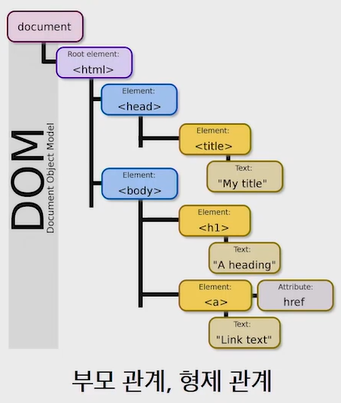

# Web

"웹 어플리케이션 개발을 통해 **SW 개발 방법 및 학습 과정을 익히기 위해서**"

웹 표준 : WHATWG기관 (HTML Living Standard 버젼 사용)

(코드 관련 질문 : JSfiddle(https://jsfiddle.net))

[TOC]

# HTML

> 웹 페이지를 작성하기 위해 **웹 컨텐츠의 의미와 구조를 정의할 때 사용하는 언어**

## HTML 기초

**Hyper**

- 텍스트 등의 정보가 동일 선상에 있는 것이 아니라 다중으로 연결되어 있는 상태

**Hyper Text**

- 참조(하이퍼링크)를 통해 사용자가 한 문서에서 다른 문서로 즉시 접근 할 수 있는 텍스트
- 하이퍼 텍스트가 쓰인 기술등 중 가장 중요한 2가지 (http, html)

**Markup Language**

- 특정 텍스트에 역할을 부여하는, 따라서 "마크업을 한다" 라고 하는 건 제목이 제목이라하고 본문이 본문이라고 마킹을 하는 것
- ex) h1 tag는 단순히 글자가 커지는 것이 아니라 의미론적으로 그 페이지에서 가장 핵심 주제를 의미하는 것
- 태그 등을 이용하여 문서나 데이터의 구조를 명시하는 언어. 프로그래밍 언어와는 다르게 단순하게 데이터를 표현


## HTML 기본 구조

**DOM (Document Object Model) 트리**



- DOM은 문서의 구조화된 표현(structured representation)을 제공하며 프로그래밍 언어가 DOM 구조에 접근할 수 있는 방법을 제공하여 그들이 문서 구조, 스타일, 내용 등을 변경할 수 있게 도움
- DOM은 동일한 문서를 표현하고, 저장하고, 조작하는 방법을 제공
- 웹 페이지의 객체 지향 표현


**요소 (Element)**

- HTML 문서의 최상위 요소로 문서의 root 의미. head와 body로 구분. 

```html
<!DOCTYPE html> #html 문서정의
<html lanng="ko">
	<head> 
        <meta charset="UTF-8"> # HTML 문서의 메타 데이터를 통해 문서 정보 전달
        <title>Document</title>
    </head> # 해당 html 문서의 정보를 담고 있다.
    		# (제목, 문자의 인코딩, 외부 로딩 파일 지정)
    		# 브라우저에는 나타나지 않음.
    		# CSS 선언 혹은 외부 로딩 파일 지정 등도 작성    	
    <body> 
    </body> #브라우저 화면에 실질적으로 나타나는 정보
</html>
```

- HTML 요소는 시작 태그와 종료 태그 그리고 태그 사이에 위치한 내용으로 구성

  - 태그(Element, 요소)는 컨텐츠(내용)를 감싸서 그 정보의 성격과 의미를 정의 한다.

- 내용이 없는 태그들

  - br, hr, img, input, link, meta

- `시맨틱 태그` : 브라우저, 검색엔진, 개발자 모두에게 콘텐츠의 의미를 명확히 설명하는 태그. 단순히 구역을 나누는 것 뿐만 아니라 의미론적 요소를 담은 태그. 

  - Semantic
    - header : 문서 전체나 섹션의 헤더(머릿말 부분)
    - nav : 내비게이션
    - aside : 사이드에 위치한 공간, 메인 콘텐츠와 관련성이 적은 콘텐츠
    - section : 문서의 일반적인 구분, 컨텐츠의 그룹을 표현
    - article : 문서, 페이지, 사이트 안에서 독립적으로 구분되는 영역
    - footer : 문서 전체나 섹션의 푸터(마지막 부분)
    - h1 (블록 요소)
    - table
  - Non semantic
    - div
    - span (인라인 요소)
  - 장점
    1. 읽기 쉬워진다. (개발자)
       - 개발자가 의도한 요소의 의미가 명확히 드러나고 있다.이것은 코드의 가독성을 높이고 유지보수를 쉽게 한다.
    2. 접근성이 좋아진다. (검색엔진 및 보조기술 → 시력장애용 스크린리더 → 더 나은 경험 제공)
       - HTML 문서는 html 언어 + 사람이 읽을 수 있는 content의 조합인데, 검색 엔진은 HTML 코드만 잘 읽는다.
       - 그래서 이 검색 엔진이 HTML을 잘 이해하도록 시맨틱 태그 사용이 권장되고, 그러면 검색 엔진도 무슨 내용인지 이해할 수 있게 된다.

- 그룹 컨텐츠

  - p : paragraph
  - hr : 헤드라인
  - ol(번호가 붙은), ul(번호가 없는) : 리스트
  - pre, blockquote : 인용문
  - div : 구분표시

- 텍스트 관련 

  - a : 링크
  - b, strong(강조) : 굵게
  - i, em(강조) : 기울이기
  - span : 인라인
  - br : 줄 바꾸기
  - img : 이미지

- 테이블 관련

  - tr, td, th : 행제목, 행열
  - thead, tbody, tfoot : 테이블 구조
  - caption 
  - colspan, rowspan : 셀 병합
  - scope
  - col, colgroup

- `form  태그`: 서버에서 처리될 데이터를 제공하는 역할 (기본 속성 : action, method)

  ```html
  <form action="#" method="GET">
      <div>
          <label for="name">이름을 기재해주세요.</label>
          <input type="text" id="name" autofocus> 
      </div>
      
      <div>
          <label for="region">지역을 선택해주세요.</label><br>
          <select name="region" id="region">
              <option value="">선택</option>
              <option value="서울" disabled>서울</option>
              <option value="대전">대전</option>
              <option value="광주">광주</option>
              <option value="구미">구미</option>
          </select>
      </div>
      
      <div>
          <p>오늘의 체온을 선택해주세요.</p>
          <label for="normal">37도 미만</label>
          <input type="radio" name="body=heat" id="normal" value="normal">
          <label for="warning">37도 이상</label>
          <input type="radio" name="body=heat" id="warning" value="warning">        
      </div>
      
      <input type="submit" value="제출하기">
  </form>
  ```

  - label : 서식 입력 요소의 캡션

  - input : 입력 데이터 필드. 요소의 동작은 type에 따라 달라짐

    - type : text, radio, checkbox, date, password, ...

    - 공통 속성 : name, placeholder(입력 장소 안내), required, autofocus(커서 자동 위치)

- 요소는 중첩(nested)될 수 있다.

  - 이러한 중첩들로 하나의 문서를 완성해 나간다.
  - 그리고 항상 열고 닫는 태그 쌍이 잘 맞는지 잘 봐야한다.
  - HTML은 오류를 뿜지 않고 그냥 레이아웃이 깨져버리기 때문에 어떤 면에서는 친절하게 오류 띄워주고 어디 틀렸는지 알려주는 프로그래밍 보다 디버깅이 힘들다.


**속성 (Attribute)**

- 속성(Attribute)은 태그의 부가적인 정보가 들어온다. 태그별로 사용할 수 있는 속성은 다르다. 

  ```html
  <a href="https://google.com"></a>
    속성명         속성값
  
  ```

- 요소는 속성을 가질 수 있으며 요소에 추가적 정보(이미지 파일의 경로, 크기 등)를 제공한다. 

- 요소의 시작 태그에 위치해야 하며 **이름**과 **값**의 쌍을 이룬다. 공백은 No!, "" 사용!

- 태그와 상관없이 사용 가능한 속성들(html global attribute)도 있다.  (몇몇 요소에는 아무 효과가 없을 수 있음)

  - id, class
  - hidden
  - lang
  - style
  - tabindex
  - title


**시맨틱 웹**

- 웹에 존재하는 수많은 웹페이지들에 메타데이터를 부여하여, 기존의 단순한 데이터 집합이었던 웹페이지를 '의미'와 '관련성'을 가지는 거대한 데이터베이스로 구축하고자 하는 발상.

---

## 참고 문헌

https://developer.mozilla.org/ko/docs/Learn/HTML/Introduction_to_HTML/Getting_started

https://developer.mozilla.org/ko/docs/Web/HTML/Global_attributes

https://developer.mozilla.org/ko/docs/Glossary/Semantics