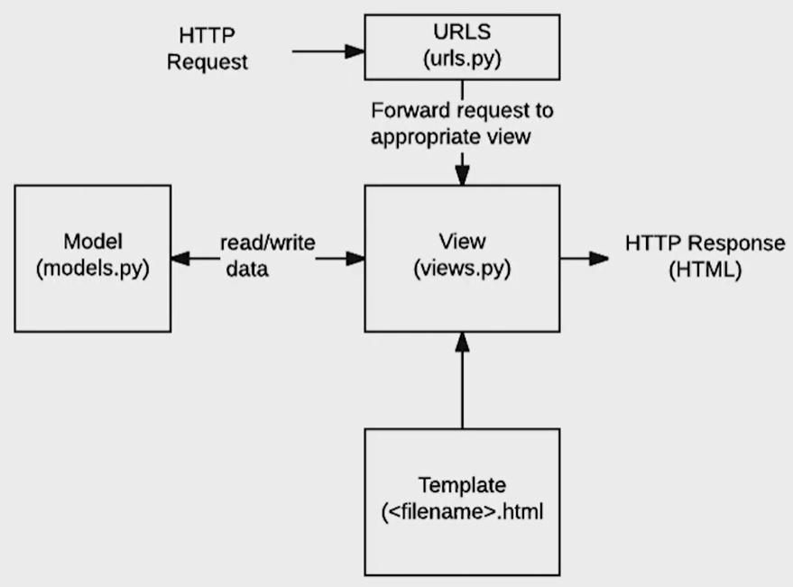
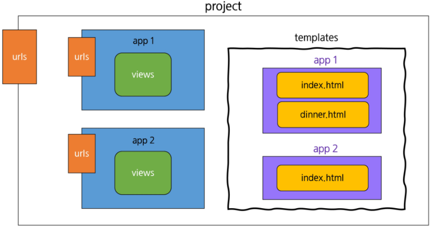
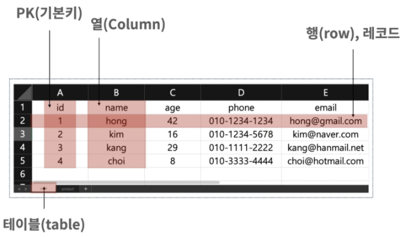
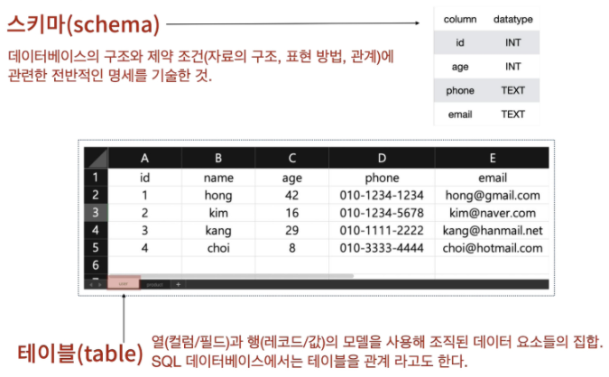
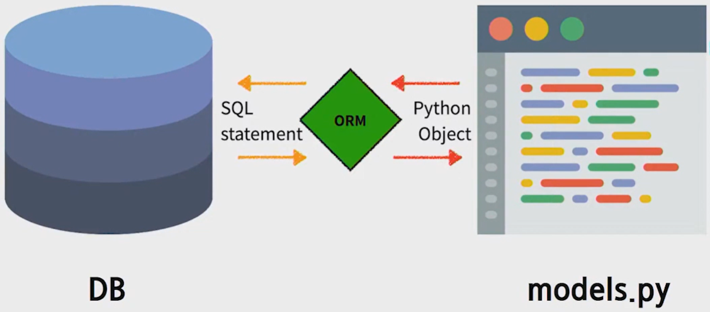
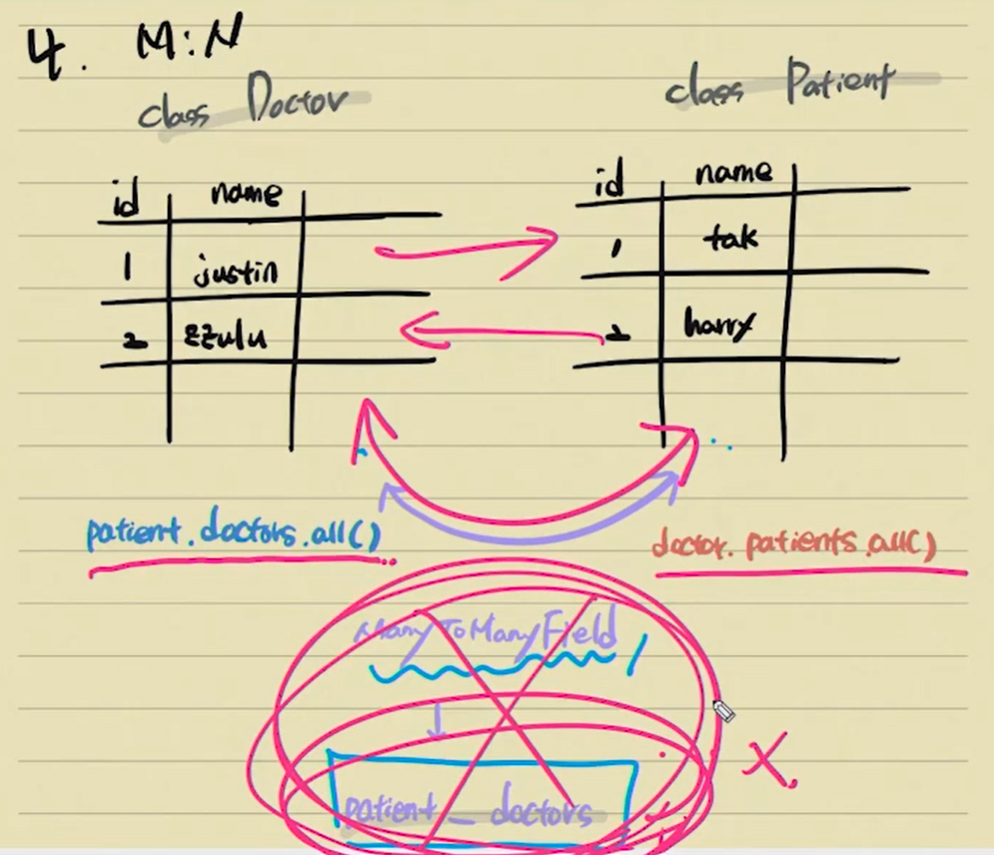
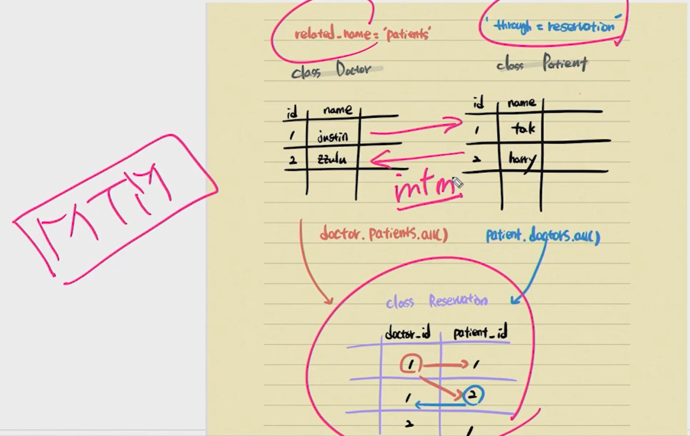
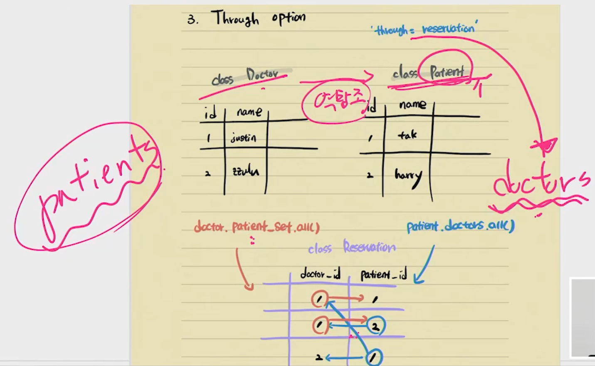

[TOC]

# 00_django_intro

> 파이썬으로 작성된 오픈소스 웹 어플리케이션 프레임워크. **모델-템플릿-뷰 패턴**
>
> **Model**(데이터 관리) - **Template**(인터페이스 : 화면) - **View**(중간 관리 : 상호 동작)



## Intro

> 1. git bash 해서 python version 3.7 확인 : `python -V`
> 2. vscode django extension 설치 및 설정 : ctrl+shift+p 후 json 검색 후, HTML 추가

**설치**

가장 최근 버전(Django 3.1) 설치

```bash
$ pip install django
```

- 특정 버전 설치

  ```bash
  $ pip install django==3.0.8
  ```

- 설치 확인

  ```bash
  $ pip list
  # python -m django --version (장고만 확인)
  ```


**프로젝트 생성**

> project 를 생성할 때, Python 이나 Django 에서 사용중인 이름은 피해야 한다. 
>
> `-` 도 사용할 수 없다. (ex. django, test, class, django-test...)

```bash
$ django-admin startproject first_project
```

- `first-project` 라는 이름으로 폴더가 생성

  - 여기 안에는 `first-project` 폴더와 `manage.py` 생성 되어짐.

    - first_project : 프로젝트 설정 파일들이 들어 있음

    - manage.py : 장고 명령어를 실행하기 위한 파일

      `python manage.py 장고명령어`

  - 가장 바깥에 있는 프로젝트 폴더명은 수정 가능 하나, setting 파일이 들어있는 폴더명은 건들이지 말자.

**서버 실행**

```bash
$ python manage.py runserver
```

- 로켓이 보임

**프로젝트 구조**

- `__init__.py`
  - 빈 파일
  - Python에게 이 디렉토리를 하나의 Python 패키지로 다루도록 지시
- `settings.py`
  - 웹사이트의 모든 설정을 포함
  - 우리가 만드는 어떤 application이라도 등록이 되는 곳이며, static files의 위치, database 세부 설정 등이 작성
- `urls.py`
  - 사이트의 url와 view의 연결을 지정
- `wsgi.py`
  - Web Server Gateway Interface
  - 장고 어플리케이션이 웹서버와 연결 및 소통하는 것을 도움
- `asgi.py`
  - new in 3.0
  - Asynchronous Server Gateway Interface
  - 장고 어플리케이션이 비동기식 웹 서버와 연결 및 소통하는 것을 도움


**Application (app)**

- 실제로 어떠한 역할을 해주는 친구가 app.
- 프로젝트는 이러한 어플리케이션의 집합이고, 실제 요청을 처리하고 페이지를 보여주고 하는 것들은 이 어플리케이션의 역할.
- 하나의 프로젝트는 여러 개의 app을 가질 수 있다.
  - app은 하나의 역할 및 기능 단위로 쪼개는 것이 일반적
  - 그러나 작은 규모의 서비스에서는 잘 나누지 않는다. 
  - 반드시 이렇게 나눠야 한다 같은 기준 또한 없다.
- **일반적으로 app 이름은 `복수형`으로 하는 것이 좋다.**

**Application 생성**

```bash
$ python manage.py startapp articles(앱이름)
```

- 해당 앱 이름으로 폴더가 생성된다. (앱 폴더)

**Application 구조**

- `admin.py`
  - 관리자용 페이지 관련 기능을 작성 하는 곳.
- `apps.py`
  - 앱의 정보가 있는 곳. 
  - 우리는 수정할 일이 없다.
- `models.py`
  - 앱에서 사용하는 Model(Database)를 정의하는 곳.
- `tests.py`
  - 테스트 코드를 작성하는 곳.
- `views.py`
  - view가 정의 되는 곳. 

**Application 등록**

> 반드시 **app 생성 후 등록** 순서를 지켜야한다.

- 방금 생성한 application을 사용하려면 장고 프로젝트에 등록을 해야 한다.

  ```python
  # settings.py
  
  INSTALLED_APPS = [
  	'articles', # 내가 생성한 app을 등록해줘야 한다.
      'django.contrib.admin',
      'django.contrib.auth',
      'django.contrib.contenttypes',
      'django.contrib.sessions',
      'django.contrib.messages',
      'django.contrib.staticfiles', # 마지막 요소에 , 있어야 한다.
  ]
  ```

  - INSTALLED_APPS의 app order

    ```python
    INSTALLED_APPS = [
        # 1. Local apps : 직접 생성한 app
        'blogs.apps.BlogsConfig',
    
        # 2. Third party apps
        'haystack',
    
        # 3. Django apps : 장고의 기본적인 app
        'django.contrib.admin',
        'django.contrib.auth',
        'django.contrib.contenttypes',
        'django.contrib.sessions',
        'django.contrib.sites',
    ]
    ```

- **Internationalization**

  ```python
  # settings.py
  
  LANGUAGE_CODE = 'ko-kr' # 소문자
  
  TIME_ZONE = 'Asia/Seoul' # 앞에만 대문자
  ```

  https://docs.djangoproject.com/en/3.1/topics/i18n/


**runserver** Automatic reloading

- 개발 서버는 요청이 들어올 때마다(코드가 저장될 때 마다) 자동으로 Python 코드를 다시 불러온다. 
- 코드의 변경사항을 반영하기 위해서 굳이 서버를 재가동 하지 않아도 된다. 
- 그러나, 파일을 추가하는 등의 몇몇의 동작(커스텀 필터, 새로운 모듈 추가 등)은 개발 서버가 자동으로 인식하지 못하기 때문에, 이런 상황에서는 서버를 재가동 해야 적용되는 경우도 있다.


### 여기 까지가 장고를 시작하기 위한 단계

---

### 이제 부터는 서버를 동작하기 위한 단계


## Url & Template

**urls.py**

- 장고 서버로 요청(request)이 들어오면, 그 요청이 어디로 가야하는지 인식하고 관련된 함수(view)로 넘겨준다. 경로 패턴 정의. **path(route, view, kwargs=None, name=None)**

- `views.py` 에서 만든 함수를 연결시켜준다.

  ```python
  # first_project/urls.py
  
  from django.contrib import admin
  from django.urls import path
  from articles import views # articles 라는 앱의 views 를 가져온다.
  
  urlpatterns = [
      path('admin/', admin.site.urls), # url 패턴 뒤에 / 꼭 있어야 한다.
      path('index/', views.index), # path('url 패턴/', 실행이 되어야 하는 views에 있는 함수, 해당 path의 별명)
  ]
  ```

  

**views.py**

- 함수를 정의
- return 은 꼭 필요하다.
  - render : 주로 templates 와 함께 response 할 때 사용되는 함수
- **render(request, template_name, context=None, content_type=None, status=None, using=None)**

```python
# articles/views.py
from django.shortcuts import render

def index(request): # 첫번째 인자는 반드시 request
		return render(request, 'index.html') # render의 첫번째 인자도 반드시 request
    

# 함수들 간 blank 는 2줄
```


**Templates**

- `views.py`에서 지정한 `index.html` 파일을 만들자. (html 틀)

- Django에서 template이라고 부르는 HTML 파일은 기본적으로 **app 폴더안의 templates 폴더 안에 위치**한다. 

  ```html
  <!-- articles/templates/index.html -->
  
  <h1>만나서 반갑습니다!</h1>
  ```


### 여기 까지가 기본 수정할 파일들 조작 방법

---

### 여기서 부터는 본격 장고 동작 정의 방법


## Template

> https://docs.djangoproject.com/ko/3.1/topics/templates/#context


### Template Variable

- `render()`를 사용하여 views.py에서 정의한 변수를 template(html) 파일로 넘겨 사용하는 것.

- `render()`의 세번째 인자로 `{'key': value}` 와 같이 딕셔너리 형태로 넘겨주며, 여기서 정의한 `key`에 해당하는 문자열이 template에서 사용 가능한 변수명이 된다.

  ```python
  # articles/views.py
  
  def dinner(request):
      menus = ['족발', '햄버거', '치킨', '초밥']
      pick = random.choice(menus)
      context = {
          'pick': pick, # {'key': value} -> {{ key }} 이렇게 value 를 보여준다.
      }
      return render(request, 'dinner.html', context)
  ```

  ```html
  <!-- articles/templates/dinner.html -->
  
  <h1>오늘 저녁은 {{ pick }}!</h1>
  ```

  

**django imports style guide**

> https://docs.djangoproject.com/en/3.1/internals/contributing/writing-code/coding-style/#imports

```python
# 1. standard library
import json

# 2. third-party
import bcrypt

# 3. Django
from django.http import Http404

# 4. local Django
from .models import LogEntry
```


### Variable Routing(동적 라우팅)

> url 주소 자체를 변수처럼 사용해서 동적으로 주소를 만드는 것
>
> 주소 요청 : `https://127.0.0.1:8000/hello/문자열`
>
> https://docs.djangoproject.com/en/3.1/topics/http/urls/#path-converters

```python
# first_project/urls.py

urlpatterns = [
    ... ,
    # 혹은 path('hello/<name>/', views.hello),
    path('hello/<str(타입):name(저장되는 변수명)>/', views.hello),
]              # int : 숫자형식으로 받음
```

- default 는 `str` 이기 때문에 생략 가능하다.

```python
# articles/views.py

def hello(request, name):
    context = {
        'name': name,
    }
    return render(request, 'hello.html', context)
```

```html
<!-- articles/templates/hello.html -->

<h1>안녕하세요, {{ name }}님!</h1> <!-- context 의 key 값을 사용하면 value 출력 -->
```


### Django Template Language (DTL)

> django template에서 사용하는 built-in template system이며,  조건, 반복, 변수 치환, 필터 등의 기능을 제공
>
> 프로그래밍적 로직이 아니라 프레젠테이션을 표현하기 위한 것
>
> 파이썬처럼 if, for 를 사용할 수 있지만, 단순히 python code 로 실행되는 것이 아님
>
> https://docs.djangoproject.com/ko/3.1/ref/templates/language/#tags
>
> https://docs.djangoproject.com/ko/3.1/ref/templates/builtins/#built-in-template-tags-and-filters

**syntax** 

- variables : `{{}}`

  - context에서 **값**을 출력하는데, context는 키를 **값**에 매핑하는 딕셔너리와 유사한 객체.

    변수 출력을 위한 문법.

- tags : ``

  - 특정 로직, 문법

    - for 태그

      - 반복을 위한 태그

        ```
        
        
        ```

      - for empty

        ```
        
        	값이 하나라도 있으면 여기가 실행
        
        	출력할 값이 없으면 출력
        
        ```

    - if 태그

      - 조건을 구분하기 위한 태그

        ```
        
        
        
        
        ```

      - and, or, not, ==, !=, <, >, <=, >=, in, not in, is, is not 연산자 모두 활용 가능

    - 나머지 기타 유용한 dtl 문서를 참고. (구글에서 찾을 때 바로 찾는 키워드 **django built in template**)

- filters : `{{ variable|filter }}`

  - 특정 변수의 출력 및 태그 인수의 값을 변형
    - 길이 : {{ 'abc'|length }}
    - 소문자 변환 : {{ 'abc'|lower }}
    - Title 형식 변환 : {{ 'abc'|title }}
    - 대문자 변환 : {{ 'abc'|capfrist }}
    - 단어, 문자 길이 제한 : {{ 'abc'|truncatewords:2 }}
    - 하이퍼링크 생성 : {{ 'abc'|urlize }}

- comments : `{# #}` or  주석할 내용 

  ```html
  <!-- <h1>{{ i * 2 }}</h1> -->
   <h1>{{ i * 2 }}</h1> 
  ```

  

---


## HTML Form

**Form**

- 웹에서 사용자 정보를 입력하는 여러(text, button, checkbox, file, hidden, image, password, radio, reset, submit) 방식을 제공하고, **사용자로부터 할당된 데이터를 서버로 전송하는 역할**을 담당하는 HTML 태그
- form은 한 페이지에서 다른 페이지로 데이터를 전달하기 위해서 사용한다.
- 핵심 속성 2가지
  - **action** —> 입력 데이터가 **전송될 URL** 지정
  - **method** —> 입력 데이터 **전달 방식** 지정

**Input**

- form 태그 중에서 가장 중요한 태그로 **사용자로부터 데이터를 입력 받기 위해** 사용된다.
- input 태그의 속성
  - `name` 
    - 중복 가능, form을 제출했을 때 name이라는 이름에 설정된 값을 넘겨서 값을 가져올 수 있다. 
    - 주요 용도는 GET/POST 방식으로 서버에 전달하는 파라미터(name 은 key , value 는 value)로 `?key=value&key=value` 형태로 전달된다.

**HTTP method `GET`**

> https://developer.mozilla.org/ko/docs/Web/HTTP/Methods

- 서버로부터 **정보를 조회**하는 데 사용한다. 
- 데이터를 서버로 전송할 때 body가 아닌 **`쿼리 스트링`을 통해 전송**한다. (url에서 확인 가능)
- **서버의 데이터나 상태를 변경 시키지 않아야 하기 때문에 조회(html)를 할 때 사용**한다. 
- 우리는 서버에 요청을 하면 HTML 문서 파일 한 장을 받는데 이때 사용하는 요청의 방식이 GET 방식이다.

```html
# action : 보내려는 목표 # method : http method (get / post)
<form action="" method="GET">

	input 데이터를 입력받게 적당히 코딩하면 됨.

	# 오락실 버튼
	<input type="button">
	
	# 미사일 버튼 (데이터를 action 으로 전송)
	<input type="submit">
			or
	<button></button>
</form>
```

```html
<!-- action에 들어가는 목표 url 설정 주의 사항!!!! -->

action="/catch/"
=> 127.0.0.1:8000/catch?name=asdf

현재 주소 : 127.0.0.1:8000/index
action="catch/"
=> 127.0.0.1:8000/index/catch?name=asdf
```


**throw & catch**

- throw

  ```python
  # first_project/urls.py
  
  path('throw/', views.throw),
  ```

  ```python
  # articles/views.py 
  
  def throw(request):
      return render(request, 'throw.html')
  ```

  ```html
  <!-- articles/templates/throw.html -->
  
  <form action="/catch/" method="GET">
    <label for="message">Throw</label>
    <input type="text" id="message" name="message"> <!-- id는 무조건 한 개! -->
    <input type="submit">
  </form>
  ```

- catch

  ```python
  # first_project/urls.py
  
  path('catch/', views.catch),
  ```

  ```python
  # articles/views.py
  
  def catch(request):
      message = request.GET.get('message') # throw 에서 보낸 form 데이터를 받기
      context = {
          'message': message,
      }
      return render(request, 'catch.html', context)
  ```

  ```django
  <!-- articles/templates/catch.html -->
  
  <h1>너가 던져서 내가 받은건 {{ message }}야!</h1>
  <a href="/throw/">뒤로</a>
  ```


**Request**

> https://docs.djangoproject.com/en/3.1/ref/request-response/#module-django.http

- 요청 간의 모든 정보를 담고 있는 변수
- 페이지가 요청되면 Django는 요청에 대한 메타 데이터를 포함하는 HttpRequest 객체를 만든다.
- 그런 다음 Django는 적절한 view 함수를 로드하고 HttpRequest를 뷰 함수의 첫 번째 인수로 전달합니다. 
- 그리고 각 view는 HttpResponse 개체를 반환한다.


---


## URL 분리

> 각 app 폴더에 urls.py를 각각 작성함으로써 코드 유지보수에 긍정적인 구조로 변경


**두번째 app 생성 및 등록**

```bash
$ python manage.py startapp pages
```

```python
INSTALLED_APPS = [
    'articles',
    'pages',
    ...,
]
```


**프로젝트 urls.py**

```python
# firstapp/urls.py

from django.urls import path, include


urlpatterns = [
    path('admin/', admin.site.urls),
    path('articles/', include('articles.urls')),
    path('pages/', include('pages.urls')),
]
```


`include()`

- 다른 URLconf(app1/urls.py)들을 참조할 수 있도록 도와준다.
- Django가 함수 `include()`를 만나게 되면, URL의 그 시점까지 일치하는 부분을 잘라내고, 남은 문자열 부분을 후속 처리를 위해 include 된 URLconf로 전달한다.


---


## URL Name

> path() 함수의 name value를 작성해 `` template tag로 호출



**url template tag**

> https://docs.djangoproject.com/en/3.1/ref/templates/builtins/#url

- django 는 path() 함수에서 name 인수(optional) 를 정의해, `` template tag 를 사용하여 URL 설정에 정의된 특정한 URL 경로들의 의존성을 제거할 수 있다.

  ```python
  # articles/urls.py
  
  urlpatterns = [
      path('index/', views.index, name='index'),
      path('dinner/', views.dinner, name='dinner'),
      path('hello/<str:name>/', views.hello, name='hello'),
      path('dtl-practice/', views.dtl_practice, name='dtl_practice'),
      path('throw/', views.throw, name='throw'),
      path('catch/', views.catch, name='catch'),
  ]
  ```

  ```django
  <!-- throw.html -->
  
  <body>
    <h1>Throw 페이지</h1>
    <form action="" method="GET">
      <label for="name">데이터 입력 : </label>
      <input type="text" id="name" name="name">
      <input type="submit">
    </form>
  </body>
  ```


---


## URL Namespace

- 예를 들어, articles app은 index 이라는 view를 가지고 있고, 동일한 프로젝트에 다른 app 에서도 index 이라는 view를 가지고 동일한 url name 을 사용할 수도 있다. 과연 Django가 `` 처럼 사용할 때, 어떤 app 의 view 에서 URL을 생성할지 알 수 있을까?

  ```python
  # articles/urls.py
  
  app_name = 'articles'
  urlpatterns = [
      ...
  ]
  ```

  ```python
  # pages/urls.py
  
  app_name = 'pages'
  urlpatterns = [
  ]
  ```

  - urls.py 에 app_name 을 통해 app 의 이름공간을 설정한다.
  - 이제 기존 모든 url 은 다음과 같이 변경할 수 있다.

  ```django
  <!-- throw.html -->
  
  <form action="" method="GET">
    ...
  </form>
  ```

  

---


## Django Namespace

> Namespace
>
> 이름공간 또는 네임스페이스(Namespace)는 객체를 구분할 수 있는 범위를 나타내는 말로 일반적으로 하나의 이름 공간에서는 하나의 이름이 단 하나의 객체만을 가리키게 된다.
>
> django에서는 서로 다른 app의 같은 이름을 가진 url name은 app_name을 설정해서 구분하고,
>
> templates, static 등 django는 정해진 경로 하나로 모아서 보기 때문에 중간에 폴더를 임의로 만들어 줌으로써 이름공간을 설정한다.


**파일트리 예시**

```
├── articles
│   ├── templates
│   │   └── articles
│   │       ├── catch.html
│   │       ├── dinner.html
│   │       ├── dtl_practice.html
│   │       ├── hello.html
│   │       ├── index.html
│   │       └── throw.html
```

```python
# articles/views.py 

return render(request, 'articles/index.html')
```


---


## Template Inheritance

> https://docs.djangoproject.com/ko/3.1/ref/templates/language/#template-inheritance


**템플릿 상속**

- 템플릿 상속을 사용하면 사이트의 모든 공통 요소를 포함하고, 하위 템플릿이 재정의(override) 할 수있는 블록(block)을 정의하는 기본 "스켈레톤" 템플릿을 만들 수 있다.

- 템플릿 상속은 기본적으로 코드의 재사용성에 초점을 맞춘다. 


**작성**

- `base.html` 파일을 `firstapp/templates/base.html` 에 생성 해보자.

- Django는 기본적으로 `app_name/templates` 를 바라보게 설정되어있다. (`APP_DIRS=True` 설정)

- 우리가 옮긴 위치는 `project폴더/templates` 이므로, Django는 현재 상태에서 해당 template 파일을 찾을 수 없다.

- 각 앱 내의 `templates` 폴더가 아닌 임의의 위치에 있는 template을 읽기 위해서는 Django에서 그 위치를 알려줘야 한다.

  ```python
  TEMPLATES = [
      {
          'BACKEND': 'django.template.backends.django.DjangoTemplates',
          'DIRS': [BASE_DIR / 'first_project' / 'templates'],
          ...,
  ]
  ```


**[참고] Path()** 

> os 마다 경로를 표기하는 `/` , `\` 로 다를 수 있음. (ex. WINDOWS) 
>
> 어떤 환경에서건 `/` 로 경로 표기(unix path)를 통일하기 위해 사용
>
> https://docs.python.org/ko/3/library/pathlib.html#module-pathlib


**템플릿 상속을 위한 기본 세팅**

- 프로젝트 폴더에서 `templates` 폴더 만든 후에 `base.html` 파일 생성

  ```django
  <!-- firstapp/templates/base.html -->
  
  <!DOCTYPE html>
  <html lang="en">
  <head>
    <meta charset="UTF-8">
    <meta name="viewport" content="width=device-width, initial-scale=1.0">
    <link rel="stylesheet" href="<https://stackpath.bootstrapcdn.com/bootstrap/4.5.2/css/bootstrap.min.css>" integrity="sha384-JcKb8q3iqJ61gNV9KGb8thSsNjpSL0n8PARn9HuZOnIxN0hoP+VmmDGMN5t9UJ0Z" crossorigin="anonymous">
    <title>Document</title>
  </head>
  <body>
    <h1 class="text-center">Template Inheritance</h1>
    <hr>
    <div class="container">
      
      
    </div>
    <script src="<https://code.jquery.com/jquery-3.5.1.slim.min.js>" integrity="sha384-DfXdz2htPH0lsSSs5nCTpuj/zy4C+OGpamoFVy38MVBnE+IbbVYUew+OrCXaRkfj" crossorigin="anonymous"></script>
    <script src="<https://cdn.jsdelivr.net/npm/popper.js@1.16.1/dist/umd/popper.min.js>" integrity="sha384-9/reFTGAW83EW2RDu2S0VKaIzap3H66lZH81PoYlFhbGU+6BZp6G7niu735Sk7lN" crossorigin="anonymous"></script>
    <script src="<https://stackpath.bootstrapcdn.com/bootstrap/4.5.2/js/bootstrap.min.js>" integrity="sha384-B4gt1jrGC7Jh4AgTPSdUtOBvfO8shuf57BaghqFfPlYxofvL8/KUEfYiJOMMV+rV" crossorigin="anonymous"></script>
  </body>
  </html>
  ```


**`block` tag**

- 하위 템플릿에서 재 지정(overriden)할 수있는 블록을 정의
- 하위 템플릿이 채울 수 있는 공간


**`extends` tag**

> https://docs.djangoproject.com/ko/3.1/ref/templates/builtins/#std:templatetag-extends

- 이(자식) 템플릿이 부모 템플릿을 확장한다는 것을 알림

- `` 는 반드시 문서의 최상단에 위치해야 한다.

  ```django
  
  
  
    <h1>안녕하세요! 반갑습니다!!</h1>
  
  ```


**django 설계 철학 (Template)**

> https://docs.djangoproject.com/ko/3.1/misc/design-philosophies/#template-system

- 표현과 로직(view)을 분리

  - 우리는 템플릿 시스템이 `표현`을 제어하는 도구이자 표현에 관련된 로직일 뿐이라고 본다. 
  - 템플릿 시스템은 이러한 기본 목표를 넘어서는 기능을 지원하지 말아야 한다,

- 중복을 배제

  - 대다수의 동적 웹사이트는 공통 헤더, 푸터, 네이게이션 바 같은 사이트 공통 디자인을 갖는다. 

    Django 템플릿 시스템은 이러한 요소를 한 곳에 저장하기 쉽게 하여 중복 코드를 없애야 한다.

  - 이것이 `템플릿 상속`의 기초가 되는 철학


[TOC]

# 01_django_model

> 2020.08.19

## Model Intro

**Model 개념** : DB에 데이터를 저장하고 가져오는 것

- 모델은 단일한 **데이터에 대한 정보**를 가지고 있다.
- 필수적인 필드(컬럼)와 데이터(레코드)에 대한 정보를 포함한다.
- 일반적으로 각각의 **모델(클래스)**는 단일한 데이터베이스 **테이블과 매핑**된다.
- 모델은 부가적인 메타데이터를 가진 **DB의 구조(layout)를 의미**
- 사용자가 저장하는 **데이터들의 필수적인 필드와 동작(behavior)** 포함
- django 는 model 을 통해 데이터에 접속하고 관리


**DB의 기본 구조**



- 데이터베이스 (DB)

  - 체계화된 데이터의 모임

- 쿼리(Query)

  - 데이터를 조회하기 위한 명령어
  - (주로 테이블형 자료구조에서) 조건에 맞는 데이터를 추출하거나 조작(수정,삭제)하는 명령어
  - Query를 날린다 → 데이터를 DB에 요청 → 응답 데이터는 QuerySet (Model의 인스턴스)




- 스키마 (Schema) / 뼈대(Structure)

  - 데이터베이스에서 자료의 구조, 표현 방법, 관계 등을 정의한 구조
  - 데이터베이스 관리 시스템(DBMS)이 주어진 설정에 따라 데이터베이스 스키마를 생상하며, 데이터베이스 사용자가 자료를 저장, 조회, 삭제, 변경할 때 DBMS는 자신이 생성한 데이터베이스 스키마를 참조하여 명령을 수행

- 테이블 (Table) / 관계(Relation)

  - 필드(field): 속성, 컬럼(Column)

    - 모델 안에 정의한 클래스에서 클래스 변수가 필드가 된다.

  - 레코드(record): 튜플, 행(Row)

    - 우리가 ORM을 통해 해당하는 필드에 넣은 데이터(값)을 의미한다.

- PK(기본키) : 각 행의 고유값. 반드시 설정하여야 한다.

    

------


## ORM

 

**개념** : 쉽게 말해 통역기. 쿼리를 python에서 object로 사용할 수 있게 해줌

- "Object-Relational-Mapping 은 객체 지향 프로그래밍 언어를 사용하여 호환되지 않는 유형의 시스템간에(Django - SQL)데이터를 변환하는 프로그래밍 기술이다. 이것은 프로그래밍 언어에서 사용할 수 있는 '가상 객체 데이터베이스'를 만들어 사용한다."

- OOP 프로그래밍에서 RDBMS을 연동할 때, 데이터베이스와 객체 지향 프로그래밍 언어 간의 호환되지 않는 데이터를 변환하는 프로그래밍 기법이다. 객체 관계 매핑이라고도 부른다.
- 객체 지향 언어에서 사용할 수 있는 '가상' 객체 데이터베이스를 구축하는 방법이다.
- 현대 대부분의 프레임워크는 ORM 사용


**장/단점**

- 장점
  - SQL(select * from table ;)을 몰라도 DB 연동이 가능하다. (SQL 문법을 몰라도 쿼리 조작 가능)
  - SQL의 절차적인 접근이 아닌 객체 지향적인 접근으로 인해 `생산성`이 증가한다.
  - ORM은 독립적으로 작성되어 있고, 해당 객체들을 재활용할 수 있다. 때문에 모델에서 가공된 데이터를 컨트롤러(view)에 의해 뷰(template)과 합쳐지는 형태로 디자인 패턴을 견고하게 다지는데 유리
- 단점
  - ORM 만으로 완전한 서비스를 구현하기 어렵다.
  - 프로젝트의 복잡성이 커질 경우 설계 난이도가 상승할 수 있다.


**정리**

- 객체 지향 프로그래밍에서 DB를 편리하게 관리하게 위해 ORM 프레임워크를 도입
- **"우리는 DB를 객체(object)로 조작하기 위해 ORM을 사용한다."**


------


## Model

**프로젝트 시작**

> 01_django_model 폴더 안에서 진행

```bash
$ django-admin startproject crud 
$ cd crud
$ python manage.py startapp articles
```

```python
# crud/settings.py

INSTALLED_APPS = [
    'articles',	
		...
]
```


**models.py 정의**

```python
# articles/models.py

class Article(models.Model): # 상속. Article = 테이블명
    # id는 기본적으로 처음 테이블 생성시 자동으로 만들어진다.
    title = models.CharField(max_length=10) # 클래스 변수(DB의 필드). 열 = 타입
    content = models.TextField() 
    created_at = models.DateTimeField(auto_now_add=True)
```


**대표 필드**

- `CharField(max_length=None, **options)`

  - 길이의 제한이 있는 문자열을 넣을 때 사용
  - CharField의 max_length는 필수 인자
  - **필드의 최대 길이(문자),** 데이터베이스 레벨과 Django의 유효성 검사(값을 검증하는 것)에서 활용
  - 문자열 필드 → 텍스트 양이 많을 경우 `TextField()` 사용
  - 기본 양식 위젯은 **TextInput**

- `TextField(**options)`

  - **글의 수가 많을 때 사용**
  - max_length 옵션을 주면 자동양식필드의 textarea 위젯에 반영은 되지만 모델과 데이터베이스 수준에는 적용되지 않는다. (CharField 를 사용)
  - 기본 양식 위젯은 **Textarea**

- `DateTimeField(auto_now=False, auto_now_add=False, **options)`

  - 최초 생성 일자

    - `auto_now_add=True`

    - django ORM이 **최초 insert(테이블에 데이터 입력)시**에만 **현재 날짜와 시간으로 갱신(테이블에 어떤 값을 최초로 넣을 때)**
  - 최종 수정 일자

    - `auto_now=True`
    - django ORM이 **save를 할 때마다 현재 날짜와 시간으로 갱신**

- `IntegerField`
- `BooleanField`

Django 공식 문서 Model field 라고 구글링하면 찾을 수 있음

------


## Migrations

>  django가 모델에 생긴 변화(필드를 추가했다던가 모델을 삭제했다던가 등)를 반영하는 방법.
>
>  DB 생성. 클래스를 다 정의하면 반드시 해야만 하는 일!!!


**makemigrations**

> migration 파일은 데이터베이스 스키마를 위한 버전관리 시스템이라 생각하자

- 모델을 변경한 것에 기반한 새로운 마이그레이션을 만들 때 사용
- 모델을 활성화 하기 전에 DB 설계도(마이그레이션) 작성
- app 이름을 뒤에 적으면 해당 app에 있는 models.py의 내용만 설계도를 만듦
- migrations 폴더 안에 정의한 class를 토대로 Django ORM이 우리에게 만들어준 설계도 확인

```bash
$ python manage.py makemigrations
```

- `0001_initial.py` 생성 확인

```python
class Article(models.Model):
    title = models.CharField(max_length=10)
    content = models.TextField()
    created_at = models.DateTimeField(auto_now_add=True)
    updated_at = models.DateTimeField(auto_now=True)
```

```bash
$ python manage.py makemigrations
```


**migrate**

> 설계도를 실제 DB에 반영하는 과정

- 기존에 내가 `[models.py](<http://models.py>)` 에 정의하지 않았던 테이블은 장고가 기존에 미리 만들어 놓은 테이블

- `migrate` 는 `makemigrations` 로 만든 설계도를 실제 `db.sqlite3` DB에 반영한다.

- app 이름을 적으면 해당 app에 작성된 migration 파일들을 기반으로 실제 DB에 반영

- 모델에서의 변경 사항들과 DB의 스키마가 동기화를 이룬다.

  ```bash
  $ python manage.py migrate
  ```


**sqlmigrate**

- 해당 migrations 설계도가 SQL 문으로 어떻게 해석되어서 동작할지 미리 확인 할 수 있다.

  ```bash
  $ python manage.py sqlmigrate app_name 0001
  ```


**showmigrations**

- migrations 설계도들이 migrate 됐는지 안됐는지 여부를 확인 할 수 있다.

  ```bash
  $ python manage.py showmigrations
  ```

  

**Model 중요 3단계**

- `models.py` : 변경사항 발생 (생성 / 수정)
- `makemigrations` : migration 파일 만들기 (설계도)
- `migrate` : DB에 적용 (테이블 생성)


**실제 DB 테이블 확인**

- vs code extension - sqlite3 검색 후 설치

  - `F1` → `sqlite` 검색 후 Open Database 클릭 → `db.sqlite3` 클릭 → 왼쪽 EXPLORER 하단에 보면 `SQLITE EXPLORER` 라고 되어있는 거 클릭

- 테이블을 확인해보면 `articles_article`이라는 이름으로 테이블 생성

  - INSTALLED_APPS 중 몇몇은 최소 하나 이상의 DB 테이블을 사용하기 때문에 migrate 와 함께 테이블이 만들어진다.

  - 테이블의 이름은 app의 이름과 model 의 이름이 조합(모두 소문자)되어 자동으로 생성된다. (소문자)

    - `app이름(articles)_소문자 모델이름(article)`

    

------


## Database API

> django가 기본적으로 orm을 제공함에 따른 것으로 db를 편하게 조작할 수 있도록 도와줌


**Django shell**

- 일반 파이썬 쉘을 통해서는 장고 프로젝트 환경에 접근할 수 없음

- 그래서 장고 프로젝트 설정이 로딩된 파이썬 쉘을 활용

- Django 프로젝트 내의 각종 모듈 패키지를 활용 할 수 있다.

  ```bash
  $ pip install ipython django-extensions
  ```

  ```python
  # settings.py
  
  INSTALLED_APPS = [
      ...
      'django_extensions',
      ...
  ]
  ```

  ```bash
  $ python manage.py shell_plus
  ```


**DB API 구문**

> https://docs.djangoproject.com/en/3.1/ref/models/querysets/#queryset-api-reference
>
> https://docs.djangoproject.com/en/3.1/topics/db/queries/#making-queries


```
모델클래스이름.objects.QuerySetAPI

Article.objects.all()
 * objects : s를 내비두고 놀지 말자. 항상 같이 델고 다니자!!
```


**`objects` Manager**

> https://docs.djangoproject.com/en/3.1/topics/db/managers/#managers
>
> Django 모델에 데이터베이스 쿼리 작업이 제공되는 인터페이스

- Model Manager와 Django Model 사이의 ***Query 연산의 인터페이스 역할\*** 을 해주는 친구
- 즉, `models.py` 에 설정한 클래스(테이블)을 불러와서 사용할 때 DB와의 interface 역할을 하는 매니저 
- ORM이 클래스로 만든 인스턴스 객체와 db를 연결하는데 그 사이에서 통역 역할을 하는게 ORM의 역할이라고 생각하면 된다. 즉, DB를 Python class로 조작할 수 있는 manager
  - **Python Class(`models.py`) ——— objects ——— DB**
- Django는 기본적으로 모든 Django 모델 클래스에 대해 '`objects`' 라는 Manager(django.db.models.Manager) 객체를 자동으로 추가한다.
- Manager(objects)를 통해 특정 데이터를 조작(메서드)할 수 있다.


**QuerySet**

> 데이터베이스로부터 데이터를 읽고, 필터를 걸거나 정렬 등을 수행
>
> 쿼리(질문)를 DB에게 던져서 글을 읽거나, 생성하거나, 수정하거나, 삭제

- 데이터베이스에서 전달 받은 객체의 목록
- django orm에서 발생한 자료형
- objects를 사용하여 복수의 데이터를 가져오는 함수를 사용할 때 반환되는 객체
- 단일한 객체를 리턴할 때는 테이블(Class)의 인스턴스로 리턴됨


---


# **CRUD**

> 대부분의 컴퓨터 소프트웨어가 가지는 기본적인 데이터 처리 기능인 
> Create(생성), Read(읽기), Update(갱신), Delete(삭제)를 묶어서 일컫는 말
>
> 이러한 4개의 조작을 모두 할 수 없다면 그 소프트웨어는 완전하다고 할 수 없다. 
>
> 이들 기능은 매우 기본적이기 때문에, 한 묶음으로 설명되는 경우가 많다.
>
> https://ko.wikipedia.org/wiki/CRUD


## Create

**기초 설정**

- `articles_article` 테이블을 사용하기 위해서는 `import` 가 필요하다.

```python
# DB에 앤스턴스 객체를 얻기 위한 쿼리문 날리기
>>> Article.objects.all()
<QuerySet []>
```


**데이터 객체를 만드는(생성하는) 3가지 방법**

**첫번째 방식**

- ORM을 쓰는 이유는 DB 조작을 객체 지향 프로그래밍(클래스)처럼 하기 위해
  - `article = Article()` :  모델 클래스로부터 인스턴스 생성
  - `article.title` : 인스턴스로 클래스 변수에 접근해 해당 인스턴스 변수를 변경
  - `article.save()` : 인스턴스로 메소드를 호출

```python
>>> article = Article() # Article(class)로부터 article(instance)
>>> article
<Article: Article object (None)>

>>> article.title = 'first' # 인스턴스 변수(title)에 값을 할당 / 변경
>>> article.content = 'django!' # 인스턴스 변수(content)에 값을 할당 / 변경

# save 를 하지 않으면 아직 DB에 값이 저장되지 않음
>>> article
<Article: Article object (None)>

>>> Article.objects.all()                            
<QuerySet []>

# save 를 하고 확인하면 저장된 것을 확인할 수 있다
>>> article.save() # 메서드 호출 -> DB에 실제로 저장
>>> article
<Article: Article object (1)>
>>> Article.objects.all()
<QuerySet [Article: Article object (1)]>

# 인스턴스인 article을 활용하여 변수에 접근해보자(저장된걸 확인)
>>> article.title
'first'
>>> article.content
'django!'
>>> article.created_at
datetime.datetime(2019, 8, 21, 2, 43, 56, 49345, tzinfo=<UTC>)
```


**두번째 방식**

- 함수에서 keyword 인자를 넘기는 방식과 동일

```python
>>> article = Article(title='second', content='django!!')

# 아직 저장이 안되어 있음
>>> article
<Article: Article object (None)>

# save를 해주면 저장이 된다.
>>> article.save() # 메서드 호출 -> DB에 실제로 저장
>>> article
<Article: Article object (2)>
>>> Article.objects.all()
<QuerySet [<Article: Article object (1)>, <Article: Article object (2)>]>

# 값을 확인해보자
>>> article.pk
2
>>> article.title
'second'
>>> article.content
'django!'
```


**세번째 방식**

- `create()` 를 사용하면 쿼리셋 객체를 생성하고 저장하는 로직이 한번의 스텝으로 가능

```python
>>> Article.objects.create(title='third', content='django!')
<Article: Article object (3)>
**__str__**
```


`__str__`

- 모든 모델마다 표준 파이썬 클래스의 메소드인 **str**() 을 정의하여 각각의 object가 사람이 읽을 수 있는 문자열을 반환(return)하도록 한다.

  ```python
  class Article(models.Model):
      title = models.CharField(max_length=10)
      content = models.TextField()
      created_at = models.DateTimeField(auto_now_add=True)
      updated_at = models.DateTimeField(auto_now=True)
  
      def __str__(self):
          return self.title
  ```


**`save()`**

> https://docs.djangoproject.com/en/3.1/ref/models/instances/#saving-objects

- `.save()` 메서드 호출을 통해 데이터를 DB에 저장한다.


## Read

`all()`

> https://docs.djangoproject.com/en/3.1/ref/models/querysets/#all

- `QuerySet` return
- 리스트는 아니지만 리스트와 거의 비슷하게 동작

```python
>>> Article.objects.all()
<QuerySet [<Article: Article object (1)>, <Article: Article object (2)>, <Article: Article object (3)>, <Article: Article object (4)>]>
get()
```


`get()`

>  https://docs.djangoproject.com/en/3.1/ref/models/querysets/#get

- `Object` return

- 객체가 없으면 `DoesNotExist` 에러가 나오고 

  객체가 여러 개일 경우에 `MultipleObjectReturned` 오류를 띄움.

- 위와 같은 특징을 가지고 있기 때문에 unique 혹은 Not Null 특징을 가지고 있으면 사용할 수 있다.

```python
>>> article = Article.objects.get(pk=100)
DoesNotExist: Article matching query does not exist.

>>> Article.objects.get(content='django!')
MultipleObjectsReturned: get() returned more than one Article -- it returned 2!
**filter()**
```


`filter()`

>  https://docs.djangoproject.com/en/3.1/ref/models/querysets/#filter

- 지정된 조회 매개 변수와 일치하는 객체를 포함하는 새 QuerySet을 반환

  ```python
  >>> Article.objects.filter(content='django!')
  <QuerySet [<Article: first>, <Article: fourth>]>
  
  >>> Article.objects.filter(title='first')
  <QuerySet [<Article: first>]>
  ```


**The `pk` lookup shortcut**

> https://docs.djangoproject.com/en/3.1/topics/db/queries/#the-pk-lookup-shortcut

- 또한, 우리가 `.get(id=1)` 형태 뿐만 아니라 `.get(pk=1)` 로 사용할 수 있는 이유는(DB에는 id로 필드 이름이 지정 됨에도) `.get(pk=1)` 이`.get(id__exact=1)` 와 동일한 의미이기 때문이다. 

- pk는 `id__exact` 의 shortcut 이다.

  ```python
  >>> Blog.objects.get(id__exact=14) # Explicit form
  >>> Blog.objects.get(id=14) # __exact is implied
  >>> Blog.objects.get(pk=14) # pk implies id__exact
  ```


## Update

- article 인스턴스 객체 생성
- `article.title = 'byebye'` : article 인스턴스 객체의 인스턴스 변수에 접근하여 기존의 값을 `byebye` 로 변경
- `article.save()` : article 인스턴스를 활용하여 `save()` 메소드 실행

```python
# UPDATE articles SET title='byebye' WHERE id=1;
>>> article = Article.objects.get(pk=1)
>>> article.title
'first'

# 값을 변경하고 저장
>>> article.title = 'byebye'
>>> article.save()

# 정상적으로 변경된 것을 확인
>>> article.title
'byebye'
```


## Delete

- article 인스턴스 생성후 `.delete()` 메서드 호출

```python
>>> article = Article.objects.get(pk=1)

# 삭제
>>> article.delete()
(1, {'articles.Article': 1})

# 다시 1번 글을 찾으려고 하면 없다고 나온다.
>>> Article.objects.get(pk=1)
DoesNotExist: Article matching query does not exist.
```


---


# Admin

**개념**

- 사용자가 아닌 서버의 관리자가 활용하기 위한 페이지
- Article class를 `admin.py` 에 등록하고 관리
- `django.contrib.auth` 모듈에서 제공하는 것 → Django에서 제공되는 Authentication 인증 프레임워크
- record 생성 여부 확인에 매우 유용하고 CRUD 로직을 확인하기에 편리하다.


**관리자 생성**

- 관리자 계정 생성 후 서버를 실행한 다음 `/admin` 으로 가서 관리자 페이지 로그인

- 계정만 만들면 실제로 Django 관리자 화면에서 아무 것도 보이지 않는다.

- `admin.py` 로 가서 관리자 사이트에 등록하여 내가 만든 record를 보기 위해서는 Django 서버에 등록

- 처음에 auth 관련된 기본 테이블이 생성되지 않으면 관리자를 생성할 수 없다.

  ```bash
  $ python manage.py createsuperuser
  ```


**admin 페이지 확인**

- admin 사이트에 방문해서 우리가 현재까지 작성한 글들을 확인 해보자.
- `admin.py` 는 관리자 사이트에 Article 객체가 관리 인터페이스를 가지고 있다는 것을 알려주는 것이다.
- 이렇게 admin 사이트에 등록된 모습이 어딘가 익숙하다? 바로 `models.py` 에 정의한 `__str__` 의 형태로 객체가 표현된다. (`list_display` 를 설정하지 않은 경우 1개의 column으로 표현됨)
- 실제로 `__str__` 부분을 주석처리 하고 reload를 하면 객체 자체가 출력 되는 것을 볼 수 있다.


**작성**

```python
# articles/admin.py

from django.contrib import admin
from .models import Article # 명시적 상대경로 표현. 현재 같은 위치에 있는 models.py로부터 모델을 import 하겠다.

admin.site.register(Article)

```


------


[TOC]

# 02_django_crud

> 2020.08.21

## 사전 준비

**템플릿 폴더 구조 및 url 분리**

- `articles/urls.py` 파일 생성

  ```python
  # articles/urls.py
  
  from django.urls import path
  
  app_name = 'articles'
  urlpatterns = [
    
  ]
  ```

- 프로젝트 폴더 url 설정

  ```python
  # crud/urls.py
  
  from django.contrib import admin
  from django.urls import path, include
  
  urlpatterns = [
      path('admin/', admin.site.urls),
      path('articles/', include('articles.urls')),
  ]
  ```


**`base.html` 설정**

```html
<!-- crud/templates/base.html -->

<!DOCTYPE html>
<html lang="en">
<head>
  <meta charset="UTF-8">
  <meta name="viewport" content="width=device-width, initial-scale=1.0">
  <title>Document</title>
  <link rel="stylesheet" href="<https://stackpath.bootstrapcdn.com/bootstrap/4.5.0/css/bootstrap.min.css>"
    integrity="sha384-9aIt2nRpC12Uk9gS9baDl411NQApFmC26EwAOH8WgZl5MYYxFfc+NcPb1dKGj7Sk" crossorigin="anonymous">
</head>
<body>
  <div class="container">
    
    
  </div>
  <script src="<https://code.jquery.com/jquery-3.5.1.slim.min.js>"
    integrity="sha384-DfXdz2htPH0lsSSs5nCTpuj/zy4C+OGpamoFVy38MVBnE+IbbVYUew+OrCXaRkfj" crossorigin="anonymous">
  </script>
  <script src="<https://cdn.jsdelivr.net/npm/popper.js@1.16.0/dist/umd/popper.min.js>"
    integrity="sha384-Q6E9RHvbIyZFJoft+2mJbHaEWldlvI9IOYy5n3zV9zzTtmI3UksdQRVvoxMfooAo" crossorigin="anonymous">
  </script>
  <script src="<https://stackpath.bootstrapcdn.com/bootstrap/4.5.0/js/bootstrap.min.js>"
    integrity="sha384-OgVRvuATP1z7JjHLkuOU7Xw704+h835Lr+6QL9UvYjZE3Ipu6Tp75j7Bh/kR0JKI" crossorigin="anonymous">
  </script>
</body>
</html>
```

```python
# crud/settings.py

'DIRS': [BASE_DIR / 'crud' / 'templates'],
```


**기본 페이지 설정**

```python
# articles/urls.py

from django.urls import path
from . import views

app_name = 'articles'
urlpatterns = [
    path('', views.index, name='index'),
]


# articles/views.py

def index(request):
    return render(request, 'articles/index.html')
```

```django
<!-- templates/articles/index.html -->




  <h1 class="text-center">Articles</h1>

```


---


## READ

**`index.html` 수정**

```python
# articles/views.py

from .models import Article

def index(request):
    articles = Article.objects.all()
    context = {
        'articles': articles,
    }
    return render(request, 'articles/index.html', context)
```

```django
<!--templates/articles/index.html-->




  <h1 class="text-center">Articles</h1>
  <hr>
  
    <p>글 번호: {{ article.pk }}</p>
    <p>글 제목: {{ article.title }}</p>
    <p>글 내용: {{ article.content }}</p>
    <hr>
  

```


---


## CREATE

### New

```python
# articles/urls.py

path('new/', views.new, name='new'),
```

```python
# articles/views.py

def new(request):
    return render(request, 'articles/new.html')
```

```django
<!-- templates/articles/new.html -->




  <h1 class="text-center">NEW</h1>
  <form action="#" method="GET">
    <label for="title">Title: </label>
    <input type="text" name="title"><br>
    <label for="content">Content: </label>
    <textarea name="content" cols="30" rows="5"></textarea><br>
    <input type="submit">
  </form>
  <hr>
  <a href="">[back]</a>

```

```django
<!-- templates/articles/index.html -->




  <h1 class="text-center">Articles</h1>
  <a href="">[new]</a>
  <hr>

```


### Create

```python
# article/urls.py

path('create/', views.create, name='create'),
```

```python
def create(request):
    title = request.GET.get('title') 
    content = request.GET.get('content')
    
		# 1.
		# article = Article()
		# article.title = title
		# article.content = content
		# article.save()
		
		# 2. 
    # Article.objects.create(title=title, content=content)
		
    article = Article(title=title, content=content)
    article.save()
    return render(request, 'articles/create.html')
```

```django
<!-- templates/articles/create.html -->




  <h1 class='text-center'>성공적으로 글이 작성되었습니다.</h1>

```

```django
<!-- templates/articles/index.html -->




  <h1 class="text-center">NEW</h1>
  <form action="" method="GET">
    <label for="title">Title: </label>
    <input type="text" name="title"><br>
    <label for="content">Content: </label>
    <textarea name="content" cols="30" rows="5"></textarea><br>
    <input type="submit">
  </form>
  <hr>
  <a href="">[back]</a>

```


**게시글 순서 변경**

- `#1`의 경우 기존에 DB에 있는 순서를 파이썬이 변경한다.

- `#2` 의 경우 DB가 변경한다. (2번으로 진행)

- 참고로, `order_by` 는 단일 쿼리에서는 사용할 수 없고 QuerySet 에서만 사용 가능하다.

  ```python
  # articles/views.py
  
  def index(request):
      # 1. articles = Article.objects.all()[::-1]	 # 파이썬이 변경
      # 2. articles = Artile.objects.order_by('-pk')  # DB에서 변경
  ```

- 이제 글이 작성되면 create.html 이 아닌 index.html 로 돌아가게 해보자

  ```python
  # articles/views.py
  
  def create(request):
      ...
      
      return render(request, 'articles/index.html')
  ```


---


### Http Method POST

> https://developer.mozilla.org/ko/docs/Web/HTTP/Methods/POST

- **3가지 이유에서 우리는 글을 작성할 때 GET 요청이 아닌 POST 요청을 해야 한다.**

  1. 사용자는 Django에게 '**HTML 파일 줘(GET)**' 가 아니라 '**~한 레코드(글)을 생성해(POST)**' 이기 때문에 GET보다는 POST 요청이 맞다.

  2. 데이터는 URL에 직접 노출되면 안된다. (우리가 주소창으로 접근하는 방식은 모두 GET 요청) query의 형태를 통해 DB schema를 유추할 수 있다.

  3. 모델(DB)을 건드리는 친구는 GET이 아닌 POST 요청! 왜? 중요하니까 **최소한의 신원 확인**이 필요하다!

     

- POST 요청은 리소스를 생성/변경하기 위해 데이터를 HTTP body에 담아 전송한다.

  - GET → CRUD에서 R에 해당
  - POST → CRUD에서 C/U/D에 해당

- 서버의 데이터나 상태를 변경 시키기 때문에 동일한 요청을 여러 번 전송해도 응답의 결과는 다를 수 있다.

  - 데이터가 생성/수정/삭제 되기 때문에 매번 다른 응답이 온다.

- 원칙적으로 POST 요청을 html 파일로 응답하면 안된다.

  - GET 요청만 html 파일로 응답하고 POST 요청은 GET 요청을 받는 페이지로 **redirect** 해야 한다.


**DB 조작(GET/POST)**

- GET 요청은 DB에서 데이터를 꺼내서 가져온다. 즉, DB에 변화를 주는 게 아니다.
  - 즉, **GET**은 누가 요청해도 어차피 정보를 조회(HTML 파일을 얻는 것)하기 때문에 문제가 되지 않음.
- POST 요청은 DB에 조작(생성/수정/삭제)를 하는 것(디비에 변화를 준다)
  - **POST**는 DB에 조작이 가해지기 때문에 요청자에 대한 최소한의 검증을 하지 않으면 아무나 DB에 접근해서 데이터에 조작을 가할 수 있다.
  - `csrf_token`을 통해서 요청자의 최소한의 신원확인을 한다.


**`new.html` 수정**

```django
<!-- templates/articles/new.html -->




  <h1 class="text-center">NEW</h1>
  <form action="" **method="POST"**>
    
    <label for="title">Title: </label>
    <input type="text" name="title"><br>
    <label for="content">Content: </label>
    <textarea name="content" cols="30" rows="5"></textarea><br>
    <input type="submit">
  </form>
  <hr>
  <a href="">[back]</a>

```

```python
# articles/views.py

def create(request):
    title = request.POST.get('title') 
    content = request.POST.get('content') 

    article = Article(title=title, content=content)
    article.save()
    return render(request, 'articles/index.html')
```


**CSRF Token**

> [https://ko.wikipedia.org/wiki/%EC%82%AC%EC%9D%B4%ED%8A%B8_%EA%B0%84_%EC%9A%94%EC%B2%AD_%EC%9C%84%EC%A1%B0](https://ko.wikipedia.org/wiki/사이트_간_요청_위조)

- 사이트 간 요청 위조(Cross-Site-Request-Fogery)

  - 웹 애플리케이션 취약점 중 하나로 **사용자가 자신의 의지와 무관하게 공격자가 의도한 행동을 하여 특정 웹페이지를 보안에 취약하게 한다거나 수정, 삭제 등의 작업을 하게 만드는 공격 방법**을 의미한다.
  - `` 을 설정하면 input type hidden 으로 특정한 hash 값이 들어있다.

- `` 이 없다면?

  - `403 forbidden` 에러: 서버에 요청은 도달했으나 서버가 접근을 거부할 때 반환하는 HTTP 응답 코드 / 오류 코드. 서버 자체 또는 서버에 있는 파일에 접근할 권한이 없을 경우에 발생
  - 이러한 접근을 할 수 있도록 하는 것이 `` → 사내 인트라넷 서버를 사내가 아닌 밖에서 접속하려고 할 때도 해당 HTTP 응답 코드가 뜬다.

- 해당 csrf attack 보안과 관련된 설정은 `settings.py`에서 `MIDDLEWARE` 에 되어있음

  - 실제로 요청 과정에서 `urls.py` 이전에 Middleware의 설정 사항들을 순차적으로 거친다. 응답은 아래에서 위로부터 미들웨어를 적용시킨다.

  ```python
  # settings.py
  
  MIDDLEWARE = [
  	'django.middleware.csrf.CsrfViewMiddleware',
  ]
  ```

  

### Redirect

- POST 요청은 HTML 문서를 렌더링 하는 것이 아니라 **'~~ 좀 처리해줘(요청)'의 의미이기 때문에 요청을 처리하고 나서의 요청의 결과를 보기 위한 페이지로 바로 넘겨주는 것이 일반적**이다.

  ```python
  # articles/views.py
  
  from django.shortcuts import render, redirect
  
  
  def create(request):
      title = request.POST.get('title') 
      content = request.POST.get('content')
      
      article = Article(title=title, content=content)
      article.save()
      return redirect('articles:index')
  ```


**POST 요청으로 변경 후 변화하는 것**

- POST 요청을 하게 되면 form을 통해 전송한 데이터를 받을 때도 `request.POST.get()` 로 받아야 함
- 글이 작성되면 실제로 주소 창에 내가 넘긴 데이터가 나타나지 않는다.(POST 요청은 HTTP body에 데이터를 전송함)
- POST는 html을 요청하는 것이 아니기 때문에 html 파일을 받아볼 수 있는 곳으로 다시 redirect 한다.


---


## DETAIL

**urls 설정**

- variable routing → 주소를 통해 요청이 들어올 때 특정 값을 변수화 시킬 수 있다.
- 우리는 pk 값을 변수화 시켜 사용할 것 pk는 detail 함수의 pk라는 이름의 인자로 넘어가게 된다!
- `index.html` 의 `<a href="/articles/{{ article.pk }}/">[글 보러가기]</a>`  부분에서 `{{ article.pk }}` 가 실제 특정 숫자(pk값)일 것이고 요청이 보내질 때 숫자로 넘어 간다.
- 그럼 path에서 해당하는 숫자는 pk라는 변수에 저장될 것이다.

```python
# articles/urls.py

path('<int:pk>/', views.detail, name='detail'),
```


**views 설정**

```python
# articles/views.py

def detail(request, pk):
    article = Article.objects.get(pk=pk)
    context = {
        'article': article,
    }
    return render(request, 'articles/detail.html', context)
```


**templates 설정**

> https://docs.djangoproject.com/en/3.1/ref/templates/builtins/#date

```django
<!-- templates/articles/detail.html -->




  <h2 class='text-center'>DETAIL</h2>
  <h3>{{ article.pk }} 번째 글</h3>
  <hr>
  <p>제목: {{ article.title }}</p>
  <p>내용: {{ article.content }}</p>
  <p>작성 시각: {{ article.created_at|date:"SHORT_DATE_FORMAT" }}</p>
  <p>수정 시각: {{ article.updated_at|date:"M, j, Y" }}</p>
  <hr>
  <a href="">[back]</a>

```

- 하지만 지금은 1번 글, 2번 글 등을 보기 위해 주소창에 `articles/1` `articles/2` 이런식으로 요청을 보내야 한다. 이를 해결 하기 위해 index 페이지에 링크를 달아보자.

  ```django
  <!-- templates/articles/index.html -->
  
  
  
  
  <h1 class="text-center">Articles</h1>
  <a href="">[new]</a>
  <hr>
  
    <p>글 번호: {{ article.pk }}</p>
    <p>글 제목: {{ article.title }}</p>
    <p>글 내용: {{ article.content }}</p>
    **<a href="">[detail]</a>**
    <hr>
  
  
  ```


**`humanize` (참고)**

> https://docs.djangoproject.com/en/3.1/ref/contrib/humanize/#module-django.contrib.humanize

```django




  <h2 class='text-center'>DETAIL</h2>
  <h3>{{ article.pk }} 번째 글</h3>
  <hr>
  <p>제목: {{ article.title }}</p>
  <p>내용: {{ article.content }}</p>
  <p>작성 시각: {{ article.created_at|naturalday }}</p>
  <p>수정 시각: {{ article.updated_at|naturaltime }}</p>
  <hr>
  <a href="">[back]</a>

```


**create 로직 변경**

```python
# articles/views.py

def create(request):
    title = request.POST.get('title')
    content = request.POST.get('content')

    article = Article(title=title, content=content)
    article.save()
    return redirect('articles:detail', article.pk)
```


------


## DELETE

**urls 설정**

```python
# articles/urls.py

path('<int:pk>/delete/', views.delete, name='delete'),
```


**views 설정**

```python
# articles/views.py

def delete(request, pk):
    article = Article.objects.get(pk=pk)
    article.delete()
    return redirect('articles:index')
```


**templates 설정**

```django



  <h2 class='text-center'>DETAIL</h2>
  <h3>{{ article.pk }} 번째 글</h3>
  <hr>
  <p>제목: {{ article.title }}</p>
  <p>내용: {{ article.content }}</p>
  <p>작성 시각: {{ article.created_at|date:"SHORT_DATE_FORMAT" }}</p>
  <p>수정 시각: {{ article.updated_at|date:"M, j, Y" }}</p>
  <hr>
  <a href="">[DELETE]</a><br>
  <a href="">[back]</a>

```


**delete → POST**

```django
<!-- articles/detail.html -->




  ...
  <form action="" method="POST">
    
    <button class="btn btn-danger">DELETE</button>
  </form><br>
  <a href="">[back]</a>

```

- 그래서 POST 로 요청을 받기 위해 다음과 같이 조건을 만든다.

  ```python
  # articles/views.py
  
  def delete(request, pk):
      article = Article.objects.get(pk=pk)
      if request.method == 'POST':
          article.delete()
          return redirect('articles:index')
      else:
          return redirect('articles:detail', article.pk)
  ```


---


## UPDATE

### Edit

**urls 설정**

```python
# articles/urls.py

path('<int:pk>/edit/', views.delete, name='edit'),
```


**views 설정**

```python
# articles/views.py

def edit(request, pk):
    article = Article.objects.get(pk=pk)
    context = {
        'article': article,
    }
    return render(request, 'articles/edit.html', context)
```


**templates 설정**

```django
<!-- articles/edit.html -->




  <h1 class="text-center">EDIT</h1>
  <form action="#" method="POST">
    
    <label for="title">Title: </label>
    <input type="text" name="title" value="{{ article.title }}"><br>
    <label for="content">Content: </label>
    <textarea name="content" cols="30" rows="5">{{ article.content }}</textarea><br>
    <input type="submit">
  </form>
  <hr>
  <a href="">[back]</a>

```

- `detail.html` 에 edit 으로 가는 링크 작성

  ```django
  <!-- articles/detail.html -->
  
  
  
  
    <h2 class='text-center'>DETAIL</h2>
    <h3>{{ article.pk }} 번째 글</h3>
    <hr>
    <p>제목: {{ article.title }}</p>
    <p>내용: {{ article.content }}</p>
    <p>작성 시각: {{ article.created_at|date:"SHORT_DATE_FORMAT" }}</p>
    <p>수정 시각: {{ article.updated_at|date:"M, j, Y" }}</p>
    <hr>
    <a href="" class="btn btn-primary">EDIT</a><br>
    <form action="" method="POST">
      
      <button class="btn btn-danger">DELETE</button>
    </form><br>
    <a href="">[back]</a>
  
  ```


### Update

**urls 설정**

```python
# articles/urls.py

path('<int:pk>/update/', views.update, name='update'),
```


**views 설정**

```python
# articles/views.py

def update(request, pk):
    article = Article.objects.get(pk=pk)
    article.title = request.POST.get('title')
    article.content = request.POST.get('content')
    article.save()
    return redirect('articles:detail', article.pk)
```

```django



  <h1 class="text-center">EDIT</h1>
  <form **action=""** method="POST">
    
    ...
  <a href="">[back]</a>

```

------


[TOC]

# 03_django_form

> 2020.09.14

## Intro

> Form은 Django 프로젝트의 주요 유효성 검사 도구들 중 하나이며, 공격 및 우연한 데이터 손상에 대한 중요한 방어 수단이다.

- 우리는 지금까지 HTML form, input을 통해서 사용자로부터 데이터를 받았다.
- 이렇게 직접 사용자의 데이터를 받으면 입력된 데이터의 유효성을 검증하고, 필요시에 입력된 데이터를 검증 결과와 함께 다시 표시하며, 유효한 데이터에 대해 요구되는 동작을 수행하는 것을 "올바르게 하기" 위해서는 꽤 많은 노력이 필요한 작업이다.
- Django는 일부 과중한 작업과 반복 코드를 줄여줌으로써, 이 작업을 훨씬 쉽게 만든다.

<br>

## Django's role in forms

Django는 forms에 관련된 작업의 세 부분을 처리한다.

1. 렌더링을 위한 데이터 준비 및 재구성
2. 데이터에 대한 HTML forms 생성
3. 클라이언트로 부터 받은 데이터 수신 및 처리 

이 모든 작업을 수동으로 수행하는 코드를 작성할 수 있지만 Django가 모든 작업을 처리 할 수 있다.

<br>

## Form Class

> https://docs.djangoproject.com/ko/3.1/topics/forms/#working-with-forms

- `Form` 클래스는 Django form 관리 시스템의 핵심이다. Form 클래스는 form내 field들, field 배치, 디스플레이 widget, label, 초기값, 유효한 값과 (유효성 체크이후에) 비유효 field에 관련된 에러메시지를 결정한다.

<br>

**들어가기 전**

- `Form` 을 선언하는 문법은 `Model` 을 선언하는 것과 비슷하고 같은 필드 타입을 사용한다. (또한, 일부 매개변수도 유사하다.)

<br>

**Form 선언**

- Form을 생성하기 위해, Form클래스에서 파생된, `forms` 라이브러리를 import 하고 폼 필드를 생성한다.

- app 폴더에 `forms.py` 파일을 작성한다.

- view까지 작성해서 템플릿에서 출력까지 확인.

  ```python
  # articles/forms.py
  
  from django import forms
  
  class ArticleForm(forms.Form):
      title = forms.CharField(max_length=10)
      content = forms.CharField(widget=forms.Textarea)
  ```

  ```python
  # articles/views.py
  
  from .forms import ArticleForm
  
  def new(request):
      form = ArticleForm()
      context = {
          'form': form,
      }
      return render(request, 'articles/new.html', context)
  ```

  ```django
  <!-- articles/new.html -->
  
  
  
  
    <h1 class="text-center">NEW</h1>
    <form action="" method="POST">
      
      {{ form.as_p }}
      <input type="submit">
    </form>
    <hr>
    <a href="">[back]</a>
  
  ```

  - 개발자 도구로 만들어진 input 태그 확인해보자.

<br>

**Outputting forms as HTML**

> https://docs.djangoproject.com/ko/2.2/ref/forms/api/#outputting-forms-as-html

- `as_p()` : 각 필드가 단락(paragraph)으로 렌더링
- `as_ul()` : 각 필드가 목록항목(list item)으로 렌더링
- `as_table()` : 각 필드가 테이블 행으로 렌더링

<br>

**form fields**

- 입력 유효성 검사 논리를 처리하며 템플릿에서 직접 사용됨

<br>

**widget**

> Django의 HTML input 요소 표현
> https://docs.djangoproject.com/en/3.1/ref/forms/widgets/#module-django.forms.widgets

- 하지만 위젯은 반드시 form fields에 할당 됨을 주의하자

- 위젯을 form fields와 혼동해서는 안된다

<br>

### Form fields

> https://docs.djangoproject.com/en/3.1/ref/forms/fields/#module-django.forms.fields

```python
class ArticleForm(forms.Form):
    REGION_A = 'sl'
    REGION_B = 'dj'
    REGION_C = 'gj'
    REGION_D = 'gm'
    REGIONS = [
        (REGION_A, '서울'),
        (REGION_B, '대전'),
        (REGION_C, '광주'),
        (REGION_D, '구미'),
    ]
    title = forms.CharField(max_length=10)
    content = forms.CharField(widget=forms.Textarea)
    region = forms.ChoiceField(choices=REGIONS, widget=forms.RadioSelect())
```


---


## ModelForm

> https://docs.djangoproject.com/en/3.1/topics/forms/modelforms/#creating-forms-from-models

- FormClass 에서는 Model에서 이미 정의한 필드를 반복해서 정의해야 했다. 

- 하지만 Model에 이미 필드를 정의했기 때문에 다시 필드 유형을 정의하는 것은 불필요하다.

- Django에서는 model을 통해 Form Class를 만들수 있는 Helper(도우미)를 제공한다.

  - ModelForm Helper 클래스를 사용하여 모델에서 form을 작성
  - ModelForm은 일반 Form과 완전히 같은 방식(객체생성)으로 view에서 사용할 수 있다.

  ```python
  # articles/forms.py
  
  from django import forms
  from .models import Article
  
  # class ArticleForm(forms.Form):
  #     title = forms.CharField(max_length=10)
  #     content = forms.CharField(widget=forms.Textarea)
  
  class ArticleForm(forms.ModelForm):
      
      class Meta: # 클래스에 대한 데이터 (데이터에 대한 데이터 )
          model = Article
          fields = '__all__'
          # exclude = ('title',)
  ```

  - 기존 ArticleForm 클래스를 주석 처리하고, 같은 이름의 새로운 클래스를 정의한다.
  - `new.html` 변화 확인

<br>

### CREATE

```python
# articles/views.py

def create(request):
    form = ArticleForm(request.POST) 
    if form.is_valid():
        article = form.save()
        return redirect('articles:detail', article.pk)
    return redirect('articles:new')
```

<br>

**The `save()` method**

> https://docs.djangoproject.com/ko/3.1/topics/forms/modelforms/#the-save-method

<br>

### view 합치기

> https://docs.djangoproject.com/en/3.1/topics/forms/#the-view

```python
# articles/forms.py

def create(request):
    # http method가 POST 일 때
    if request.method == 'POST':
        form = ArticleForm(request.POST) 
        if form.is_valid():
            article = form.save()
            return redirect('articles:detail', article.pk)
    # GET (http method가 POST가 아닌 다른 method일 때)
    else:
        form = ArticleForm()
    context = {
        # 1. is_valid에서 내려온 form : 에러메세지를 포함
        # 2. else 구문에서 내려온 form
        'form': form,
    }
    return render(request, 'articles/create.html', context)
```

>  new view 함수, url 삭제
>
>  new.html → `create.html` 이름변경

```django
<!-- articles/create.html -->




  <h1 class="text-center">CREATE</h1>
  <form action="" method="POST">
    
    {{ form.as_p }}
    <input type="submit">
  </form>
  <hr>
  <a href="">[back]</a>

```

- input 태그에 데이터를 공백으로 넣어보고 글 작성 후 에러 메세지 출력 확인

<br>

### Widgets

> https://docs.djangoproject.com/en/3.1/ref/forms/widgets/#module-django.forms.widgets

1. 첫번째 방식

   ```python
   class ArticleForm(forms.ModelForm):
   
       class Meta:
           model = Article
           fields = '__all__'
           widgets = {
               'title': forms.TextInput(attrs={
                   'class': 'title',
                   'placeholder': 'Enter the title',
                   'maxlength': 10,
                   }
               )
           }
   ```

2. 두번째 방식 **(권장)**

   ```python
   class ArticleForm(forms.ModelForm):
       title = forms.CharField(
           label='제목',
           widget=forms.TextInput(
               attrs={
                   'class': 'my-title', 
                   'placeholder': 'Enter the title',
               }
           ),
       )
   
       class Meta:
           model = Article
           fields = '__all__'
   ```

   ```python
   class ArticleForm(forms.ModelForm):
       title = forms.CharField(
           label='제목',
           widget=forms.TextInput(
               attrs={
                   'class': 'my-title', 
                   'placeholder': 'Enter the title',
                   'maxlength': 10,
               }
           ),
       )
       content = forms.CharField(
           label='내용',
           widget=forms.Textarea(
               attrs={
                   'class': 'my-content',
                   'placeholder': 'Enter the content',
                   'rows': 5,
                   'cols': 50,
               }
           ),
           error_messages={
               'required': 'Please enter your content'
           }
       )
       
       class Meta:
           model = Article
           fields = '__all__'
   ```

<br>

**Form과 ModelForm의 핵심 차이점**

- Form
  - 어떤 모델에 저장해야 하는지 알 수 없기 때문에 유효성 검사를 하고 실제로 DB에 저장할 때는  `cleaned_data` 와 `article = Article(title=title, content=content)` 를 사용해서 따로 `.save()` 를 해야 한다.
  - Form Class가 `cleaned_data` 로 딕셔너리로 만들어서 제공해 주고, 우리는 `.get` 으로 가져와서 Article 을 만드는데 사용한다.
- ModelForm
  - django 가 해당 모델에서 양식에 필요한 대부분의 정보를 이미 정의한다.
  - `forms.py` 에 Meta 정보로 `models.py` 에 이미 정의한  Article 을 넘겼기 때문에 어떤 모델에 레코드를 만들어야 할지 알고 있어서 바로 `.save()` 가 가능하다.

<br>

### Update

> https://docs.djangoproject.com/ko/3.1/topics/forms/modelforms/#the-save-method

- 인자 `instance`는 **수정 대상이 되는 객체를 지정**한다.

- create 로직과 다른 점은 기존의 데이터를 가져와 수정을 한다는 점이다. 

  `article` 인스턴스를 DB에서 가져와, ArticleForm에  `instance` 의 인자로 넣는다.

  - `request.POST` : 사용자가 form을 통해 전송한 데이터
  - `instance` : 수정이 되는 대상

```python
# articles/urls.py

path('<int:pk>/update/', views.update, name='update'),
```

```python
# articles/views.py

def update(request, pk):
    article = Article.objects.get(pk=pk)
    if request.method == 'POST':
        # Create a form to edit an existing Article,
        # but use POST data to populate the form.
        form = ArticleForm(request.POST, instance=article)
        if form.is_valid():
            form.save()
            return redirect('articles:detail', article.pk)
    else:
        # Creating a form to change an existing article.
        form = ArticleForm(instance=article)
    context = {
        'form': form,
    }
    return render(request, 'articles/update.html', context)
```

```django
<!-- articles/update.html -->




  <h1 class="text-center">UPDATE</h1>
  <form action="" method="POST">
    
    {{ form.as_p }}
    <input type="submit">
  </form>
  <hr>
  <a href="">[back]</a>

```

```django
<!-- articles/detail.html -->

<a href="">UPDATE</a><br>
```

```python
# articles/views.py

def update(request, pk):
    ...
    context = {
        'form': form,
        'article': article,
    }
    return render(request, 'articles/update.html', context)
```

<br>

### Delete

```python
# articles/urls.py

path('<int:pk>/delete/', views.delete, name='delete'),
```

```python
# articles/views.py

def delete(request, pk):
    article = Article.objects.get(pk=pk)
    if request.method == 'POST':
        article.delete()
        return redirect('articles:index')
    return redirect('articles:detail', article.pk)
```

```django
<!-- articles/detail.html -->

<form action="" method="POST">
  
  <input type="submit" value="DELETE">
</form>
```


**`forms.py`  위치**

- Form class는 `forms.py` 뿐만 아니라 다른 위치 어느 곳에 두어도 상관없다.
- 하지만 되도록 app 폴더에 두며, Form class는 `forms.py` 에 작성하는 것이 일반적인 컨벤션이다.


------


## Rendering fields manually

> https://docs.djangoproject.com/ko/3.1/topics/forms/#rendering-fields-manually

<br>

### Form 분리

- template에서 `{{ form }}` 으로 한번에 사용해서 커스터마이징이 힘들었는데, 다양한 방법으로 사용도 가능하다.

1. Rendering fields manually

   ```django
   <!-- articles/create.html --> 
   
   <h1>CREATE</h1>
   ...
   <hr>
   
   <form action="" method="POST">
     
     <div>
       {{ form.title.errors }}
       {{ form.title.label_tag }}
       {{ form.title }}
     </div>
     <div>
       {{ form.content.errors }}
       {{ form.content.label_tag }}
       {{ form.content }}
     </div>
     <button class="btn btn-primary">작성</button>
   </form>
   ```

2. Looping over the form’s fields (``)

   ```django
   <!-- articles/create.html --> 
   
   ...
   
   <hr>
   
   <form action="" method="POST">
     
     
       {{ field.errors }}
       {{ field.label_tag }}
       {{ field }}
     
     <button class="btn btn-primary">작성</button>
   </form>
   ```

<br>

### Bootstrap Form

> https://getbootstrap.com/docs/4.5/components/forms/

- `form-group`, `form-control` 두 class name이 핵심이다.

  ```django
  <!-- articles/create.html -->
  
  ...
  
  <hr>
  
  <h2>Bootstrap Form</h2>
  <form action="" method="POST">
    
    
      <div class="form-group">
        {{ field.errors }}
        {{ field.label_tag }} 
        {{ field }}
      </div>
    
    <button class="btn btn-primary">작성</button>
  </form>
  ```

  ```python
  # articles/forms.py
  
  class ArticleForm(forms.ModelForm):
      title = forms.CharField(
          label='제목',
          widget=forms.TextInput(attrs={
              'class': 'my-title form-control',
              'placeholder': 'Enter the title',
              'maxlength': 10,
          })
      )
      content = forms.CharField(
          label='내용',
          widget=forms.Textarea(attrs={
              'class': 'my-content form-control',
              'rows': 5,
              'cols': 50,
          }),
          error_messages={
              'required': '내용 넣어라...'
          }
      )
  ```

<br>

### Error message with Bootstrap

```django
<form action="" method="POST">
  
  
    
      
        <div class="alert alert-warning" role="alert">{{ error|escape }}</div>
      
    
    <div class="form-group">
      {{ field.label_tag }} 
      {{ field }}
    </div>
  
  <button class="btn btn-primary">작성</button>
</form>
```


---


## Django Bootstrap Library

<br>

### django-bootstrap4

> https://django-bootstrap4.readthedocs.io/en/latest/installation.html
>
> https://pypi.org/project/django-bootstrap4/

- 공식 문서를 같이 따라가며 이것저것 사용 해보자.

  ```bash
  $ pip install django-bootstrap4
  ```

  ```python
  # settings.py
  
  INSTALLED_APPS = [
    ...
    'bootstrap4',
  	...
  ]
  ```

  ```bash
  $ pip freeze > requirements.txt
  ```

  ```django
  <!-- articles/base.html -->
  
  
  
  <!DOCTYPE html>
  <html lang="ko">
  <head>
    <meta charset="UTF-8">
    <meta name="viewport" content="width=device-width, initial-scale=1.0">
    
    <title>Document</title>
  </head>
  <body>
    <div class="container">
      
      
    </div>
    
  </body>
  </html>
  ```

  ```django
  <!-- articles/update.html -->
  
  
  
  
  
    ...
    <form action="" method="POST">
      
      
      
    </form>
    ...
    
  
  ```


---


## View decorators

> https://docs.djangoproject.com/en/3.1/topics/http/decorators/#module-django.views.decorators.http

<br>

**데코레이터(decorator)**

- 어떤 함수에 기능을 추가하고 싶을 때, 해당 함수를 수정하지 않고 기능을 `연장`하게 해주는 `함수`

- Django는 다양한 HTTP 기능을 지원하기 위해 뷰에 적용 할 수있는 여러 데코레이터를 제공

<br>

### Allowed HTTP methods

> 일치하지 않는 메서드 요청이라면 `405 Method Not Allowed` 에러를 발생

<br>

**`require_http_methods()`**

- view가 특정한 요청 method만 허용하도록하는 데코레이터

  ```python
  from django.views.decorators.http import require_http_methods, require_POST
  
  
  @require_http_methods(['GET', 'POST'])
  def create(request):
      pass
  
    
  @require_http_methods(['GET', 'POST'])
  def update(request, pk):
      pass
  ```

**`require_POST()`**

- view가 POST 메서드만 요청만 승인하도록 하는 데코레이터

  ```python
  from django.views.decorators.http import require_http_methods, require_POST
  
  
  @require_POST
  def delete(request, pk):
      article = Article.objects.get(pk=pk)
      article.delete()
      return redirect('articles:index')
  ```

  - url 로 delete 시도 후 405 에러페이지 & terminal 로그 확인하기


------


[TOC]

# 04_django_static_media

> 2020.09.15

## Static

> https://docs.djangoproject.com/en/3.1/howto/static-files/#managing-static-files-e-g-images-javascript-css
>
> 웹 사이트의 구성 요소 중에서 image, css, js 파일과 같이 해당 내용이 고정되어 응답을 할 때 별도의 처리 없이 파일 내용을 그대로 보여주면 되는 파일

- 사용자의 요청에 따라 내용이 바뀌는 것이 아니라 요청한 것을 그대로 내어 주면 되는 파일

- django 는 기본적으로 static 위치를 `app_name/static/`로 알고 있다.

- 진행 중 적용이 안된다면 서버를 재시작한다.

- `articles/static/articles/images/` 폴더를 만들고 샘플 이미지를 넣어보자

  ```django
  <!-- articles/index.html -->
  
  
  
  
  
    
  
  ```

<br>

### staticfiles app

> https://docs.djangoproject.com/en/3.1/ref/contrib/staticfiles/#module-django.contrib.staticfiles

**`STATIC_ROOT`**

- collectstatic이 배포를 위해 정적파일을 수집하는 절대 경로
- collectstatic
  - 프로젝트 배포 시 흩어져있는 정적 파일들을 모아 특정 디렉토리로 옮기는 작업

**`STATIC_URL`**

- `STATIC_ROOT`에 있는 정적파일을 참조 할 때 사용할 URL

**`STATICFILES_DIRS`**

- app내의 static 디렉토리 경로를 사용하는 것 외에 추가적인 정적 파일 경로 정의

- `crud/static/stylesheets` 에 `style.css` 파일을 생성해서 링크를 설정 해보자.

  ```django
  <!-- base.html -->
  
  <head>
    
  </head>
  ```

  ```python
  # settings.py
  
  STATICFILES_DIRS = [
      BASE_DIR / 'crud' / 'static',
  ]
  ```

  ```django
  <!-- articles/index.html -->
  
  
  
  
  
    <link rel="stylesheet" href="">
  
  ```

  ```css
  /* crud/static/stylesheets/style.css */
  
  h1 {
      color: crimson;
  }
  ```


---


## Media

> 사용자가 웹에서 올리는 파일 파일 자체는 고정 이지만, 언제/어떤 파일이 정적 파일로 제공 되는지는 예측할 수 없는 파일

### Image Field

> https://docs.djangoproject.com/ko/3.1/ref/models/fields/#filefield

- `Article` 모델에 새로운 컬럼 추가

  - image 컬럼 코드를 기존 컬럼 코드 사이에 넣어도(title, content와 created_at과 updated_at 사이에 넣어도!) 추가 될 때는 제일 우측(뒤)에 추가된다.

  ```python
  class Article(models.Model):
      title = models.CharField(max_length=20)
      content = models.TextField()
      image = models.ImageField(blank=True)
      created_at = models.DateTimeField(auto_now_add=True)
      updated_at = models.DateTimeField(auto_now=True)
  ```

  ```bash
  $ python manage.py makemigrations
  ```

  ```bash
  $ pip install Pillow
  
  $ python manage.py makemigrations
  $ python manage.py migrate
  ```

  - 이미지 작성 input이 생성되었는지 확인.

> **null / blank / default 옵션**
>
> 1. 두 가지 필드의 옵션은 비슷한 역할을 하지만 차이점이 있다.
>
>    - **Null** : **DB와 관련**되어 있다.(Database-related) 주어진 데이터베이스 컬럼이 Null을 가질 것인지를 결정한다.
>    - **Blank**: **데이터 유효성**과 관련되어 있다. (Validation-related) `form.is_valid()` 가 호출될 때 폼 유효성 검사에 사용된다.
>
> 2. 위와 같은 정의에 의하여 `null=True, blank=False` 옵션을 하나의 필드 내에서 사용하는 것은 문제가 없다. DB에서는 해당 필드가 NULL을 허용하지만, application에서는 input 태그의 `required` 필드 인 것을 의미한다.
>
> 3. 주의사항
>
>    - `CharField()` 와 `TextField()` 와 같은 문자열 기반 필드에 `null=True` 를 정의하면 안된다.
>    - 이렇게 설정을 하게 되면 '데이터 없음'에 두 가지의 값, None과 빈 문자열을 갖게 된다. '데이터 없음'에 대해 두 가지 값을 갖는 것은 중복이다. Null이 아닌 빈 스트링을 사용하는 것이 장고 컨벤션이다.
>    - **문자열 기반 필드에 `null=True` 금지**
>
> 4. 만약 문자열 기반 모델 필드를 'nullable' 하게 만들고 싶으면 아래와 같이 설정하자.
>
>    ```python
>    class Person(models.Model):
>    	name = models.CharField(max_length=25)
>    	bio = models.TextField(max_length=50, blank=True) # null=True는 X
>    	birth_date = models.DateField(null=True, blank=True) # 여기서는 null=True 설정 가능
>    ```
>
>    - null과 blank 옵션의 디폴트는 False이다.
>    - 만약, `BooleanField` 에서 Null을 받고 싶다면, 위젯으로`NullBooleanSelect` 사용 (if `null=True`)

<br>

### Create

- 파일을 사용자에게 받으려면 추가 메서드 설정이 필요하다.

  - form 태그 `enctype(인코딩)` 메서드

    > https://developer.mozilla.org/ko/docs/Web/HTML/Element/form

    1. `apllication/x-www-form-urlencoded` : (기본값) 모든 문자 인코딩
    2. `multipart/form-data` : 파일/이미지 업로드 시에 반드시 사용해야 한다. (전송되는 데이터의 형식을 지정한다.
    3. `text/plain` : 인코딩을 하지 않은 문자 상태로 전송. 공백은 '+' 기호로 변환하지만, 특수 문자는 인코딩 하지 않음.

  ```django
  <!-- articles/create.html -->
  
  <form action="" method="POST" enctype="multipart/form-data">
    
    {{ form.as_p }}
    <input type="submit">
  </form>
  ```

  ```python
  # articles/views.py
  
  @require_http_methods(['GET', 'POST'])
  def create(request):
      if request.method == 'POST':
          form = ArticleForm(request.POST, request.FILES)
          if form.is_valid():
              article.save()
              return redirect('articles:detail', article.pk)
      else: 
          form = ArticleForm()
      context = {
          'form': form,
      }
      return render(request, 'articles/create.html', context)
  ```

<br>

### Read

- `article.image.url` - 파일의 주소
- `article.image` - 파일 이름

```django
<!-- articles/detail.html -->




  <h2 class='text-center'>DETAIL</h2>
  <h3>{{ article.pk }} 번 글</h3>
  
  <hr>
  ...

```

- 새로운 글을 작성해서 확인해보면

  - 이미지가 로드 되지 않고
  - 이미지 파일 위치가 이상한 곳(app, project, manage.py와 동일한 위치)에 업로드 된다. (개발자 도구-Network 탭에서 경로 확인)
  - `settings.py` 에서 `MEDIA_ROOT` 를 설정 해주지 않았기 때문이다.

  

------


## MEDIA_in settings

**`MEDIA_ROOT`**

> https://docs.djangoproject.com/ko/3.1/ref/settings/#media-root

- 업로드가 끝난 파일을 배치할 최상위 경로를 지정하는 설정이다. 

- `STATICFILES_DIRS` 과 비슷한 역할을 한다. (실제 해당 파일의 업로드가 끝나면 어디에 파일이 저장되게 할 지 경로) 

- `MEDIA_ROOT` 는 `STATIC_ROOT` 와 다른 경로로 지정을 해야 한다.

  ```bash
  # settings.py
  
  MEDIA_ROOT = BASE_DIR / 'media'
  ```

**`MEDIA_URL`**

> https://docs.djangoproject.com/ko/3.1/ref/settings/#media-url

- `STATIC_URL` 과 역할이 비슷하다. 업로드 된 파일의 주소(URL)를 만들어 주는 역할.

- `/` 이 필수이고 문자열로 설정해야 한다. 

- `MEDIA_URL` 도 `MEDIA_ROOT` 와 마찬가지로 `STATIC_URL` 과 URL 경로가 달라야 한다.

- 아무 값이나 작성해도 된다. 하지만 일반적으로 `/media/` 를 사용함

  ```python
  # settings.py
  
  MEDIA_URL = '/media/' 
  ```

<br>

**이미지 경로 설정**

> https://docs.djangoproject.com/en/3.1/howto/static-files/#serving-files-uploaded-by-a-user-during-development

- media 파일을 업로드할 때 사용하는 코드인데 개발하는 단계에서 media 파일을 사용자가 업로드 하면 우리 프로젝트의 media 폴더로 업로드 하도록 한다.

- 이렇게 사용자로부터 업로드된 파일이 우리 프로젝트 내부에 들어오기는 했지만, 실제로 사용자가 보게 하기 위해서는 `article.image.url`을 통해서 불러온다. 

- 이때 url을 만들어 주는 친구가 `urlpatterns += static(settings.MEDIA_URL, document_root=settings.MEDIA_ROOT)`이다.

- 이 url을 만들어 줘야하는 이유는 파일이 업로드가 되어서 프로젝트 내부에 존재하기는 하지만 이 파일로 접근하는 url이 없어서 만들어 줘야 하는데, 저 코드가 사용자가 업로드한 파일로 접근하는 url을 생성해준다고 생각하면 된다.

- 즉, urls.py에 앞으로 업로드 될 모든 media에 대해 적용 가능한 주소를 붙여준다고 생각하면 된다.

  ```python
  # crud/urls.py
  
  from django.conf import settings
  from django.conf.urls.static import static
  
  urlpatterns = [
      path('admin/', admin.site.urls),
      path('articles/', include('articles.urls')),
      path('accounts/', include('accounts.urls')),
  ] + static(settings.MEDIA_URL, document_root=settings.MEDIA_ROOT)
  
  # 첫번째 인자: 어떤 URL을 정적으로 추가 할지 (Media file URL)
  
  # 두번째 인자: 실제 해당 미디어 파일은 어디에 있는지 / 이때 document_root는 키워드인자로 Media File이 위치한 경로로 전달.
  ```

- 위에서 작성한 `settings.py` 설정을 바탕으로 업로드 된 파일의 주소(`MEDIA_ROOT` 역할) 또한 만들어 준다. 업로드 된 파일을 가져오기 위해서는 그 파일에 접근하는 URL(`MEDIA_URL` 역할)이 필요하다.

- 설정을 마무리 하고 처음에 올렸던 이미지 파일의 요청 경로를 개발자 도구의 newwork 탭을 통해 확인 해보자

  - 경로가  `http://주소/media/이미지이름.jpg` 로 바뀌었다.

- 다시 한번 이미지를 업로드 해보고 `media` 라고 이름 지어준 폴더에 잘 업로드 되었는지 확인 해보자.

- `article.image.url` == `/media/이미지이름.jpg`

<br>

### Update

- 이미지는 바이너리 데이터(하나의 덩어리)라서 텍스트처럼 *일부만 수정 하는게 불가능*하다. 그렇기 때문에 `Input value` 에 넣어서 수정하는 방식을 사용하는 게 아니고, 새로운 사진으로 덮어 씌우는 방식을 사용한다.

- 실제 수정을 진행 해보고 이미지가 잘 수정 되었는지 확인하기

  ```django
  <!-- articles/update.html -->
  
  
    <h1 class="text-center">UPDATE</h1>
    <form action="" method="POST" enctype="multipart/form-data">
      
      
      
    </form>
    <hr>
    <a href="">[back]</a>
  
  ```

<br>

### 추가 설정

- 한가지 문제가 생긴다. 이미지 필드 설정 이전에 올렸던 이전 게시물들을 보여주는 detail 페이지에서 image 속성을 읽어 오지 못해 페이지를 띄우지 못한다. if 문 분기를 통해 이를 해결할 수 있다.

  ```django
  <!-- articles/detail.html -->
  
  
  
  
    <h1>DETAIL</h1>
    <h2>{{ article.pk }} 번 글</h2>
    
      
    
  ```


---


## 이미지 업로드 경로 설정

> https://docs.djangoproject.com/ko/3.1/ref/models/fields/#filefield

- 지금까지는 고정적인 폴더에 이미지가 업로드 되도록 작성했다.
- 이러면 하나의 폴더에 모든 이미지가 업로드 되어 추후에 관리가 어렵다. 
- 소개하는 2가지 방법을 참고해보자.

1. 날짜로 분류해보기

   > https://docs.python.org/3/library/time.html#time.strftime

   ```python
   # models.py
   
   class Article(models.Model):
       title = models.CharField(max_length=20)
       content = models.TextField()
       image = models.ImageField(blank=True, upload_to='%Y/%m/%d/')
       created_at = models.DateTimeField(auto_now_add=True)
       updated_at = models.DateTimeField(auto_now=True)
   ```

   ```bash
   $ python manage.py makemigrations
   $ python manage.py migrate
   ```

2. FileField에 정의된 모델 인스턴스 사용 (참고)

   ```python
   # models.py
   
   def articles_image_path(instance, filename):
       return f'user_{instance.user.pk}/{filename}'
   
   class Article(models.Model):
       title = models.CharField(max_length=20)
       content = models.TextField()
       image = models.ImageField(blank=True, upload_to=articles_image_path)
       created_at = models.DateTimeField(auto_now_add=True)
       updated_at = models.DateTimeField(auto_now=True)
   ```

   ```bash
   $ python manage.py makemigrations
   $ python manage.py migrate
   ```

   - `instance` --> instance는 Article 모델의 객체
   - `filename` --> 업로드한 이미지 파일의 이름

   

------


## Image Resizing

> - `Pillow` 
>
>   - Pillow는 PIL 프로젝트에서 fork 되어서 나온 라이브러리. 
>   - PIL이 Python3를 지원하지 않기 때문에 Pillow를 많이 씀.(`ImageField()` 사용시에 필수 라이브러리)
>
> - `pilkit`
>
>   - Pillow를 쉽게 쓸 수 있도록 도와주는 라이브러리. 다양한 Processors 지원
>   - https://github.com/matthewwithanm/pilkit/tree/master/pilkit/processors
>
>   - Thumbnail
>   - Resize
>   - Crop
>
> - `django-imagekit`
>
>   - 이미지 썸네일 helper Django 앱(실제 이미지를 처리할 때는 Pilkit을 사용)
>   - 이미지 썸네일 helper 장고 앱

<br>

### 이미지 사이즈 조절

- detail 페이지를 보게 되면, 이미지가 원본 그대로 업로드 되어서 너무 크거나 너무 작다.

- 또한, 실제 원본 이미지를 서버에 그대로 로드 할 경우 문제가 비용 문제가 생긴다.

- html img 태그에서 직접 사이즈를 조정할 수도 있지만(`width` 와 `height` 로 조정), 용량 문제도 있기 때문에 업로드 될 때의 이미지 자체를 resizing 할 필요가 있다.

- resizing은 `django-imagekit` 모듈을 활용한다.

  ```bash
  $ pip install pilkit # imagekit을 위해 사전 설치 필요
  $ pip install django-imagekit
  
  $ pip freeze > requirements.txt
  ```

- 설치한 모듈을 INSTALLED_APSS에 등록한다.

  ```python
  INSTALLED_APP = [
  		...
  		'imagekit',
      ...
  ]
  ```

<br>

**원본 이미지를 재가공하여 저장 (원본x, 썸네일o)**

```python
# models.py

from imagekit.models import ProcessedImageField
from imagekit.processors import Thumbnail


class Article(models.Model):
    title = models.CharField(max_length=20)
    content = models.TextField()
    image = ProcessedImageField(
                blank=True, 
                processors=[Thumbnail(200,300)],
                format='JPEG',
                options={'quality': 90},
            )
```

- `ProcessedImageField()`의 parameter로 들어가 있는 값들은 makemigrations 후에 변경이 되더라도 **다시 makemigrations 를 해줄 필요 없다**. 

```bash
$ python manage.py makemigrations
$ python manage.py migrate
```

- 서버를 실행하고 이미지를 업로드 해보자.
  - 다시 개발자 도구로 이미지의 요청 경로를 확인한다.


[TOC]

# 05_django_auth

> 2020.09.16

<br>

## Accounts

> app 이름이 반드시 accounts 일 필요는 없지만, **auth 관련 기본 설정들이 accounts로 내부적으로 사용되고** 있기 때문에 되도록 accounts로 명명한다.

```bash
$ python manage.py startapp accounts
```

```python
# settings.py

INSTALLED_APPS = [
    'articles',
    'accounts',
...
```

```python
# myform/urls.py

urlpatterns = [
    path('accounts/', include('accounts.urls')),
]
```

```python
# accounts/urls.py

from django.urls import path
from . import views

app_name = 'accounts'
urlpatterns = [
    
]
```


---


## Sign Up

> **Django authentication system**
>
> https://docs.djangoproject.com/en/3.1/topics/auth/default/#module-django.contrib.auth.forms

<br>

**Authentication(인증)**

- 신원 확인
- 자신이 누구라고 **주장하는 사람의 신원을 확인**하는 것

<br>

**Authorization(권한, 허가)**

- 권한 부여
- 가고 싶은 곳으로 가도록 혹은 **원하는 정보를 얻도록 허용**하는 과정

<br>

### UserCreationForm

>  https://github.com/django/django/blob/27c09043da52ca1f02605bf28600bfd5ace95ae4/django/contrib/auth/forms.py#L82

```python
# accounts/urls.py

app_name = 'accounts'
urlpatterns = [
    path('signup/', views.signup, name='signup'),
]
```

```python
# accounts/views.py

from django.contrib.auth.forms import UserCreationForm


def signup(request):
    if request.method == 'POST':
        pass
    else:
        form = UserCreationForm()
    context = {
        'form': form,
    }
    return render(request, 'accounts/signup.html', context)
```

```django
<!-- accounts/signup.html -->




<h1>회원가입</h1>
<form action="" method="POST">
  
  {{ form.as_p }}
  <input type="submit">
</form>

```

- `/accounts/signup/` 에 접속하면 UserCreationForm 을 통해 만들어진 form 의 모습을  확인 할 수 있다.

<br>

```python
# accounts/views.py

from django.shortcuts import render, redirect


def signup(request):
    if request.method == 'POST':
        form = UserCreationForm(request.POST)
        if form.is_valid():
            form.save()
            return redirect('articles:index') # 메인 페이지
    else:
        form = UserCreationForm()
    context = {
        'form': form,
    }
    return render(request, 'accounts/signup.html', context)
```

- 회원가입을 해보고 admin 페이지에서 `사용자(들)` 에 새로운 계정이 생겼는지 확인 해보자. 

<br>

- 회원가입 링크 작성

  ```django
  <!-- base.html -->
  
  <!DOCTYPE html>
  <html lang="ko">
  <head>
    <meta charset="UTF-8">
    <meta name="viewport" content="width=device-width, initial-scale=1.0">
    <title>Document</title>
    <link rel="stylesheet" href="https://stackpath.bootstrapcdn.com/bootstrap/4.5.0/css/bootstrap.min.css" integrity="sha384-9aIt2nRpC12Uk9gS9baDl411NQApFmC26EwAOH8WgZl5MYYxFfc+NcPb1dKGj7Sk" crossorigin="anonymous">
  </head>
  <body>
    <div class="container">
      <a href="">Signup</a>
      
      
    </div>
    ...
  </body>
  </html>
  ```

<br>

---

<br>

## Login

### AuthenticationForm

> https://docs.djangoproject.com/en/3.1/topics/auth/default/#django.contrib.auth.forms.AuthenticationForm
>
> https://github.com/django/django/blob/258c88a913fe1e7704cdb6f61c6ceb7493f6092a/django/contrib/auth/forms.py#L173

- 로그인도 Create 로직과 같고 **`Session 을 create 하는 것`**이다.

<br>

### login()

**login(request, user, backend=None)**

> https://docs.djangoproject.com/en/3.1/topics/auth/default/#authentication-in-web-requests

- 현재 세션에 연결하려는 인증 된 사용자가 있는 경우 `login()` 함수가 필요하다.

- django 의 session framework 를 통해 user 의 ID 를 세션에 저장한다.

- 즉, 로그인을 한다.

  ```python
  # accounts/urls.py
  
  path('login/', views.login, name='login'),
  ```

  > **`AuthenticationForm` 은 왜 첫번째 인자가 request 인가? ModelForm이 아닌 Form 이기 때문.**

  ```python
  # accounts/views.py
  
  from django.shortcuts import render, redirect
  from django.contrib.auth import login as auth_login
  from django.contrib.auth.forms import UserCreationForm, AuthenticationForm
  
  
  def login(request):
      if request.method == 'POST':
          form = AuthenticationForm(request, request.POST)
          if form.is_valid():
              auth_login(request, form.get_user())
              return redirect('articles:index')
      else:
          form = AuthenticationForm()
      context = {
          'form': form,
      }
      return render(request, 'accounts/login.html', context)
  ```

  - login 함수 이름을 `auth_login` 으로 변경해서 사용하는 이유는 view 함수인 login 과의 충돌을 방지하기 위함이다.

  ```django
  <!-- accounts/login.html -->
  
  
  
  
  <h1>로그인</h1>
  <form action="" method="POST">
    
    {{ form.as_p }}
    <input type="submit">
  </form>
  
  ```

  - 로그인 후 브라우저와 DB에서 세션 확인

<br>

- 로그인을 진행하면 현재 로그인이 되어 있는지 확인할 수가 없기 때문에, 템플릿에서 현재 로그인 유저 이름을 출력 해보자.

  ```django
  <!-- base.html -->
  
  <!DOCTYPE html>
  <html lang="ko">
  <head>
    <meta charset="UTF-8">
    <meta name="viewport" content="width=device-width, initial-scale=1.0">
    <title>Document</title>
    <link rel="stylesheet" href="https://stackpath.bootstrapcdn.com/bootstrap/4.5.0/css/bootstrap.min.css" integrity="sha384-9aIt2nRpC12Uk9gS9baDl411NQApFmC26EwAOH8WgZl5MYYxFfc+NcPb1dKGj7Sk" crossorigin="anonymous">
  </head>
  <body>
    <div class="container">
      <h3>Hello, {{ user.username }}</h3> # 바로 사용 가능
      <a href="">Signup</a>
      <a href="">Login</a>
      
      
    </div>
    ...
  </body>
  </html>
  ```

<br>

**회원가입 후 자동으로 로그인 상태 전환**

- 현재는 회원 가입이 완료되면 로그인 되지 않은 상태로 index 페이지로 넘어가게 된다. 즉 회원가입후 다시 로그인을 해야 한다.

- UserCreationForm 이 save 메서드를 호출 했을 때 return 값이 어떤 것인지 확인

  >  https://github.com/django/django/blob/27c09043da52ca1f02605bf28600bfd5ace95ae4/django/contrib/auth/forms.py#L82

- 회원 가입이 성공적으로 이루어지면 바로 로그인 상태로 전환하자.

  ```python
  # accounts/views.py
  
  def signup(request):
      if request.method == 'POST':
          form = UserCreationForm(request.POST)
          if form.is_valid():
              user = form.save()
              auth_login(request, user)
              return redirect('articles:index')
      else:
          form = UserCreationForm()
      context = {'form': form,}
      return render(request, 'accounts/signup.html', context)
  ```

  - 이제는 회원가입과 동시에 로그인 상태로 된다.

  

------


## Logout

> 로그아웃은 CRUD 패턴에서 **Session을 Delete** 하는 로직과 같다.

### logout()

> https://docs.djangoproject.com/ko/3.1/topics/auth/default/#how-to-log-a-user-out

- logout 함수는 HttpRequest 객체를 인자로 받고 return 값은 없다.

- logout 함수를 호출하면 현재 request에 대한 db의 session data를 완전히 정리하고, 클라이언트 쿠키에서도 sessionid가 삭제된다.

- 이는 다른 사람이 동일한 웹 브라우저를 사용하여 로그인하고, 이전 사용자의 세션 데이터에 액세스하는 것을 방지하기 위한 것이다.

- 사용자가 로그인하지 않은 경우 오류를 발생시키지 않는다.

  ```python
  # accounts/urls.py
  
  path('logout/', views.logout, name='logout'),
  ```

  ```python
  # accounts/views.py
  
  from django.contrib.auth import logout as auth_logout
  # from django.contrib.auth import login as auth_login, logout as auth_logout 처럼 작성 가능
  from django.views.decorators.http import require_POST
  
  
  @require_POST
  def logout(request):
      auth_logout(request)
      return redirect('articles:index')
  ```

  ```django
  <!-- base.html -->
  
  <!DOCTYPE html>
  <html lang="ko">
  <head>
    <meta charset="UTF-8">
    <meta name="viewport" content="width=device-width, initial-scale=1.0">
    <title>Document</title>
    <link rel="stylesheet" href="https://stackpath.bootstrapcdn.com/bootstrap/4.5.0/css/bootstrap.min.css" integrity="sha384-9aIt2nRpC12Uk9gS9baDl411NQApFmC26EwAOH8WgZl5MYYxFfc+NcPb1dKGj7Sk" crossorigin="anonymous">
  </head>
  <body>
    <div class="container">
      <h3>Hello, {{ user.username }}</h3>
      <a href="">Signup</a>
      <a href="">Login</a>
      <form action="" method="POST">
        
        <input type="submit" value="Logout">
      </form>
      
      
    </div>
  ```

<br>

---

<br>

## 로그인 사용자에 대한 접근 제한

> https://docs.djangoproject.com/ko/3.1/topics/auth/default/#limiting-access-to-logged-in-users
>
> **미들웨어**
>
> - http 요청 / 응답 처리 중간에서 작동하는 시스템(hooks) 
>
> - 장고는 http 요청이 들어오면 미들웨어를 거쳐서 해당 URL 에 등록되어 있는 뷰로 연결해주고, http 응답 역시 미들웨어를 거쳐서 내보낸다.
> - 데이터 관리, 애플리케이션 서비스, 메시징, 인증 및 API 관리는 주로 미들웨어를 통해 처리
> - 개발자들이 애플리케이션을 보다 효율적으로 구축할 수 있도록 지원하며 애플리케이션, 데이터 및 사용자 사이를 연결하는 요소처럼 작동

- django 는 세션과 미들웨어를 통해 인증 시스템(authentication system)을 request 객체에 연결한다.

<br>

### is_authenticated

> **주의!** 
> 이것은 권한(permission)과는 관련이 없으며 사용자가 활성화 상태(active)이거나 유효한 세션(valid session)을 가지고 있는지도 확인하지 않는다.

> https://docs.djangoproject.com/en/3.1/ref/contrib/auth/#attributes
>
> https://github.com/django/django/blob/27c09043da52ca1f02605bf28600bfd5ace95ae4/django/contrib/auth/base_user.py#L90

- 사용자가 인증 되었는지 알 수 있는 방법

- User model 의 `속성(attributes)` 들 중 하나.

- User에 항상 `True`이며, AnonymousUser에 대해서만 항상 `False`이다.

- 일반적으로 request.user 에서 이 속성을 사용하여 미들웨어의 `'django.contrib.auth.middleware.AuthenticationMiddleware'`를 통과 했는지 확인한다.

  ```django
  <!-- base.html -->
  
  
    <h3>Hello, {{ user.username }}</h3>
    <a href="">Logout</a>
  
    <a href="">Login</a>
    <a href="">Signup</a>
  
  ```

<br>

**로그인 후에는 로그인/회원가입 페이지 접근 제한**

- 현재 로그인 상태에서도 주소창에 `accounts/signup/` 또는 `accounts/login/` 를 입력하면 접속이 가능하다.

- 로그인이 되어있는 상태라면 로그인과 회원가입 페이지에 접근할 수 없도록 해보자

  ```python
  # accounts/views.py
  
  def signup(request):
      if request.user.is_authenticated:
          return redirect('articles:index')
  
  def login(request):
      if request.user.is_authenticated:
          return redirect('articles:index')
  ```

<br>

**비 로그인시 게시글 작성 링크 가리기**

```django
<!-- articles/index.html -->




  <h1 class="text-center">Articles</h1>
  
    <a href="">NEW</a>
  
    <a href="">[새 글을 작성하려면 로그인하세요]</a>
  
  ...

```

- 하지만 비 로그인 상태로도 url 에 직접 입력하면 작성 페이지로 갈 수 있다.

<br>

### login_required decorator

> https://docs.djangoproject.com/en/3.1/topics/auth/default/#limiting-access-to-logged-in-users
>
> https://github.com/django/django/blob/27c09043da/django/contrib/auth/decorators.py#L38

- 로그인 하지 않은 사용자의 경우 `settings.LOGIN_URL`에 설정된 문자열 기반 절대 경로로 리다이렉트 된다.
  - ex) 이후 인증 성공시 사용자가 redirect 되어야하는 경로는 `next`라는 쿼리 문자열 매개 변수에 저장
- LOGIN_URL 의 기본 값은 `'/accounts/login/'`, 우리가 두번째 app 이름을 accounts 로 했던 이유 중 하나
- 로그인 된 사용자의 경우 정상적으로 해당 view 를 실행한다.

<br>

**로그인 상태에서만 글을 작성/수정/삭제 할 수 있도록 변경**

- `@login_required` 는 해당 view 함수를 실행 하려면 로그인이 필요하다는 조건을 만들어준다.

  ```python
  # articles/views.py
  
  from django.contrib.auth.decorators import login_required
  
  
  @login_required
  @require_http_methods(['GET', 'POST'])
  def create(request):
  
    
  @login_required
  @require_http_methods(['GET', 'POST'])
  def update(request, pk):
  
    
  @login_required
  @require_POST
  def delete(request, pk):
  ```

  - 이제 `articles/create/` 로 강제 접속 시 로그인 페이지로 리다이렉트 된다.
  - 그런데 `/accounts/login/?next=/articles/create/` 와 같은 주소가 생성된다.

<br>

**`"next"` query string parameter**

- `@login_required` 은 기본적으로 인증 성공 후 사용자를 리다이렉트 할 경로를 **next 라는 문자열 매개 변수에 저장**한다.

- 우리가 url 로 접근하려고 했던 그 주소가 로그인이 되어있지 않으면 볼 수 없는 곳이라서, django 가 로그인 페이지로 강제로 돌려 보냈는데, 로그인을 다시 정상적으로 하면 원래 요청했던 주소로 보내 주기 위해 **keep 해주는 것**이다.

- 따로 처리 해주지 않으면 우리가 view에 설정한 redirect 경로로 이동하지만, next 에 저장된 주소로 이동되도록 만들기 위해 작업을 해보자.

  ```python
  # accounts/views.py
  
  def login(request):
      if request.user.is_authenticated:
          return redirect('articles:index')
  
      if request.method == 'POST':
          form = AuthenticationForm(request, request.POST)
          if form.is_valid():
              auth_login(request, form.get_user())
              return redirect(request.GET.get('next') or 'articles:index')
  
  ...
  ```

  > 주의
  >
  > 만약 `login.html`에서 form action이 작성되어 있다면 동작하지 않는다.
  >
  > ```django
  > 
  > <h1>로그인</h1>
  > <form action="" method="POST">
  > 
  > {{ form.as_p }}
  > <input type="submit">
  > </form>
  > 
  > ```
  >
  > - 해당 action 주소 자체가 next 파라미터가 붙어있는 현재 url이 아닌 `/accounts/login/` 으로 요청을 보내기 때문이다.

<br>

**두 데코레이터로 인해 로직상 문제 발생**

- 비로그인 상태로 detail 페이지에서 글 삭제 시도해보자.

- 만약 `@require_POST` 가 있는 함수에 `@login_required` 가 설정 된다면 로그인 이후 `"next"` 매개변수를 따라 해당 함수로 다시 redirect 되면서 `@require_POST` 때문에 405 에러가 발생하게 될 것이다.

- 이 경우 두가지 문제가 발생하게 되는데 첫째로는 **redirect 중 POST 데이터의 손실**이 일어나며 둘째로는 애초에 **redirect 는 POST Request 가 불가능**하여 GET Request 로 요청이 보내진다.

- 비로그인 상태 POST로 요청 -> 로그인 검증(@login_required) -> 로그인 페이지 (?next='articles/1/delete/') -> 로그인 성공 -> next로 redirect (GET Request) -> POST인지 검증(@require_POST) -> 405 Method Not Allowed

> `login_required` 는 GET 요청을 처리할 수 있는 View에서만 사용하자.

- 때문에 POST 요청만 허용하는 `delete` 와 같은 함수는 아래와 같이 함수 내부에서 처리하도록 한다.

  ```python
  # articles/views.py
  
  @require_POST
  def delete(request, pk):
      if request.user.is_authenticated:
          article = Article.objects.get(pk=pk)
          article.delete()
      return redirect('articles:index')
  ```

<br>

------

<br>

## 회원 탈퇴

- 탈퇴하는 것은 DB 에서 유저를 삭제하는 것과 같다.

- 로그인 된 상태에서만 회원 탈퇴 링크를 만들어서 회원 정보를 삭제하도록 한다.

  ```python
  # accounts/urls.py
  
  path('delete/', views.delete, name='delete'),
  ```

  ```python
  # accounts/views.py
  
  from django.views.decorators.http import require_POST
  
  
  @require_POST
  def delete(request):
      if request.user.is_authenticated:
          request.user.delete()
      return redirect('articles:index')
  ```

  ```django
  <!-- articles/base.html --> 
  
  
    <h3>Hello, {{ user.username }}</h3>
    <a href="">Logout</a>
    <form action="" method="POST">
      
      <input type="submit" value="회원탈퇴">
    </form>
  
    <a href="">Login</a>
    <a href="">Signup</a>
  
  ```

  - sqlite 확장프로그램이나 admin 페이지에서 유저가 삭제 되었는지 확인해 본다.

<br>

------

<br>

## 회원 수정

### UserChangeForm

> https://docs.djangoproject.com/en/3.1/topics/auth/default/#django.contrib.auth.forms.UserChangeForm
>
> https://github.com/django/django/blob/27c09043da52ca1f02605bf28600bfd5ace95ae4/django/contrib/auth/forms.py#L142

- 회원 정보를 수정하는 ModelForm은 `UserChangeForm` 을 사용한다.

  ```python
  # accounts/urls.py
  
  path('update/', views.update, name='update'),
  ```

  ```python
  # accounts/views.py
  from django.contrib.auth.forms import UserCreationForm, AuthenticationForm, UserChangeForm
  
  
  def update(request):
      if request.method == 'POST':
          pass
      else:
          form = UserChangeForm(instance=request.user)
      context = {
          'form': form,
      }
      return render(request, 'accounts/update.html', context)
  ```

  ```django
  <!-- accounts/update.html -->
  
  
  
  
  <h1>회원정보수정</h1>
  <form action="" method="POST">
    
    {{ form.as_p }}
    <input type="submit">
  </form>
  
  ```

  ```html
  <!-- articles/base.html -->
  
  
    <h3>Hello, {{ user.username }}</h3>
    <a href="">정보수정</a>
    <a href="">Logout</a>
    <form action="" method="POST">
      
      <input type="submit" value="회원탈퇴">
    </form>
  
    <a href="">Login</a>
    <a href="">Signup</a>
  
  ```

  - 정보수정 페이지를 확인해보자.

<br>

### Custom Form

- 위와 같이 했을 때의 문제점은, 일반 사용자가 접근해서는 안될 정보들(fields)까지 모두 수정이 가능해진다. 

- 그래서 `UserChangeForm` 을 상속받아 새로운 `CustomUserChangeForm` 을 만들어 접근 가능한 필드를 조정해야 한다.

  ```python
  # accounts/forms.py
  
  from django.contrib.auth.forms import UserChangeForm
  from django.contrib.auth import get_user_model
  
  class CustomUserChangeForm(UserChangeForm):
  
      class Meta:
          model = get_user_model()
          fields = ('email', 'first_name', 'last_name',)
  ```

1. `get_user_model()` 은 무엇일까?
2. User의 fields 명들은 어떻게 알 수 있을까?

<br>

### get_user_model()

> https://docs.djangoproject.com/ko/3.1/topics/auth/customizing/#referencing-the-user-model

- `User` 를 직접 참조하는 대신`django.contrib.auth.get_user_model()` 을 사용하여 User model 을 참조해야 한다.
- **이 함수는 현재 활성화(active)된 user model을 리턴**한다.

<br>

**AbstractUser**

> User model을 구현하는 완전한 기능을 갖춘 기본 클래스 

- django github 으로 가서 직접 `UserChangeForm` 을 확인해보자. 

  - https://github.com/django/django/blob/04ac9b45a34440fa447feb6ae934687aacbfc5f4/django/contrib/auth/forms.py#L132

- Meta 정보를 보면 User 라는 model 을 참조하는 ModelForm 이라는 것을 확인할 수 있다.

- 이번엔 User 클래스를 찾아가보자. 

  - https://github.com/django/django/blob/04ac9b45a34440fa447feb6ae934687aacbfc5f4/django/contrib/auth/models.py#L384

- 그런데 User 클래스는 비어있고 `AbstractUser` 를 상속받고 있다. AbstractUser 를 다시 따라가보자. 

  - https://github.com/django/django/blob/04ac9b45a34440fa447feb6ae934687aacbfc5f4/django/contrib/auth/models.py#L316

- `AbstractUser` 의 클래스 변수명들을 확인해보면 우리가 회원수정 페이지에서 봤던 필드들과 일치한다는 것을 할 수 있다.

- 이제 공식문서에서 User 모델의 Fields 를 자세히 확인해보자.

  - https://docs.djangoproject.com/en/3.1/ref/contrib/auth/#user-model

- 이제 기존 UserChangeForm 이 아닌 CustomUserChangeForm 을 사용해 확인해보자.

  ```python
  # accounts/views.py
  
  from .forms import CustomUserChangeForm
  
  def update(request):
      if request.method == 'POST':
          pass
      else:
          form = CustomUserChangeForm(instance=request.user)
      context = {'form': form,}
      return render(request, 'accounts/update.html', context)
  ```

- 실제 회원정보가 수정되도록 POST 요청 코드를 작성해보자.

  ```python
  # accounts/views.py
  
  def update(request):
      if request.method == 'POST':
          form = CustomUserChangeForm(request.POST, instance=request.user)
          if form.is_valid():
              form.save()
              return redirect('articles:index')
      else:
          ...
  ```

  - admin 페이지에서 실제 회원정보가 수정되었는지 확인해보자.

- 로그인 한 유저만 해당 view 를 호출할 수 있도록 수정한다.

  ```python
  # accounts/views.py
  
  from django.contrib.auth.decorators import login_required
  
  @login_required
  def update(request):
      ...
  ```

<br>

---

<br>

## 비밀번호 변경

### PasswordChangeForm

> https://docs.djangoproject.com/en/3.1/topics/auth/default/#django.contrib.auth.forms.PasswordChangeForm

- 회원정보 수정을 위한 `UserChangeForm` 에도 password 필드는 있지만 막상 필드를 보면 수정할 수 없다.

- 대신, 가장 하단에 '**다만 이 양식으로 비밀번호를 변경할 수 없습니다.**' 라는 문구가 있는데, 이 링크를 클릭하면 `accounts/password/` 라는 주소로 이동한다. django가 기본적으로 설정하고 있는 주소이다. 

  ```python
  # accounts/urls.py
  
  path('password/', views.change_password, name='change_password'),
  ```

  ```python
  # accounts/views.py
  
  from django.contrib.auth.forms import (
      UserCreationForm,
      AuthenticationForm,
      PasswordChangeForm,
  )
  
  
  @login_required
  def change_password(request):
      if request.method == 'POST':
          pass
      else:
          form = PasswordChangeForm(request.user)
      context = {
          'form': form,
      }
      return render(request, 'accounts/change_password.html', context)
  ```

  - 비밀번호 변경의 부모 form인 `SetPasswordForm`을 보면 첫번째 인자로 반드시 user가 들어간다.

    > https://github.com/django/django/blob/04ac9b45a3/django/contrib/auth/forms.py#L312

  ```html
  <!-- accounts/change_password.html -->
  
  
  
  
  <h1>비밀번호 변경</h1>
  <form action="" method="POST">
    
    {{ form.as_p }}
    <input type="submit">
  </form>
  
  ```

- 비밀번호 변경 페이지를 확인해보자.

  ```python
  # accounts/views.py
  
  def change_password(request):
      if request.method == 'POST':
          # data 키워드 생략가능
          form = PasswordChangeForm(request.user, data=request.POST)
          if form.is_valid():
              form.save()
              return redirect('articles:index')
      else:
          form = PasswordChangeForm(request.user)
      context = {'form': form}
      return render(request, 'accounts/change_password.html', context)
  ```

<br>

- 비밀번호를 변경하고 나니 로그인이 풀려 버렸다.
- 변경된 비밀번호로 로그인 해보니 변경은 잘 되었다는 것을 확인할 수 있다.
- 그런데 로그아웃이 되어버린 이유는 비밀번호가 변경 되면서 기존 세션과의 회원 인증 정보가 일치하지 않게 되어 버렸기 때문이다.
- 이 문제를 막기 위해서 `update_session_auth_hash` 를 사용한다.

<br>

### update_session_auth_hash()

> 암호 변경 시 세션 무효화 방지
> 이 함수는 **현재 요청**과 새 세션 해시가 파생 될 **업데이트 된 사용자 객체**를 가져 와서 세션 해시를 적절하게 업데이트 해준다.즉, 현재 사용자의 **인증 세션이 무효화 되는 것을 막고**, **세션을 유지한 상태로 업데이트** 한다.
>
> https://docs.djangoproject.com/en/3.1/topics/auth/default/#session-invalidation-on-password-change

```python
# accounts/views.py

from django.contrib.auth import update_session_auth_hash

def change_password(request):
    if request.method == 'POST':
        form = PasswordChangeForm(request.user, request.POST)
        if form.is_valid():
            user = form.save()
            update_session_auth_hash(request, user)
            return redirect('articles:index')
    else:
        form = PasswordChangeForm(request.user)
    context = {'form': form}
    return render(request, 'accounts/change_password.html', context)
```

- `SetPasswordForm` 에서 `.save()`시 return 값이 어떤 것인지 확인

  > https://github.com/django/django/blob/04ac9b45a3/django/contrib/auth/forms.py#L348

<br>

---

<br>

## 단단한 사이트

> https://docs.djangoproject.com/en/3.1/topics/http/decorators/

- View decorators - Allowed HTTP methods를 사용해 accounts의 view함수들을 단단하게 만들어보자.

  ```python
  from django.views.decorators.http import require_POST, require_http_methods, require_safe
  
  
  @require_http_methods(['GET', 'POST'])
  def signup(request):
  
    
  @require_http_methods(['GET', 'POST'])
  def login(request):
  
    
  @login_required
  @require_http_methods(['GET', 'POST'])
  def update(request):
  
    
  @require_POST
  def delete(request):
  
    
  @login_required
  @require_http_methods(['GET', 'POST'])
  def change_password(request):
  ```


[TOC]

# 06_django_many_to_one

> 2020.09.21

<br>

## Django Relationship fields

> https://docs.djangoproject.com/ko/3.1/ref/models/fields/#module-django.db.models.fields.related

<br>

## ForeignKey (1:N Relation)

>  A many-to-one relationship

**개념**

- 외래 키는 참조하는 테이블에서 1개의 키(속성 또는 속성의 집합)에 해당하고, 참조하는 측의 관계 변수는 참조되는 측의 테이블의 키를 가리킨다.
- 하나(또는 복수) 다른 테이블의 기본 키 필드를 가리키는 데이터의 참조 무결성(Referential Integrity)를 확인하기 위하여 사용된다. 즉, 허용된 데이터 값만 데이터베이스에 저장되는 것이다.

**특징**

- 외래 키를 사용하여 **부모 테이블의 유일한 값을 참조**한다. (예를 들어, 부모 테이블의 기본 키를 참조 )
- 외래 키의 값이 부모 테이블의 기본 키 일 필요는 없지만 **유일**해야 한다.

<br>

**comment 모델 정의**

```python
# articles/models.py

class Comment(models.Model):
    article = models.ForeignKey(Article, on_delete=models.CASCADE)
    content = models.CharField(max_length=200)
    created_at = models.DateTimeField(auto_now_add=True)
    updated_at = models.DateTimeField(auto_now=True)

    def __str__(self):
        return self.content
```

- 한 테이블에 있는 두 개 이상의 레코드가 다른 테이블에 있는 하나의 레코드를 참조할 때, 두 모델 간의 관계를 일대다 관계라고 한다.
- 이때 참조하는 대상이 되는 테이블의 필드는 유일한 값 이어야 한다. (ex. PK)
- Article : Comment = 1 : N → 하나의 게시글에는 여러 개의 댓글이 달릴 수 있다.

<br>

`on_delete`

- ForeignKey의 필수 인자이며, ForeignKey가 참조하고 있는 부모(Article) 객체가 사라졌을 때 달려 있는 댓글들을 어떻게 처리할 지 정의
- Database Integrity(데이터 무결성)을 위해서 매우 중요한 설정이다.
  - **개체 무결성**: 식별자는 NULL 혹은 중복일 수 없다. (PK / NOT NULL)
  - 참조 무결성: 릴레이션과 관련된 설정(모든 외래 키 값은 두 가지 상태 가운데 하나에만 속함)
  - 범위 / 도메인 무결성 : 컬럼은 지정된 형식을 만족해야한다. (Integer Datetime 등 / Not Null / Default / Check)

<br>

**possible values for `on_delete`**

- `CASCADE` : **부모 객체(참조 된 객체)가 삭제 됐을 때 이를 참조하는 객체도 삭제**한다.
- `PROTECT` : 참조가 되어 있는 경우 오류 발생.
- `SET_NULL` : 부모객체가 삭제 됐을 때 모든 값을 NULL로 치환. (NOT NULL 조건시 불가능)
- `SET_DEFAULT` : 모든 값이 DEFAULT 값으로 치환 (DEFAULT 설정 있어야함. DB에서는 보통 default 없으면 null로 잡기도 함. 장고는 아님.)
- `SET()` : 특정 함수 호출.
- `DO_NOTHING` : 아무것도 하지 않음. 다만, 데이터베이스 필드에 대한 SQL `ON DELETE` 제한 조건을 설정해야 한다.
- `RESTRICT`(new in 3.1) : RestrictedError를 발생시켜 참조 된 객체의 삭제를 방지

<br>

**데이터베이스 표현**

- Django는 필드 이름에 `_id`를 추가하여 데이터베이스 열 이름을 만듦

<br>

**Table 직접 확인하기**

- `article_id` 라는 컬럼이 생성되었다. 우리가 댓글을 작성하면 댓글이 해당하는 글이 **몇 번째 게시 글의 댓글인지 알아야 하기 때문**
- 만약 ForeignKey 를 article 이라고 하지 않고 `abcd = models.ForeignKey(..)` 형태로 생성 했다면 `abcd_id` 로 만들어진다. 이렇게되면 모델 관계를 파악하는 것이 어렵기 때문에 **부모 클래스명의 소문자(단수형)로 작성하는 것이 바람직하다.**

<br>

**1 : N 관계 manager**

- **Article(1)** : **Comment(N)** : `comment_set`
  - `article.comment` 형태로는 가져올 수 없다. 
  - 게시글에 몇 개의 댓글이 있는지 Django ORM이 보장할 수 없기 때문 (본질적으로는 애초에 Article 클래스에 Comment 와의 어떠한 관계도 연결하지 않음)
  - article 는 comment 가 있을 수도 있고, 없을 수도 있기 때문.
- **Comment(N)** : **Article(1)** : `article`
  - 그에 반해 댓글의 경우 `comment.article` 식의 접근이 가능한 이유는 어떠한 댓글이든 반드시 자신이 참조하고 있는 게시글이 있으므로 이와 같이 접근할 수 있다.

<br>

**`related_name`**

> https://docs.djangoproject.com/en/3.1/ref/models/fields/#django.db.models.ForeignKey.related_name

- 위에서 확인한 것처럼 부모 테이블에서 역으로 참조할 때(the relation from the related object back to this one.) `모델이름_set` 이라는 형식으로 참조한다. (**역참조**)

- related_name 값은 django 가 기본적으로 만들어 주는 `_set` 명령어를 임의로 변경할 수 있다.

  ```python
  # articles/models.py
  
  class Comment(models.Model):
      article = models.ForeignKey(Article, on_delete=models.CASCADE, related_name='comments')
    ...
  ```

- 위와 같이 변경하면 `article.comment_set` 은 더이상 사용할 수 없고 `article.comments` 로 대체된다.

- 1:N 관계에서는 거의 사용하지 않지만 M:N 관계에서는 반드시 사용해야 할 경우가 발생한다.

<br>

------

<br>

## Comment

### CREATE

- CommentForm 작성

  ```python
  # forms.py
  
  from .models import Article, Comment
  
  class CommentForm(forms.ModelForm):
  
      class Meta:
          model = Comment
          fields = '__all__'
  ```

- detail 에서 commentform 보여주기

  ```python
  from .forms import ArticleForm, CommentForm
  
  def detail(request, pk):
      article = Article.objects.get(pk=pk)
      comment_form = CommentForm()
      context = {
          'article': article,
          'comment_form': comment_form,
      }
      return render(request, 'articles/detail.html', context)
  ```

- **detail page 에 댓글 작성 form 추가**

  ```html
  <!-- articles/detail.html -->
  
  
  
  
    ...
    <a href="">back</a>
    <hr>
    <form action="" method="POST">
      
      {{ comment_form }}
      <input type="submit">
    </form>
  
  ```

- 그런데 외래키를 직접 입력한다. Comment

  ```python
  class CommentForm(forms.ModelForm):
  
      class Meta:
          model = Comment
          exclude = ['article',]
  ```

```python
# articles/urls.py

path('<int:pk>/comments/', views.comments_create, name='comments_create'),
save()
```

<br>

**save method**

>  https://docs.djangoproject.com/en/3.0/topics/forms/modelforms/#the-save-method

- 우리가 `models.py` 에서 `Comment` 클래스를 정의 했을 때 필드(컬럼)을 `article`과`content` 2개를 설정했다. 데이터 무결성의 원칙에 따라 해당 필드는 레코드가 없는 NULL 일 상태 일 수 없기 때문에 값을 넣어 주어야 한다.

  ```python
  # articles/views.py
  
  @require_POST
  def comments_create(request, pk):
      article = Article.objects.get(pk=pk)
      comment_form = CommentForm(request.POST)
      if comment_form.is_valid():
          comment = comment_form.save(commit=False)
          comment.article = article
          comment.save()
          return redirect('articles:detail', article.pk)
      context = {
          'comment_form': comment_form,
          'article': article,
      }
      return render(request, 'articles/detail.html', context)
  ```

  ```html
  <form action="" method="POST">
    
    {{ comment_form }}
    <input type="submit">
  </form>
  ```

  - 댓글을 작성한 후 admin 페이지 혹은 sqlite 확장에서 확인

<br>

### READ

- 특정 article에 있는 모든 댓글을 가져온 후 template 으로 전달한다.

  ```python
  # articles/views.py
  
  from .models import Article, Comment
  
  def detail(request, pk):
      article = Article.objects.get(pk=pk)
      comment_form = CommentForm()
      comments = article.comment_set.all()
      context = {
          'article': article,
          'comment_form': comment_form,
          'comments': comments,
      }
      return render(request, 'articles/detail.html', context)
  ```

  ```html
  <!-- articles/detail.html -->
  
  
  
  
    ...
    <a href="">back</a>
    <hr>
    <h4>댓글 목록</h4>
    
      <li>{{ comment.content }}</li>
    
    <hr>
    ...
  
  ```

<br>

### DELETE

```python
# articles/urls.py

path('<int:article_pk>/comments/<int:comment_pk>/delete/', views.comments_delete, name='comments_delete'),
```

```python
# articles/views.py

@require_POST
def comments_delete(request, article_pk, comment_pk):
    comment = Comment.objects.get(pk=comment_pk)
    comment.delete()
    return redirect('articles:detail', article_pk)
```

```django
<!-- articles/detail.html -->




  ...
  <h4>댓글 목록</h4>
  
    <li>
      {{ comment.content }}
      <form action="" method="POST" class="d-inline">
        
        <input type="submit" value="DELETE">
      </form>
    </li>
  
  <hr>
	...

```

- comment update 페이지의 경우 JS를 사용하지 않으면 흐름이 부자연스럽다.

<br>

------

<br>

## Comment 관련 추가 사항

### 댓글 개수 출력

```python
# 1. {{ comments|length }}

# 2. {{ article.comment_set.all|length }}

# 3. {{ comments.count }} 는 count 메서드가 호출되면서 comment 모델 쿼리를 한번 더 보내기 때문에 매우 작은 속도차이지만 더 느려진다. (단, 상황에 따라 달라질 수 있다.)
```

```django
<!-- articles/detail.html -->

<h4>댓글 목록</h4>

  <p><b>{{ comments|length }}개의 댓글이 있습니다.</b></p>

```

<br>

### 댓글이 없는 경우 다른 문장 출력

- `for empty` 활용

  ```html
  <!-- articles/detail.html -->
  
  
    <li>
      {{ comment.content }}
      <form action="" method="POST" class="d-inline">
        
        <button>댓글삭제</button>
      </form>
    </li>
  
    <p><b>댓글이 없어요..</b></p>
  
  ```

<br>

---

<br>

## get_object_or_404

> 주어진 모델 관리자에서 get()을 호출하지만 모델의 DoesNotExist 예외 대신 Http404를 발생시킴
>
> https://docs.djangoproject.com/en/3.1/topics/http/shortcuts/#get-object-or-404

- 시작하기 전에 pk 값이 없는 detail 페이지로 요청을 보내 보자. (예를 들면, url 에 `articles/100/` 이라고 입력 해보자. 존재하지 않는 pk로!) 에러 메시지가 500(Internal Server Error)으로 나온다.

- 500 에러는 내부 서버의 오류로 '서버에 오류가 발생하여 요청을 수행할 수 없다'는 의미다.  이 경우 사용자의 요청이 잘못된 경우이기 때문에 404 에러인 '서버에 존재하지 않는 페이지에 대한 요청이 있을 경우' 에 해당하는 에러로 바꿔서 처리해주는 것이 더 바람직하다.

- `get_object_or_404` 는 해당 객체가 있다면 `objects.get(pk=article_pk)` 을 실행하고 없으면 **ObjectDoesNotExist 예외**가 아닌 **Http404(HttpResponseNotFound)** 를 raise 한다.

  ```python
  from django.shortcuts import get_object_or_404
  
  article = get_object_or_404(Article, pk=pk)
  comment = get_object_or_404(Comment, pk=comment_pk)
  ```

- 모두 변경해보자

  ```python
  def detail(request, pk):
      article = get_object_or_404(Article, pk=pk)
  
  @require_http_methods(['GET', 'POST'])
  def update(request, pk):
      article = get_object_or_404(Article, pk=pk)
  
  @require_POST
  def delete(request, pk):
      article = get_object_or_404(Article, pk=pk)
  
  @require_POST
  def comments_create(request, pk):
      article = get_object_or_404(Article, pk=pk)
  
  @require_POST
  def comments_delete(request, article_pk, comment_pk):
      comment = get_object_or_404(Comment, pk=comment_pk)
  ```

- 변경 후에 다시 `articles/100` 으로 요청을 보내보면 이제는 Page not found 라는 404 에러가 발생한다.

- 응용

  ```python
  get_object_or_404(Article, title__startswith='A', pk=1)
  ```

------


[TOC]

# 07_django_many_to_one

> 2020.09.23

<br>

## User - Article

### User model 대체

> https://docs.djangoproject.com/en/3.1/topics/auth/customizing/#auth-custom-user

- 일부 프로젝트에서는 Django의 내장 유저 모델이 제공하는 인증 요구사항이 적절하지 않을 수 있다.
- 사용자 지정 모델을 참조하는 AUTH_USER_MODEL 설정 값을 변경해 기본 유저 모델을 재정의(override) 할 수 있다.
- Django는 새 프로젝트를 시작하는 경우 기본 사용자 모델이 충분하더라도 커스텀 유저 모델을 설정하는 것을 강력하게 권장한다.
- 커스텀 유저 모델은 기본 사용자 모델과 동일하게 작동하지만 필요한 경우 나중에 맞춤 설정할 수 있기 때문이다.
- **단, 프로젝트의 첫 migrate를 실행하기 전에 완료해야 한다.**

<br>

**AUTH_USER_MODEL**

> https://docs.djangoproject.com/en/3.1/ref/settings/#auth-user-model

- User를 나타내는데 사용하는 모델
- 기본 값은 ‘auth.User’
- 주의 사항
  - 프로젝트를 진행하는 동안 (즉, 프로젝트에 의존하는 모델을 만들고 마이그레이션 한 후) 설정은 변경할 수 없다. (변경하려면 큰 노력이 필요)
  - 프로젝트 시작 시 설정하기 위한 것이고 커스텀 User로 대체하기를 참고해서 설정한다.

<br>

**`AbstractUser` vs `AbstractBaseUser`**

> [https://github.com/django/django/blob/415e899dc46c2f8d667ff11d3e54eff759eaded4/django/contrib/auth/base_user.py#L47](https://github.com/django/django/blob/415e899dc46c2f8d667ff11d3e54eff759eaded4/django/contrib/auth/base_user.py)
> [https://github.com/django/django/blob/415e899dc46c2f8d667ff11d3e54eff759eaded4/django/contrib/auth/models.py#L290](https://github.com/django/django/blob/415e899dc46c2f8d667ff11d3e54eff759eaded4/django/contrib/auth/models.py)


- `AbstractBaseUser`
  - password 와 last_login 만 기본적으로 제공
  - 자유도가 높지만 다르 필요한 필드는 모두 작성해야 함
- `AbstractUser`
  - 관리자 권한과 함께 완전한 기능을 갖춘 사용자 모델을 구현하는 기본 클래스

```python
# accounts/models.py

from django.conf import settings
from django.contrib.auth.models import AbstractUser


class User(AbstractUser):
    pass
```

```python
# settings.py

AUTH_USER_MODEL = 'accounts.User'
```

- Django는 맞춤 모델을 참조하는 `AUTH_USER_MODEL` 설정 값을 제공함으로써 기본 사용자 모델을 오버라이드하도록 할 수 있다.

```python
# accounts/admin.py

from django.contrib.auth.admin import UserAdmin
from .models import User

admin.site.register(User, UserAdmin)
```

<br>

**데이터베이스 초기화 후 마이그레이션**

1. migrations 파일 삭제
2. db.sqlite3 삭제
3. migrations

<br>

### Custom user and built-in auth forms

> https://docs.djangoproject.com/ko/3.1/topics/auth/customizing/#custom-users-and-the-built-in-auth-forms

- 유저모델 대체 후 회원가입 시 에러 발생

- AbstractBaseUser의 모든 subclass와 호환되는 forms

  - AuthenticationForm, SetPasswordForm, PasswordChangeForm, AdminPasswordChangeForm

- User와 연결되어 있어서 커스텀 유저 모델을 사용하려면 다시 작성하거나 확장해야 하는 forms (ModelForm)

- UserCreationForm, UserChangeForm

- `UserCreateForm()` 을 재정의 해보자.

  ```python
  # accounts/forms.py
  
  from django.contrib.auth.forms import UserChangeForm, UserCreationForm
  
  
  class CustomUserCreationForm(UserCreationForm):
  
      class Meta(UserCreationForm.Meta):
          model = get_user_model()
          fields = UserCreationForm.Meta.fields + ('email',)
  ```

  ```python
  # accounts/views.py
  
  from .forms import CustomUserChangeForm, CustomUserCreationForm
  
  
  def signup(request):
      if request.user.is_authenticated:
          return redirect('articles:index')
  
      if request.method == 'POST':
          form = CustomUserCreationForm(request.POST)
          if form.is_valid():
              user = form.save()
              auth_login(request, user)
              return redirect('articles:index')
      else:
          form = CustomUserCreationForm()
      context = {
          'form': form,
      }
      return render(request, 'accounts/signup.html', context)
  ```

<br>

### User model 참조

`get_user_model()`

- User를 직접 참조하는 대신 django.contrib.auth.get_user_model()을 사용하여 사용자 모델을 참조해야 함
- 이 메서드는 현재 활성 사용자 모델 (지정된 경우 사용자 지정 사용자 모델, 그렇지 않은 경우 User)을 반환합니다.

<br>

`settings.AUTH_USER_MODEL`

- 유저 모델에 대한 외래 키 또는 다 대다 관계를 정의 할 때 사용

- 즉, models.py 에서 유저 모델을 참조할 때 사용

- Article 모델에 외래키 설정 후 마이그레이션 작업 진행

  ```python
  # articles/models.py
  
  from django.conf import settings
  
  class Article(models.Model):
  	  ...
      user = models.ForeignKey(settings.AUTH_USER_MODEL, on_delete=models.CASCADE)
  ```

  ```bash
  $ python manage.py makemigrations
  
  # 첫번째 상황(null 값이 허용되지 않는 user_id 가 아무 값도 없이 article 에 추가되려 하기 때문)
  $ python manage.py makemigrations
  You are trying to add a non-nullable field 'user' to article without a default; we can't do that (the database needs something to populate existing rows).
  Please select a fix:
   1) Provide a one-off default now (will be set on all existing rows with a null value for this column)
   2) Quit, and let me add a default in models.py
  Select an option: # 1 입력하고 enter
  
  # 두번째 상황(그럼 기존 article 의 user_id 로 어떤 데이터를 넣을건지 물어봄, 현재 admin 의 pk 값인 1을 넣자)
  Please enter the default value now, as valid Python
  The datetime and django.utils.timezone modules are available, so you can do e.g. timezone.now
  Type 'exit' to exit this prompt
  >>> # 1 입력하고 enter (그럼 현재 작성된 모든 글은 admin 이 작성한 것으로 됨)
  ```

  ```bash
  $ python manage.py migrate
  ```

<br>

- 게시글을 작성하려 하면 user 를 선택 해야하는 불필요한 field 가 노출된다. 제목과 내용만 입력하도록 필드를 설정해야한다.

  ```python
  # articles/forms.py
  
  class ArticleForm(forms.ModelForm):
      ...
      class Meta:
          model = Article
          fields = ['title', 'content',]
  ```

  - 글을 작성해보면 create 시에 유저 정보가 저장되지 않기 때문에 다음과 같은 에러가 발생한다.
    - `NOT NULL constraint failed: articles_article.user_id`

<br>

### CREATE 로직 수정

- 그리고 `request.user` 라는 현재 요청의 유저 객체를 `article.user` 에 할당한다.

  ```python
  # articles/views.py
  
  @login_required
  @require_http_methods(['GET', 'POST'])
  def create(request):
      if request.method == 'POST':
          form = ArticleForm(request.POST)
          if form.is_valid():
              article = form.save(commit=False)
              article.user = request.user
              article.save()
              return redirect('articles:detail', article.pk)
  ```

- 게시글을 작성한 user가 누구인지 보기 위해 `index.html` 수정

  ```django
  <!-- articles/index.html -->
  
  
  
  
    ...
    
      <p><b>작성자 : {{ article.user }}</b></p>
      <p>글 번호 : {{ article.pk }}</p>
      <p>글 제목 : {{ article.title }}</p>
      <p>글 내용 : {{ article.content }}</p>
      <a href="">DETAIL</a>
      <hr>
    
  
  ```

<br>

### UPDATE, DELETE 로직 수정

- 사용자가 자신의 글만 **수정/삭제** 할 수 있도록 내부(update/delete) 로직 수정

  ```python
  # articles/views.py
  
  from django.contrib.auth.decorators import login_required
  
  @login_required
  @require_http_methods(['GET', 'POST'])
  def update(request, pk):
      article = get_object_or_404(Article, pk=pk)
      if request.user == article.user:
          if request.method == 'POST':
              form = ArticleForm(request.POST, instance=article)
              if form.is_valid():
                  form.save()
                  return redirect('articles:detail', article.pk)
          else:
              form = ArticleForm(instance=article)
      else:
          return redirect('articles:index')
      context = {
          'form': form,
      }
      return render(request, 'articles/update.html', context)
  ```

  ```python
  # articles/views.py
  
  @require_POST
  def delete(request, pk):
      if request.user.is_authenticated:
          article = get_object_or_404(Article, pk=pk)
          if request.user == article.user:
              article.delete()
              return redirect('articles:index')
      return redirect('articles:detail', article.pk)
  ```

- 해당 게시글의 게시자가 아니라면, 삭제/수정 버튼을 보이지 않게하자.

  ```django
  <!-- articles/detail.html -->
  
  
  
    ...
    
      <a href="">UPDATE</a><br>
      <form action="" method="POST">
        
        <input type="submit" value="DELETE">
      </form>
    
  ...
  ```

<br>

---

<br>

## User - Comment

```python
# articles/models.py

class Comment(models.Model):
		article = models.ForeignKey(Article, on_delete=models.CASCADE)
    user = models.ForeignKey(settings.AUTH_USER_MODEL, on_delete=models.CASCADE)
		...
```

```bash
$ python manage.py makemigrations

# 첫번째 상황(null 값이 허용되지 않는 user_id 가 아무 값도 없이 comment 에 추가되려 하기 때문)
You are trying to add a non-nullable field 'user' to comment without a default; we can't do that (the database needs something to populate existing rows).
Please select a fix:
 1) Provide a one-off default now (will be set on all existing rows with a null value for this column)
 2) Quit, and let me add a default in models.py
Select an option: # 1 입력하고 enter

# 두번째 상황(그럼 기존 comment 의 user_id 로 뭘 넣을건지 물어봄, 현재 admin 인 1을 넣자)
Please enter the default value now, as valid Python
The datetime and django.utils.timezone modules are available, so you can do e.g. timezone.now
Type 'exit' to exit this prompt
>>> # 1 입력하고 enter (모든 댓글의 작성자를 admin 으로 하게 됨)

Migrations for 'articles':
  articles/migrations/0005_comment_user.py
    - Add field user to comment
```

```bash
$ python manage.py migrate
```

<br>

### CREATE & READ

- 해당 view 함수를 요청한 유저의 정보를 넣고나서 저장한다. (로그인 사용자만 작성하도록)

  ```python
  # articles/views.py
  
  @require_POST
  def comments_create(request, pk):
      if request.user.is_authenticated:
          article = get_object_or_404(Article, pk=pk)
          comment_form = CommentForm(request.POST)
          if comment_form.is_valid():
              comment = comment_form.save(commit=False)
              comment.article = article
              comment.user = request.user
              comment.save()
              return redirect('articles:detail', article.pk)
      return redirect('accounts:login')
  ```

- 비로그인 유저는 댓글 작성 form 을 볼 수 없도록 한다.

  ```django
  <!-- articles/detail.html -->
  
  
  
    ...
  <hr>
    
      <form action="" method="POST">
        
        {{ comment_form }}
        <input type="submit">
      </form>
    
      <a href="">[댓글을 작성하려면 로그인하세요.]</a>
    
    <a href="">[back]</a>
  
  ```

  ```python
  # articles/forms.py
  
  class CommentForm(forms.ModelForm):
  
      class Meta:
          model = Comment
          exclude = ['article', 'user',]
  ```

- 댓글 작성자 출력

  ```django
  <!-- articles/detail.html -->
  
  {{ comment.user }} - {{ comment.content }}
  ```

<br>

### DELETE

- 본인이 작성한 댓글만 삭제할 수 있어야 한다.

  ```python
  # articles/views.py
  
  @require_POST
  def comments_delete(request, article_pk, comment_pk):
      if request.user.is_authenticated:
          comment = get_object_or_404(Comment, pk=comment_pk)
          if request.user == comment.user:
              comment.delete()
      return redirect('articles:detail', article_pk)
  ```

  ```django
  <!-- articles/detail.html -->
  
  
  
    ...
    <h4>댓글 목록</h4>
    
      <p><b>{{ comments|length }}개의 댓글이 있습니다.</b></p>
    
    
      <div>
        {{ comment.user }} - {{ comment.content }}
        
          <form action="" method="POST" class="d-inline">
            
            <input type="submit" value="DELETE">
          </form>
        
      </div>
    
      <p><b>댓글이 없어요..</b></p>
    
    <hr>
    ...
  
  ```


[TOC]

# 08_django_many_to_many

> 2020.09.28

<br>

## Many-to-many relationship

> https://docs.djangoproject.com/en/3.1/ref/models/fields/#manytomanyfield

<br>

------

<br>

## ManyToManyField

> https://docs.djangoproject.com/en/3.1/ref/models/fields/#manytomanyfield

<br>

**개념**

- M:N(이하 다대다) 관계를 나타내기 위해 사용하는 필드

- 하나의 필수 위치인자(다대다 관계로 설정할 모델 클래스)가 필요하다.

<br>

**데이터베이스에서의 표현**

- django는 다대다 관계를 나타내는 중개 조인 테이블(intermediary join table)을 만든다.
- 테이블 이름은 ManyToManyField의 이름과 이를 포함하는 모델의 이름을 조합하여 생성한다.
- `db_table` 옵션을 사용하여 조인 테이블의 이름을 변경할 수도 있다.



<br>

**Arguments**

- `related_name`

  - ForeignKey의 related_name과 동일

  

- `through`

  - django는 다대다 관계를 관리하는 중개 테이블을 자동으로 생성한다.
  - 하지만, 중간 테이블을 직접 지정하려면 through 옵션을 사용하여 중개 테이블을 나타내는 Django 모델을 지정할 수 있다.
  - 일반적으로 추가 데이터를 다대다 관계와 연결하려는 경우에 사용한다.

  

- `symmetrical`

  - ManyToManyField가 동일한 모델을 가리키는 정의에서만 사용

  ```python
  from django.db import models
  
  class Person(models.Model):
      friends = models.ManyToManyField('self')
  ```

  - 예시처럼 동일한 모델을 가리키는 정의의 경우 django는 Person 클래스에 person_set 매니저를 추가 하지 않는다.
  - 대신 대칭적(`symmetrical`)이라고 간주하며, source 인스턴스가 target 인스턴스를 참조하면 target 인스턴스도 source 인스턴스를 참조하게 된다.
  - 즉, 내가 당신의 친구라면 당신도 내 친구가 된다.
  - self와의 관계에서 대칭을 원하지 않는 경우 `symmetrical=False`로 설정한다.

- related_query_name

- limit_choices_to

- through_fields

- db_table


<br>

**중개 테이블 필드 생성 규칙**

1. 소스(source model) 및 대상(target model) 모델이 다른 경우
   - id
   - `<containing_model>_id`
   - `<other_model>_id`
2. ManyToManyField가 동일한 모델을 가리키는 경우
   - id
   - `from_<model>_id`
   - `to_<model>_id`

<br>

------

<br>

## LIKE

> `user` 는 여러 `article` 에 **좋아요를 누를 수 있고**
>
> `article` 은 여러 `user` 로부터 **좋아요를 받을 수 있다.**

<br>

**model 설정**

```python
# articles/models.py

class Article(models.Model):
    ...
    like_users = models.ManyToManyField(settings.AUTH_USER_MODEL, related_name='like_articles')
```

```bash
$ python manage.py makemigrations
$ python manage.py migrate
```

<br>

- **현 상황에서는 `related_name` 작성이 필수**
  - M:N 관계 설정 시에 `related_name` 이 없다면 자동으로 `.article_set` 매니저를 사용할 수 있도록 하는 데 이 매니저는 이미 이전 1:N(User:Article) 관계에서 사용 중인 매니저이다.
  - user가 작성한 글들(`user.article_set`)과 user가 좋아요를 누른 글(`user.article_set`)을 django는 구분할 수 없게 된다.
    - `user.article_set.all()` : 유저가 작성한 게시글 전부
    - `user.like_articles.all()` : 유저가 좋아요를 누른 게시글 전부

<br>

- 여기서 `articles_article_like_users` 는 두 테이블 간의 M:N 관계를 나타내주는 중개 모델(Intermediary join table)이 된다.

  ```sql
  $ sqlite3 db.sqlite3
  
  sqlite> .tables
  articles_article             auth_user_groups
  articles_article_like_users  auth_user_user_permissions
  articles_comment             django_admin_log
  auth_group                   django_content_type
  auth_group_permissions       django_migrations
  auth_permission              django_session
  auth_user
  ```

<br>

- **이제 사용 가능한 ORM 명령어는 다음과 같다.**
  - `article.user` : 게시글을 작성한 유저 - 1:N
  - `article.like_users` : 게시글을 좋아요한 유저 - M:N
  - `user.article_set`: 유저가 작성한 게시글들 → 역참조 - 1:N
  - `user.like_articles`: 유저가 좋아요한 게시글들 → 역참조 - M:N

<br>

**view & urls**

> https://docs.djangoproject.com/en/3.1/ref/models/querysets/#filter
>
> https://docs.djangoproject.com/en/3.1/ref/models/querysets/#django.db.models.query.QuerySet.exists

- `filter()` 
  - 조건에 맞는 여러 행을 출력한다. (조건에만 맞는다면 전부 가져온다.)
- `exists()`
  - 최소한 하나의 레코드가 존재하는지 여부를 확인하여 알려 준다. 

- `.get` 이 아닌 `.filter` 를 사용하는 이유 → 데이터가 없는 경우의 오류 여부
  - `.get()` 은 유일한 값을 꺼낼 때 사용한다.(ex. pk) 유일한 값을 꺼낸다는 것은 해당 데이터가 존재하지 않는 경우가 없다는 뜻이다. 값이 없으면 에러(DoesNoetExist error) 가 발생하기 때문에 무조건 존재하는 값에 접근할 때 사용한다.
  - `.filter()` 의 경우 조건에 맞는 여러 개의 데이터를 가져온다. 이때 데이터가 1개도 없어도 빈 쿼리셋을 반환한다. (몇 개인지 보장할 수 없을 때)

```python
# articles/urls.py

urlpatterns = [
		...
		path('<int:article_pk>/like/', views.like, name='like'),
]
```

```python
# articles/views.py

@require_POST
def like(request, article_pk):
    # 인증된 사용자만 가능
    if request.user.is_authenticated:
        article = get_object_or_404(Article, pk=article_pk)
        user = request.user

        if article.like_users.filter(pk=user.pk).exists():
        # if user in article.like_users.all():
        	# 좋아요 취소
            article.like_users.remove(user)
        else:
            # 좋아요
            article.like_users.add(user)
        return redirect('articles:index')
    return redirect('accounts:login')
```

<br>

- **font awesome 을 활용한 like 버튼 만들기**

> https://fontawesome.com/

```html
<!-- articles/base.html -->

<!DOCTYPE html>
<html lang="ko">
<head>
  <meta charset="UTF-8">
  <meta name="viewport" content="width=device-width, initial-scale=1.0">
  <script src="<https://kit.fontawesome.com/dacaadcd9c.js>" crossorigin="anonymous"></script>
...
```

```django
<!-- articles/index.html -->




  <h1 class="text-center">Articles</h1>
  ...
    <p>글 내용: {{ article.content }}</p>
    <form action="" method="POST" class="d-inline">
      
      
        <button class="btn btn-link">
          <i class="fas fa-heart fa-lg" style="color:crimson;"></i>
        </button>
      
        <button class="btn btn-link">
          <i class="fas fa-heart fa-lg" style="color:black;"></i>
        </button>
      
    </form>
    {{ article.like_users.all|length }} 명이 이 글을 좋아합니다.<br>
    <a href="">[detail]</a>
    <hr>
  

```

<br>

## Profile

```python
# accounts/urls.py

path('<username>/', views.profile, name='profile'),
```

```python
# accounts/views.py

def profile(request, username):
    person = get_object_or_404(get_user_model(), username=username)
    context = {
        'person': person,
    }
    return render(request, 'accounts/profile.html', context)
```

```django
<!-- accounts/profile.html -->




<h1 class="text-center">{{ person.username }}님의 프로필</h1>

<!-- bootstrap 점보트론 들어갈 곳 -->

<hr>

<h2>{{ person.username }}가 쓴 글</h2>

  <div>{{ article.title }}</div>


<hr>

<h2>{{ person.username }}가 쓴 댓글</h2>

  <div>{{ comment.content }}</div>


<hr>

<h2>{{ person.username }}가 좋아요한 글</h2> 

  <div>{{ article.title }}</div>


<hr>

<a href="">back</a>

```

```django
<!-- base.html -->

<a href="">내프로필</a>
```

```django
<!-- articles/index.html -->

<p><b>작성자 : <a href="">{{ article.user }}</a></b></p>
```


<br>

## FOLLOW

**models**

```python
# accounts/models.py

from django.conf import settings

class User(AbstractUser):
    followings = models.ManyToManyField('self', symmetrical=False, related_name='followers')
```

```bash
$ python manage.py makemigrations
$ python manage.py migrate
```

<br>

**Follow 구현**

> 자기자신은 follow 하면 안된다.

```python
# accounts/urls.py

urlpatterns = [
    ...,
    path('follow/<int:user_pk>/', views.follow, name='follow'),
]
```

```python
# accounts/views.py

@require_POST
def follow(request, user_pk):
    you = get_object_or_404(get_user_model(), pk=user_pk)
    me = request.user

    if me != you:
        # if user in person.followers.all():
        if you.followers.filter(pk=me.pk).exists():
            you.followers.remove(me)
        else:
            you.followers.add(me)
    return redirect('accounts:profile', you.username)

```

<br>

**templates**

- 템플릿 분할

```django
<!-- accounts/_follow.html -->

<!-- 팔로워 수 / 팔로잉 수 -->
<div class="jumbotron">
  <p class="lead">
    팔로워 수 : {{ person.followers.all|length }} / 팔로잉 수 : {{ person.followings.all|length }} 
  </p>
  <!-- 팔로우 버튼 / 언팔로우 버튼 -->
  
    <form action="" method="POST">
      
      
      <button class="btn btn-secondary">Unfollow</button>
      
      <button class="btn btn-primary">Follow</button>
      
    </form>
  
</div>
```

```django
<!-- articles/detail.html -->




<h1 class="text-center">{{ person.username }}님의 프로필</h1>

 # 템플릿 분할

<hr>
```

<br>

**`with` template tag**

>  https://docs.djangoproject.com/en/3.1/ref/templates/builtins/#with

- 더 간단한 이름으로 복잡한 변수를 저장한다.
- 주로 데이터베이스에 중복으로 여러번 엑세스 할 때 유용하게 사용한다.
- 변수는 `` and `` 사이에서만 사용 가능하다.

```django
<!-- accounts/_follow.html -->

<!-- 팔로워 수 / 팔로잉 수 -->
<div class="jumbotron">
  
    <p class="lead">
      팔로워 수 : {{ followers|length }} / 팔로잉 수 : {{ followings|length }} 
    </p>
    <!-- 팔로우 버튼 / 언팔로우 버튼 -->
    
      <form action="" method="POST">
        
        
          <button class="btn btn-secondary">Unfollow</button>
        
          <button class="btn btn-primary">Follow</button>
        
      </form>
    
  
</div>
```

------

 

